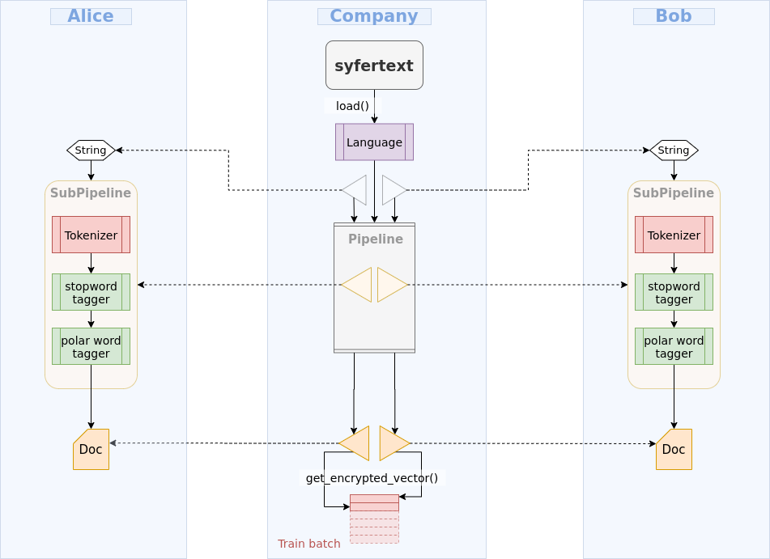

<!-- TODO(a11y): 1 localized body image(s) have empty alt text -->

_For more posts like this, follow Alan Aboudib: [Twitter](https://twitter.com/alan_aboudib) | [LinkedIn](https://www.linkedin.com/in/ala-aboudib/) | [Slack](https://app.slack.com/client/T6963A864/DDKH3SXKL/user_profile/UDKH3SH8S)_

---

**How can you do pre-processing if you are not allowed to have access to plaintext data?**

**SyferText can help you! With SyferText, you can define pre-processing components to perform pre-processing remotely, blindly and in a completely secure fashion.**

<figure class="">

</figure>

---

Suppose you run a deep learning company that provides NLP expertise. You have two clients: Bob and Alice. Each of them runs their own website were users can write reviews about movies they had watched.

Bob and Alice have heard of the great services you provide and asked you to create a sentiment classifier to help them automatically assign a sentiment (positive or negative) to each user’s review.

Now you think that this is a really good opportunity. If you pool data from both Bob’s and Alice’s datasets, you would be able to create a bigger dataset that you can use to train a better classifier.

But…

**It turns out you are not allowed to do this; both datasets are private.**

You are informed that privacy regulations, in both Bob’s and Alice’s countries, prevent them from revealing their data to any third party. You cannot move Bob’s data to your company’s machines. Same for Alice’s. Each dataset is constrained to live on its owner’s machine, and they cannot be mixed together to create a bigger dataset.

Now you think about OpenMined, and their library called PySyft that provides the possibility to perform Federated Learning and Encrypted Computations. With that, you will be able to train a single model on both datasets at the same time. This is correct!

However…

As you know, text datasets cannot be consumed directly for training a neural network. You need to create numerical representations of each text review before a network written with PySyft can be trained on it. Reviews should be first tokenized, pre-processed and vector embedding should be used instead of plaintext to train the network. **But how can you do such pre-processing if you are not allowed to have access to plaintext data?**

****SyferText**** can help you! With SyferText, you can define pre-processing components that you can send over a network to Bob’s and Alice’s machines to perform pre-processing remotely, blindly and in a completely secure fashion. SyferText components do all the work from processing plaintext to obtaining its vector representation and encrypting it to hand it over to PySyft models for training. All without you accessing the data, and without the data leaving its owner’s machine.

If you are wondering how that works, keep on following this tutorial.

****Let’s summarize:****

1.  You need to create a bigger dataset out of Bob’s and Alice’s smaller datasets. __(PySyft has the arsenal for that)__
2.  You need to prepare and pre-process the text data on Bob’s and Alice’s machines without revealing them, without moving any datasets to your machine, and without the need to work directly on Bob’s or Alice’s machines. __(SyferText to the rescue)__

For this tutorial, we are going to work with the IMDB movie review dataset. This is a public dataset. But we are going to break it into two parts, send each part to a different PySyft work. We consider that each part is a private dataset owned by its PySyft worker.

Since this is a long use-case with plenty of code, I prepared a Jupyter Notebook where you can find all of the implementation details step-by-step. You will also be able to run it on your own machine. Please [click here](https://github.com/OpenMined/SyferText/blob/master/tutorials/usecases/UC01%20-%20Sentiment%20Classifier%20-%20Private%20Datasets%20-%20\(Secure%20Training\).ipynb) to go to the notebook page.
