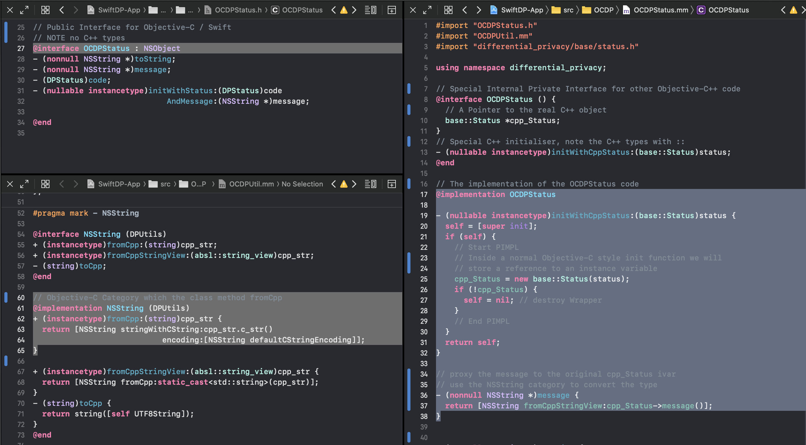

<!-- TODO(a11y): 1 localized body image(s) have empty alt text -->

[Madhava Jay](https://github.com/madhavajay), iOS ecosystem lead for OpenMined’s Differential Privacy team recently released the alpha verision of [SwiftDP](https://github.com/OpenMined/SwiftDP). Here he shares his thoughts on the sometimes difficult journey to bring [Google’s differential privacy library](https://github.com/google/differential-privacy) to iOS:

### Why SwiftDP?

The goal of SwiftDP is to provide the power and speed of Google’s Differential Privacy C++ Library to the 1.4 Billion active Apple devices world wide, many of which are iPhones.

### What were some of the challenges you faced?

Development for iOS / Apple platforms is an interesting beast. The primary programming language for iOS (plus macOS, iPadOS, tvOS, watchOS) has in recent years become Swift, a beautiful, modern, performant and typesafe language written by the Apple Swift Team and Chris Lattner the main developer of the ubiquitous LLVM compiler infrastructure project.

While there are several ways to create iPhone apps or even compile programs for macOS, by and large the majority of Apple development is now done in or leveraging the Swift toolchain.

To maintain backwards compatibility with decades of software written for Apple platforms, Swift allows for a fairly straight forwards mechanism to link and call code from its predecessor language Objective-C. This prototypical Apple development language from 1984 actually harkens back to the days of NextStep, the company Steve Jobs founded in his time away from Apple.

**Enter Bazel**

Part of the initial goal for SwiftDP was to ensure the battle tested Google Differential Privacy C++ library was left untouched and that we utilised the existing Bazel build infrastructure as much as possible. Bazel is a wonderful tool, with fast multi-threaded, deterministic, cache safe builds. Additionally there are a number of bazel build rules developed by Google to provide comprehensive support for the complexity of the myriad of compilation, bundling and linking approaches available for a suite of OS’s and hardware platforms that the world’s largest cross-device computing brand has created.

While there is ongoing debate about how best to support a direct Swift <-> C++ interop there is nothing available at this time in a [stable and reliable fashion](https://forums.swift.org/t/manifesto-interoperability-between-swift-and-c/33874).

**Objective-C++**

However, Objective-C being a superset of C and a rival alternative to C++ before it was created by Bjarne Stroustrup; has many tricks up its sleeve and offers a weird intermediate franken-mode called Objective-C++. This weird and rarely discussed or documented compilation capability provides Objective-C types and method signatures via the .h header files while allowing the ability to mix C++ and Objective-C code and types within special implementation files given the .mm extension.

The clean front facing .h headers are compiled and translated over to Swift using low level optimised toll-free bridges and the backend .mm implementation files link through to the original C++ code. After building an initial hello world type demo using Google’s impressive support in Bazel for compiling static frameworks for Apple platforms; we were able to compile and link the C++ library and call it from a simple Demo iOS app.The next steps were to determine how best to translate and wrap the C++ language idioms into ones that suited Objective-C and in turn Swift.

**How we stitched it all together**

The current solution uses an Objective-C NSObject to wrap each C++ class instance providing a clean interface on the Apple side while allowing for initialization from the C++ side using a pattern known as “Pointer to implementation” or “PImpl”.

We were able to reduce the amount of boiler plate code written for converting types by leveraging a useful mechanism of Objective-C known as Categories. This allowed us to create a utility library in an .mm file, where we can attach methods to the existing Foundation (Objective-C / iOS standard library) types like NSString or NSDictionary that provide type conversion the same way in JavaScript you can modify an object’s prototype and have that new code available at runtime.

It has been far from smooth and the Alpha release is early days; but the goal of re-implementing the Carrots Demo which calls a number of bounded methods from the DP library, and running it on an iPhone has been achieved.

We have faced some complicated issues in utilising well known package management tools such as Cocopods because currently the library is built using Bazel. Normally with package managers like Cocopods, Carthage and SwiftPM the expectation is that the code is compiled locally using the Xcode toolchain, however using a few hacks we are able to transparently provide source compilation locally using Bazel.

Luckily the wonderfully powerful Xcode provides sufficient escape hatches in the form of customisable environment variables and pre / post compilation steps to inject custom shell scripts that we are confident these issues will be resolved shortly.

<figure class="">

<figcaption>Building SwiftDP with Objective-C++. Swift and Bazel!</figcaption></figure>

**Now you try it!**

This is an alpha release so there are many issues and it is far from complete.There are two ways to run the code.

1) You can clone the repo and run the start.sh script which will compile the libraries and create an xcode project with the xcodegen tool. From there simply opening the Xcode project allows you to either execute the code on a target device or run the XCTests.

2) Alternatively you can download the pre-compiled OCDP.framework zip file. This is the Objective-C part of the project which you can drag into any iOS app and then by adding OTHER\_LDFLAGS = -lc++ you should be good to go.

**Come join the team!**

If you are interested in helping with this exciting project either from an Apple / Swift / Objective-C development side or alternatively any of our other language ports such as Python, Java / Kotlin (and JVM languages), TypeScript / JavaScript, R or even another language feel free to jump on [Slack](http://slack.openmined.org/) and say hi!

Feedback, Issues and PR’s are always welcome! 🙂
