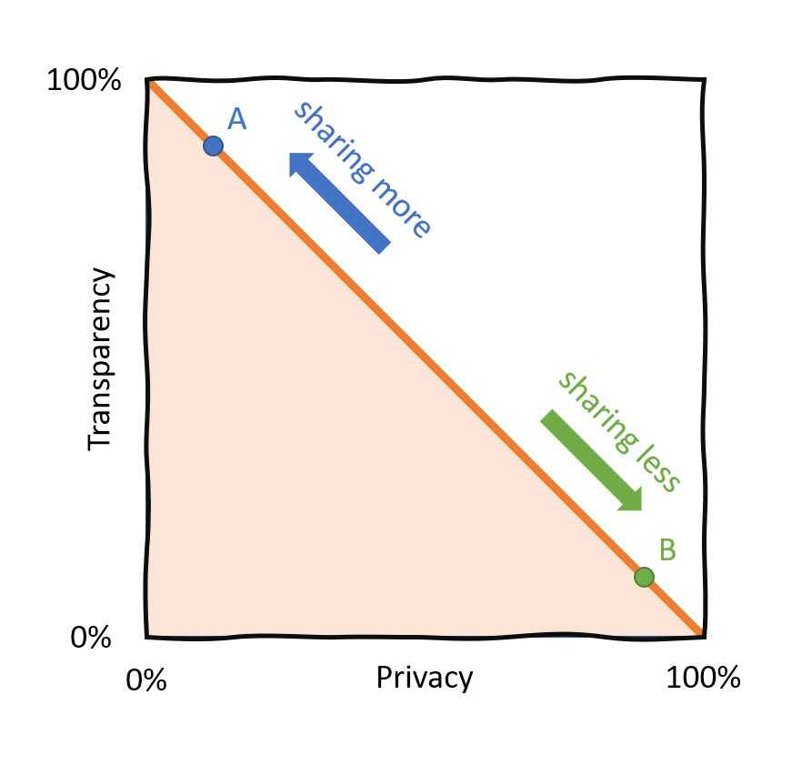
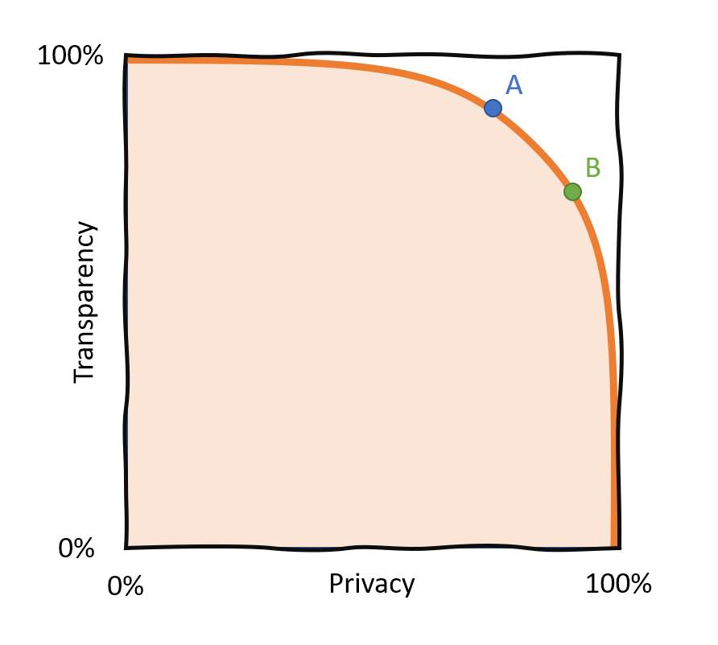

<!-- TODO(a11y): 2 localized body image(s) have empty alt text -->

<!-- TODO(content): tweet embed (verify) -->

## About the Private AI Series

[OpenMined’s Private AI Series](https://courses.openmined.org/) is aimed at facilitating the learner with awareness on the impact of privacy across industries and with working knowledge to build real-world products with privacy-preserving AI technology. With privacy infrastructure revolutionizing how information is managed in society, the first course in the series, **“Our Privacy Opportunity”** aims on making the learners aware of how privacy creates both opportunity and disruption in almost all facets of society, so as to enable them to make more informed decisions.

---

## First Steps Into the Realm of Private AI

The focus of the first course is on the **privacy-transparency trade-off** and it’s significance. This particular lesson on information flows in the society walks through some of the most important challenges to the society and identifies how the privacy-transparency trade-off underpins them. **Improving information flows**, by solving this trade-off, can help us in many areas like fighting disinformation, scientific innovation, and democracy. Every part of the human experience is soaked in information flows!

> We share our medical information with our doctors. We allow apps to access our locations to get navigation directions. We share our heart rates and sleeping patterns in hopes of improving our health and well-being.

Every day, we share personal information to exchange goods, receive services, and in general, **to collaborate**. Sharing information is a part of almost every aspect of our life.

---

## Information Flows

**What is an information flow?** Let’s take the straight-forward example of email. A sender, a message, a receiver are the entities involved. **Sounds too simple an example?** Wait, even the seemingly simple email is much more nuanced. Let’s list out a few.

-   Should other people than the receiver be allowed to read it?
-   Would I be comfortable with the receiver forwarding my email?
-   The email provider could probably read it, do I trust them?
-   Do I want the email provider to read my mail only for a specific purpose, like for spam detection?
-   Do I know exactly who the recipient is? When I’m sending the mail to a doctor’s office, who reads it?
-   Can the receiver have confidence in the identity of the sender? What if my account was hacked?

Questions like these exist around every information flow. And they can decide whether a product or service is successful. For instance, Snapchat deletes the messages once they’ve been read and prohibits forwarding or screenshotting. WhatsApp or Signal use end-to-end encryption for messages so it’s impossible for anyone other than the intended recipient to read them. Users switch to these services because of seemingly tiny changes to the guarantees around information flow. This is the beginning of a revolution!

> An information flow is a flow of bits from a sender to a receiver. The sender and receiver could either be an exact individual, a member of a group, or an anonymous individual. The identity of the sender, the receiver, and the content of the message itself can be **probabilistic**.

---

## What Does Privacy Mean?

Privacy is not about secrecy. People feel that their privacy is violated if information flows in a way they didn’t expect.

> It’s all about the _appropriate flow of information_, not about the information itself.

Privacy means the ability to ensure information flows that are according to social norms. For example, Why are people having trouble with Google taking photos of them in their front yard, when anybody could come by and see them exactly there?

> _Because when public information becomes so much more public, it bothers us._

This theory of privacy is called **[Contextual Integrity](https://en.wikipedia.org/wiki/Contextual_Integrity).** Sharing the same information might be **private in one context, but not in another context**. It’s about achieving the appropriate information flow.

---

## Data is Fire

There is the popular notion that “[**data is the new oil**](https://www.forbes.com/sites/forbestechcouncil/2019/11/15/data-is-the-new-oil-and-thats-a-good-thing/?sh=6666c9877304)“. A better analogy is “**[data is fire](https://ystrickler.medium.com/data-is-fire-92a110557ef8)“**. Why? Well, here are a few reasons:

1.  It can spread uncontrollably. Once data is out in the open, the owner loses control over who can copy the data.
2.  It can help us prosper and solve problems. Like our ancestors used fire to keep them warm and cook food, we use data to understand our world better and make money.
3.  But it can also cause irreparable damage if misused. When sensitive data leaks, it can ruin someone’s life. Companies are hoarding data to secure dominance.

This dual-use for good or harm is true for all kinds of data, not just data that is clearly sensitive like medical data. We have to learn to control and tame the downsides of data to realize its potential to improve the world.

### Everything Can be Private Data

Your grocery shopping list is boring, right? Not always. You might not care _now_ whether somebody knows you’re buying bread. But when you suddenly _stop_ buying bread (and other carbs), it might be an indication of the diagnosis of diabetes. Suddenly it’s very private information that you might not want to share.

While **anonymization** seems like the obvious solution to protect the identities of people in data, this **does not work reliably**. Even when names are removed from data, other features can be used to identify you, thanks to the power of **machine learning**. And even when your exact identity is not recoverable, data can be used for **targeting.** As long as someone is able to reach you (via your browser, your church, your neighborhood amongst others), your name is not at all necessary to do harm.

Strava released an anonymized heatmap of user activities that revealed the location of US military bases. So, privacy can be relevant not only on an individual level but on an organizational or even national security level.

<figure class=""><blockquote class="twitter-tweet" data-width="550">
Strava released their global heatmap. 13 trillion GPS points from their users (turning off data sharing is an option). <a href="https://t.co/hA6jcxfBQI">https://t.co/hA6jcxfBQI</a> … It looks very pretty, but not amazing for Op-Sec. US Bases are clearly identifiable and mappable <a href="https://t.co/rBgGnOzasq">pic.twitter.com/rBgGnOzasq</a>

— Nathan Ruser (@Nrg8000) <a href="https://twitter.com/Nrg8000/status/957318498102865920?ref_src=twsrc%5Etfw">January 27, 2018</a>
</blockquote>
 
</figure>

---

## Privacy and Transparency Dilemmas

Due to the potentially harmful use of data, we have to constantly make trade-offs and decide whether to share information, while carefully weighing the benefits and the risks.

> A **privacy dilemma** is a trade-off on whether or not to reveal information, where revealing that information causes some social good but could also lead to harm. Example: medical records can be used for scientific research, but we don’t want information about individuals being leaked.

> A **transparency dilemma** is when someone is forced to make a decision without having access to the information they need to make it. Sometimes the necessary information flows don’t exist at all, such as deciding if you could trust a stranger to fix your car’s engine.  
> Sometimes they exist, but their content is not verified, as in online product reviews.

Stopping all information flows and locking all data is not the solution to the privacy issue. This would prevent good use of data, such as in medical care or climate research, and also make undesirable actions like money laundering easier as it promotes lack of accountability.

> **Maximizing privacy could lead to a lack of transparency!**

---

## The Privacy-Transparency Pareto Frontier

<figure class="">

<figcaption>This is the privacy-transparency trade-off. More of one means less of the other. (Image Credits: <a href="https://deeplearning.berlin/online%20courses/privacy/the%20private%20ai%20series/openmined/2021/01/08/Our-Privacy-Opportunity-Part-1.html#The-Privacy-Transparency-Pareto-Frontier">Johannes Stutz</a>)</figcaption></figure>

We used to have a classic [Pareto trade-off](https://en.wikipedia.org/wiki/Pareto_efficiency) between privacy and transparency. You had to decide whether you share information at the cost of privacy (point **A** in the chart) or you keep information private, but at the cost of transparency (point **B**).

<figure class="">

<figcaption>With new privacy-enhancing technologies, we can have more of both privacy and transparency (Image Credits: <a href="https://deeplearning.berlin/online%20courses/privacy/the%20private%20ai%20series/openmined/2021/01/08/Our-Privacy-Opportunity-Part-1.html#The-Privacy-Transparency-Pareto-Frontier">Johannes Stutz</a>)</figcaption></figure>

With new technologies, we can actually move the pareto frontier. Notice that point **B** in this chart has the same amount of privacy as in the first chart, but has a lot more transparency. **We don’t have a zero-sum game anymore!**

This will affect every industry handling valuable, sensitive, or private data. In the future:

-   Governments won’t have to choose between preserving the privacy of their citizens or protecting national security, they can do both.
-   Researchers won’t have to decide whether or not to share their data, they can have the benefits from both.
-   Corporations won’t have to choose between the privacy of their users and the accuracy of their products and services, they can have both.

How these privacy-enhancing methods look like and which specific technologies are developed will be covered later in the course.

---

## Why Should We Attempt to Solve the Privacy-Transparency Trade-Off?

### Research is Constrained by Information Flows

If there was a way to share data across institutions while making sure it remained private and was used for good, all areas of research would benefit.

> _More_ data would be available, it would be available _faster_, and also: experiments could be replicated more easily.

### Healthy Market Competition for Information Services

We need more interoperability between information service providers. You should also be able to move to a different company and take your data with you. For example, Facebook started as a company that profited a lot from interoperability. Users from its established main competitor MySpace could connect their MySpace account with Facebook and message with their friends on the old platform. Without this feature, probably less people would have switched to the new platform.

> Privacy is not only about preventing information from being shared.

Sometimes satisfying privacy is about forcing companies to share or delete your data in a specific way or at a specific time. The [GDPR](https://en.wikipedia.org/wiki/General_Data_Protection_Regulation) (General Data Protection Regulation), introduced in the EU in 2018, aims to give individuals control over their personal data. Citizens now have 7 rights over their data, including the _right to be forgotten_ and the _right of access_.

### Data, Energy, and the Environment

One of society’s biggest challenges is the transition to green energy. The volatile nature of renewable energy sources makes nation-wide coordination of energy demand necessary.

Smart meters, highly valuable for the transition to clean energy also involve substantial privacy-transparency trade-off. Grid operators can have an accurate picture of energy demand, consumers can reduce energy waste. But smart meters can also be extremely privacy invasive, because one can [build rich patterns](https://smartgridawareness.org/privacy-and-data-security/how-smart-meters-invade-individual-privacy/) of your energy data.

---

## Feedback Mechanisms and Information Flows

We often rely on the opinions of others when we make purchasing decisions. But there are more feedback mechanisms. Elections, protests, Facebook likes, going to prison, boycotting, gossip, are all feedback mechanisms.

> Feedback mechanisms help us understand how the world views our work, so we can do more good things and fewer bad things.

Unfortunately, due to the privacy-transparency trade-off, many of them are broken. This is the case when feedback information is too sensitive or too valuable to be shared.

### Examples of broken feedback scenarios

-   **Medical care:** When you go for surgery, how good is your surgeon? Can you ask for reviews of previous patients, could you talk to previous nurses? And even if you could, could you talk to enough patients or nurses to make an informed decision?
-   **Consumer products:** How do you know whether a product is any good? Amazon reviews are [easy to fake](https://www.which.co.uk/news/2019/07/exposed-the-tricks-sellers-use-to-post-fake-reviews-on-amazon/), and the real ones come from only the most polarized users.
-   **Politics:** A multiple choice question between a few candidates every 4 years is a _terrible_ feedback system for reviewing the legislature of the past 4 years.

> Most feedback information simply isn’t collected, because it would be too personal to collect it.

### Democracy and Public Health Conversation

With even the political front experiencing major paradigm shifts in the recent years, there has been an uptick in polarization, one of the reasons probably being social media where algorithms maximize engagement.

A better way can be found in [Taiwan, with the _Polis_ system](https://www.theguardian.com/world/2020/sep/27/taiwan-civic-hackers-polis-consensus-social-media-platform). A community-built, nation-wide application that supports conversation between millions of citizens. People can enter their opinions in written form, these opinions are then clustered by a combination of AI and voting. In the end, the most successful formulation will be the one that gets the most consent _across opinions_.

> Democratic platforms should not be optimized for engagement, but for consensus.

Here’s an example. When Uber wanted to come to Taiwan, people had very polarized opinions. The solution the community came up with. Uber was permitted a temporary license in Taiwan. During this time, the public Taxi sector had to adopt the efficient algorithmic approaches from Uber while maintaining current labor standards. That put just enough pressure on both sides, and in the end, the public system did improve so much that Uber was excluded.

---

### New Market Incentives

Today’s incentives of companies are often misaligned with the well-being of their users. Many online companies use **attention** (often called engagement) as their key metric. For some, this intuitively makes sense, because their revenue is ad-driven. But even companies that run on a subscription model, like Netflix, do it. Netflix’s former CEO Reed Hastings famously said they are competing with sleep ([“And we’re winning!”](https://www.fastcompany.com/40491939/netflix-ceo-reed-hastings-sleep-is-our-competition)). The question is: Why? One answer is that engagement is a readily available metric which is fine-grained and allows for optimization.

Let’s speculate about a better approach. Netflix could try to optimize their experience to improve the users’ sleep. But how would they measure it and train an algorithm on it? Fitbits can track sleeping patterns, but is it safe to share this data with Netflix? In general, these alternative metrics are called **wellness metrics** and can improve our lives. Technology isn’t inherently addictive, better products are possible. But we need to solve the privacy-transparency trade-off.

### Safe Data Networks for Business, Governance and R&D

> How do privacy-transparency trade-offs affect important public information flows?

For example, the European Commission recently proposed the [Data Governance Act](https://iapp.org/news/a/proposal-for-an-eu-data-governance-act-a-first-analysis/) to ease data flow. Increased access to data would advance scientific developments and innovations, and allow coordinated action on a global pandemic or climate change. So, what are reasons that data should _not_ flow entirely freely?

1.  Commercially sensitive data like trade secrets should be protected.
2.  Data is valuable. Not just for a business, but for a country. Who controls the data has an impact on national security.
3.  Data can be private. Fundamental rights of data protection have to be respected. Anonymization is not enough, since new mathematical tools allow the reconstruction of personal details even from anonymized datasets.

But what if the data didn’t have to move? What if the institutions within the home country had the only copy of a citizen’s sensitive data, which other countries could access remotely and in a controlled manner to perform analyses? That would be much better than transferring the data around Europe, out of the owner’s control.

Today, there are new techniques to enable privacy-friendly analysis, including **differential privacy** which will be covered during this course.

---

### Conflict, Political Science & Information Flows

One reason why nations go to war is **mutual optimism.** Both parties estimate that they are more likely to win than the other country.

A way to share private military information to determine the winner (in a digital war game) ahead of time, but without actually giving away military secrets to the opponent, could potentially avoid wars.

This is true for other conflicts as well, like legal disputes or commercial competition. If the winner could be determined ahead, some conflicts wouldn’t be fought. Moving the privacy-transparency trade-off is essential here as well.

### Disinformation & Information Flows

Today, where the average person has hundreds of contacts on social media, fake news and rumors can spread easily. How to avoid disinformation on social media?

-   Have social media platforms employed people who check every bit that is published? Not feasible for hundreds of millions of users.
-   Let a machine learning algorithm check whether a piece of news is true? Detecting fake news only by reading it probably won’t work in the long run, since you have to have knowledge of the world.
-   Just get off social media? Maybe we’re just not supposed to be interconnected with that many people?

The most interesting solution is currently being deployed in Taiwan. [The Polis platform](https://www.wired.co.uk/article/taiwan-democracy-social-media) aims to improve public discourse. Trained volunteers comment on suspicious stories with reliable sources one might check. Since these comments come from people you know from your local community, you already have a higher level of trust to them.

> This is the beauty of the Taiwanese approach: not using the blunt instrument of forcing platforms to take down certain posts. But to **activate existing ways to fight disinformation** and get people to help their friends.

Also, we can use humor to foster trust between the state and its citizens. **Humor over rumor!**

<figure class=""><blockquote class="twitter-tweet" data-width="550">
?? <a href="https://twitter.com/hashtag/Taiwan?src=hash&amp;ref_src=twsrc%5Etfw">#Taiwan</a> is combating <a href="https://twitter.com/hashtag/Coronavirus?src=hash&amp;ref_src=twsrc%5Etfw">#Coronavirus</a> &amp; managing the <a href="https://twitter.com/hashtag/COVID19?src=hash&amp;ref_src=twsrc%5Etfw">#COVID19</a> pandemic.

? Digital Social Innovation is key!

? It’s fast, open, fair &amp; fun.

? Most importantly, it needs <a href="https://twitter.com/hashtag/AllHandsOnDeck?src=hash&amp;ref_src=twsrc%5Etfw">#AllHandsOnDeck</a>.

? Take 5 with me &amp; get up to speed.

? Visit <a href="https://t.co/5D68ia7PcI">https://t.co/5D68ia7PcI</a> &amp; learn much more. <a href="https://t.co/M5ecPnSPLF">pic.twitter.com/M5ecPnSPLF</a>

— Audrey Tang 唐鳳 (@audreyt) <a href="https://twitter.com/audreyt/status/1252588694147457026?ref_src=twsrc%5Etfw">April 21, 2020</a>
</blockquote>
 
</figure>

---

## Conclusion

The privacy-transparency trade-off or even privacy in general is in service of the higher aim of **creating information flows within society that create social good.**

> **Privacy technology is not just about more privacy.**

Remember to ask yourself the question the following question.

> How can society accomplish its goals with less risk, higher accuracy, faster, and with better aligned incentives than ever before, through better flows of information?

That is the promise of privacy-enhancing technology and has the potential to radically improve every aspect of how we share information.

---

## References

\[1\] [The OpenMined Private AI Series](https://courses.openmined.org/)  
\[2\] [Course 1, Our Privacy Opportunity](https://courses.openmined.org/courses/our-privacy-opportunity)  
\[3\] [Data is Fire](https://ystrickler.medium.com/data-is-fire-92a110557ef8)

Cover Image: Photo by [Aron Visuals](https://unsplash.com/@aronvisuals) on Unsplash
