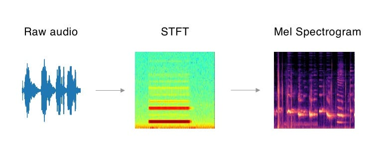
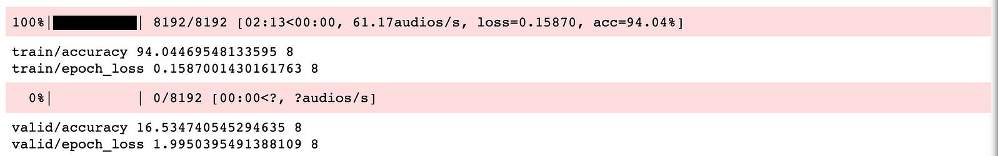
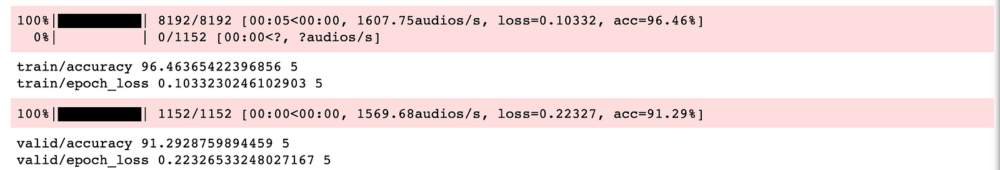
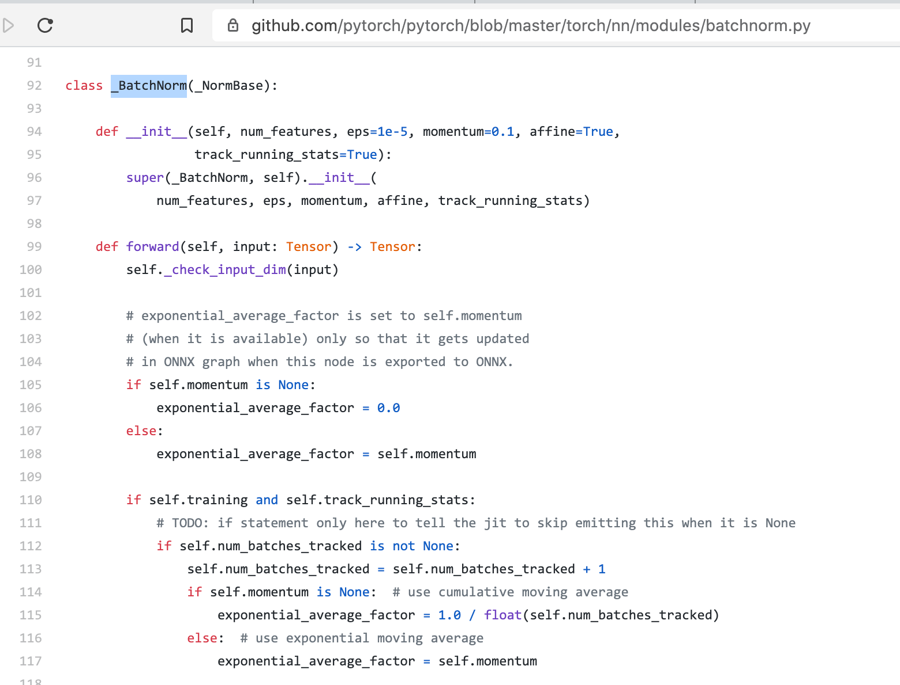
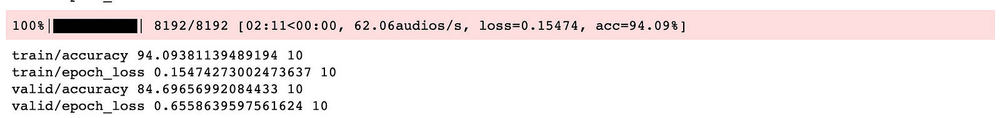

<!-- TODO(a11y): 6 localized body image(s) have empty alt text -->


<!-- TODO(content): giphy embed (verify) -->

<figure class="">


<figcaption>Photo by <a href="https://unsplash.com/@jasonrosewell?utm_source=medium&amp;utm_medium=referral" data-href="https://unsplash.com/@jasonrosewell?utm_source=medium&amp;utm_medium=referral" class="markup--anchor markup--figure-anchor" rel="photo-creator noopener" target="_blank">Jason Rosewell</a> on&nbsp;<a href="https://unsplash.com?utm_source=medium&amp;utm_medium=referral" data-href="https://unsplash.com?utm_source=medium&amp;utm_medium=referral" class="markup--anchor markup--figure-anchor" rel="photo-source noopener" target="_blank">Unsplash</a></figcaption></figure>

**_Update as of November 18, 2021: The version of PySyft mentioned in this post has been deprecated. Any implementations using this older version of PySyft are unlikely to work. Stay tuned for the release of PySyft 0.6.0, a data centric library for use in production targeted for release in early December._**

Private conversation is everywhere. If you talk to your wife, it’s obviously a private conversation. If you talk to an operator of a contact center, it’s still considered private. Almost all conversations are considered as private. Public debate is one of the exceptions.

If you want to extract meaning out of private conversation, you need to access private data, which you can **_not_** access in most cases. That’s why I think a privacy preserving deep learning technique is the key to taking speech-to-text AI to the next phase.

In this tutorial, I will show how to train a speech command prediction model with federated learning.

> _To tell the truth, I want to train speech-to-text model with federated learning instead of speech command prediction. But I couldn’t make it this time so maybe in the future…_

You can learn in this tutorial…

-   how to handle audio data
-   how to train speech commands prediction model with federated learning

I use PySyft library for federated learning. PySyft is one of libraries for privacy preserving AI, which is developed and maintained by the open-source community called OpenMined.

If the idea of privacy preserving AI is not familiar to you, please check out [OpenMined’s websites](https://www.openmined.org/). There are tons of good blogs and tutorials.

### Training Objective

The objective is to train a speech commands prediction model with federated learning. Input data is a wav audio file and output is a category id of speech commands list. We have 12 classes, unknown, silence, yes, no, up, down, left, right, on, off, stop, and go.

I borrowed almost all codes from this repository . Thanks a lot!  
[https://github.com/tugstugi/pytorch-speech-commands.git](https://github.com/tugstugi/pytorch-speech-commands.git)

The federated learning part is taken from a PySyft tutorial.  
[https://github.com/OpenMined/PySyft/blob/master/examples/tutorials/Part%2006%20-%20Federated%20Learning%20on%20MNIST%20using%20a%20CNN.ipynb](https://github.com/OpenMined/PySyft/blob/master/examples/tutorials/Part%2006%20-%20Federated%20Learning%20on%20MNIST%20using%20a%20CNN.ipynb)

### Data

We download speech command datasets from here:  
[http://download.tensorflow.org/data/speech\_commands\_v0.01.tar.gz](http://download.tensorflow.org/data/speech_commands_v0.01.tar.gz)

After downloading datasets, we do things similar to those below. The point is make sure all audio has exact same duration, 1 second in this case, and convert raw audio into Mel Spectrogram format. Mel Spectrogram is one of the audio formats to use as input. If you want to know more about audio format for deep learning, please check out [this blog](https://towardsdatascience.com/getting-to-know-the-mel-spectrogram-31bca3e2d9d0).

1.  Split datasets into training datasets and validation datasets
2.  preprocess raw audio into STFT format
3.  convert STFT format into Mel Spectrogram Format
4.  data augmentation
5.  adding background noise data augmentation

<figure class="">



</figure>

### Split and send data to remote machine

Since my objective is to use federated learning, I want remote machines to have data. So let’s send datasets to remote machines **_virtually_**.

Create 2 virtual remote machine called Alice and Bob.

```python
# import PySyft
import syft as sy # maket PySyft and PyTorch work together
hook = sy.TorchHook(torch) # create virtual remote machine called bob and alice
bob = sy.VirtualWorker(hook, id="bob") 
alice = sy.VirtualWorker(hook, id="alice")
```

Send datasets to Alice and Bob.

```python
# sy.FederatedDataLoader do the magic
federated_train_loader = sy.FederatedDataLoader(
	train_dataset.federate((bob, alice)),
    batch_size=batch_size,
)
```

### Training loop

At training, the model goes back and forth between me, main training process, and Bob and Alice.

**_inputs.location_** give you the location of data. Then **_.send()_** send the model to the location.

```python
# send model to data.location
model.send(inputs.location)
```

That’s it.

Let’s see the loss and accuracy.

<figure class="">



</figure>

After 12 epochs, we got 94 % accuracy for training datasets.  
That’s good!

> But wait…  
> validation accuracy was just 16 %. This is close to random picking…

<div style="width:100%; height:0; padding-bottom:100%; position:relative"><iframe src="https://giphy.com/embed/gIfv29q3ULtqjYTR7B" width="100%" height="100%" style="position:absolute" frameborder="0" class="giphy-embed" allowfullscreen=""></iframe></div>

[via GIPHY](https://giphy.com/gifs/ohreally-headtilt-brusselsgriffon-gIfv29q3ULtqjYTR7B)

This is the log of pure PyTorch training without federated learning.  
I used AdamW which is same as federated learning version.

<figure class="">



</figure>

Training accuracy is 94 % and validation accuracy is 91 %, which is normal.

I did a couple of experimentation such as…

-   using SGD instead of Adam.
-   using large datasets
-   not using any data augmentations
-   checking file by file

And finally I got the reason, or at least workaround.

I noticed that evaluation mode always gave me bad accuracy, but training mode gave good accuracy.

It seems PySyft version 0.2.8 sometimes can not handle self-training correctly. And a few layers like batchnorm use self-training inside.

<figure class="">



</figure>

After change **_model.eval()_** to **_model.train()_**, I can get good accuracy even for validation datasets. It’s 84 %. Of course we need _**train.eval()**_ for real world use cases, but still I think this is a good achievement.

<figure class="">



</figure>

### Conclusion

To be honest, speed is a bit slow. We might need to make the speed faster because some real world use cases require a lot more data on a much bigger architecture. And there are some functions and options which we can not use with current version of PySyft.

But PySyft is being developed rapidly. I can say the speed is very fast. So it’s going to support such functions and options soon.

Everything else works great and as an AI practitioner working in voice/speech sector, I can feel the excitement around privacy preserving AI and OpenMind.

Next time I’m going to write a demo with multiple instances with data. I mean a demo without sending datasets to virtual machines/workers because it’s closer to real world situations. I also want to try to train speech-to-text model with federated learning too, of course.

I put all the codes on a single jupyter notebooks so you can follow each steps to learn how to handle audio data and how to apply federated learning to speech command prediction model training.

Here are [the source codes](https://github.com/kouohhashi/mytutorials/blob/master/nbs/train_speech_command_federated-adamw.ipynb). I hope it’s helpful.
