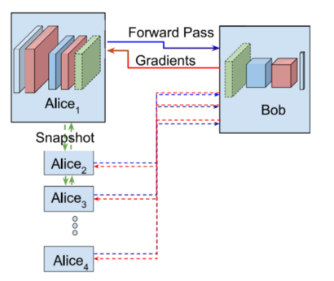
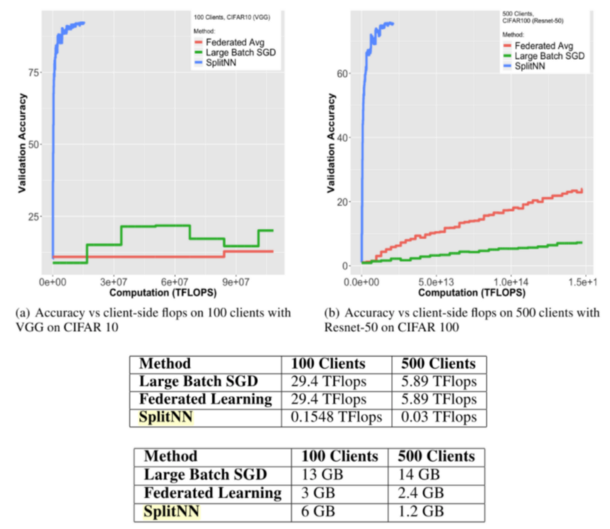
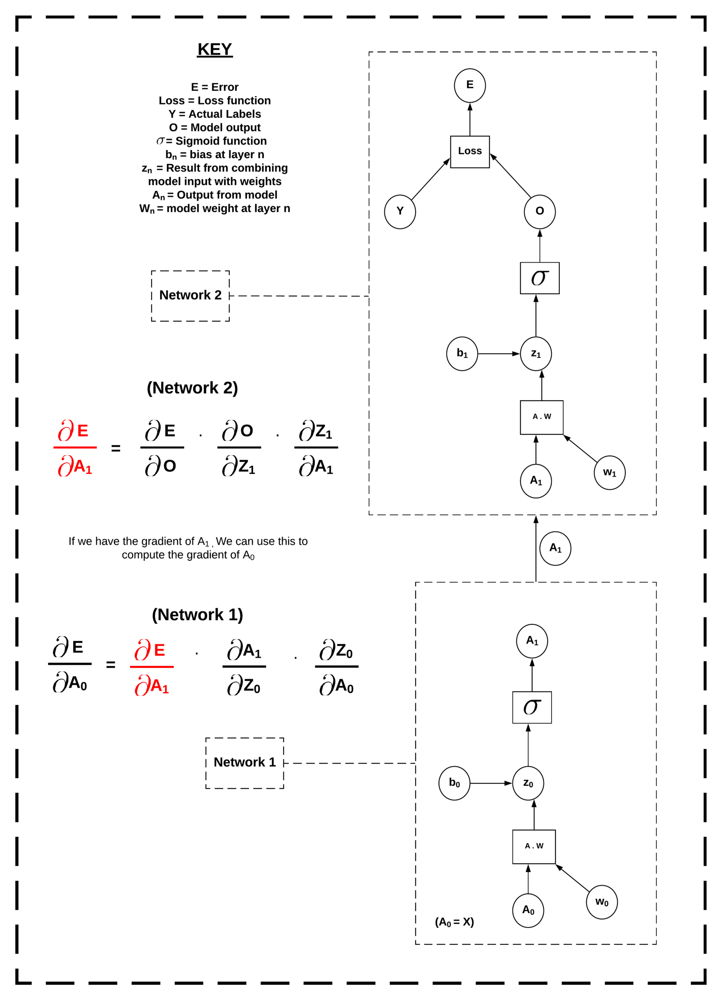

<!-- TODO(a11y): 5 localized body image(s) have empty alt text -->


**_Update as of November 18, 2021: The version of PySyft mentioned in this post has been deprecated. Any implementations using this older version of PySyft are unlikely to work. Stay tuned for the release of PySyft 0.6.0, a data centric library for use in production targeted for release in early December._**

****Summary:**** In this blog we are going to provide an introduction into a new decentralised learning methodology called, ‘Split Neural Networks’. We’ll take a look at some of the theory and then dive into some code which will allow us to run them on PySyft.

## Privacy and the Data industry

Historically, machine learning architectures have been built upon the assumption that all machine learning algorithms are to be centralised, where both the training data and the model are in the same location and known to the researcher. However, there is a growing appetite for learning techniques to be applied to domains where data is traditionally sensitive or private, i.e healthcare, operational logistics or finance. In healthcare, these kinds of applications have the capacity to improve patient outcomes through enhanced diagnostic accuracy and through the augmentation of doctor to patient time efficiency using competent clinical decision support systems.

However, until recently there has been a barrier in the way of this kind of innovation, data privacy__.__ It’s currently not possible for data owners to __truly__ know that their data hasn’t been sold on, used for something they didn’t previously consent to or held onto for far longer than intended. This leads to a problem of trust between data processors and data owners. When data has been gathered, it’s even more difficult to adequately manage the consent of its owners. This makes the traditional, centralised, industry model impossible to apply to data practices post [GDPR](https://ico.org.uk/for-organisations/guide-to-data-protection/guide-to-the-general-data-protection-regulation-gdpr/).

For these reasons, centralised learning architectures have become either an impediment to innovation or a privacy hazard for the data owners involved. Either research on private data is blocked due to privacy ramifications or it goes ahead with potentially disastrous social and political consequences for the subjects of the data.

The tech sector still races to catch up with one of the landmark innovations of our time; blockchain. However, while distributed ledger technology is going to be at the core of the next generation of the internet, it only marks the start of a greater transformation in system architectures. The genie which has left the bottle here is ****decentralisation****.

This principle has been adopted in order to build tools where the decentralisation of resources and multi-owner governance enshrine the citizens right to privacy and security. This opens the door to innovation through an information resource which has previously been inaccessible; private data. A community at the front of this transformation is OpenMined. Their private AI tool is called [PySyft](https://www.openmined.org/).

## Split Neural Network

Traditionally, [PySyft](https://www.openmined.org/) has been used to facilitate [federated learning](https://blog.openmined.org/upgrade-to-federated-learning-in-10-lines/). However, we can also leverage the tools included in this framework to implement distributed neural networks. These allow for researchers to process data held remotely and compute predictions in a radically decentralised way. First introduced by MIT in December 2018, SplitNNs represent a brand new architectural mechanic for privacy-preserving ML researchers to play with.

### What is a SplitNN?

The training of a neural network (NN) is ‘split’ across two or more hosts. Each model segment is a self contained NN that feeds into the segment in front. In this example Alice has unlabelled training data and the bottom of the network whereas Bob has the corresponding labels and the top of the network. The image below shows this training process, where Bob has all the labels and there are multiple Alices with __X__ data [\[1\]](https://arxiv.org/abs/1810.06060). Once the first Alice has trained, she sends a copy of her bottom model to the next Alice. Training is complete once all Alices have trained.

<figure class="">


</figure>

<figure class="">



<figcaption><a href="https://arxiv.org/abs/1810.06060" rel="noopener nofollow">https://arxiv.org/abs/1810.06060</a></figcaption></figure>

### Why use a SplitNN?

The SplitNN has been shown to provide a dramatic reduction to the computational burden of training while maintaining higher accuracies when training over large number of clients \[[2](https://arxiv.org/abs/1812.00564)\]. In the figure below, the Blue line denotes distributed deep learning using splitNN, the red line represents federated learning (FL) and the green line labels Large Batch Stochastic Gradient Descent (LBSGD).

<figure class="">



<figcaption><a href="https://arxiv.org/abs/1812.00564" rel="noopener nofollow">https://arxiv.org/abs/1812.00564</a></figcaption></figure>

Table 1 shows computational resources consumed when training CIFAR 10 over VGG. Theses are a fraction of the resources of FL and LBSGD. Table 2 shows the bandwidth usage when training CIFAR 100 over ResNet. Federated learning is less bandwidth intensive with fewer than 100 clients. However, the SplitNN outperforms other approaches as the number of clients grow\[[2](https://arxiv.org/abs/1812.00564)\].

### Training a SplitNN

<figure class="">

<video src="/blog/split-neural-networks-on-pysyft/1-azn3aorqniyilbpilialsw.mp4" autoplay loop muted playsinline></video>

<figcaption>Training a SplitNN</figcaption></figure>

Predictions made with a SplitNN are quite simple. All we have to do is get our data, make a prediction using the bottom segment and send that prediction to the next model segment. When that segment receives the prediction, we make a new prediction using previous one as our input data. We then send it onward to the next model. We keep going until we reach the end layer. At the end of the prediction, we have our final prediction and a computation graph for each model. Computation graphs document the transformation from the input data to the prediction and are useful in the backprop phase.

In PyTorch, the computation graph allows the autograd function to quickly differentiate variables used in a function w.r.t a loss function. Autograd produces gradients which we can then use to update the model. However, in PyTorch, this method was not designed to be distributed. We don’t have all the variables in the computation graph in one place in order to do this automatic calculation. In our method, we get around this by performing partial backprop on each model segment as we work the loss backward. We achieve this by sending the relevant gradients back as we go.

Consider the example of the computation graph below. We want to compute gradients all the way back to __W₀__ and __B₀__, which are the weights and biases in __Network 1__. However, our model splits at __A₁.__ This is the output of __Network 1__ and the input of __Network 2__. To get around this, we compute the loss of __O__, the output of Network 2, and calculate the gradients back to __A₁, W₁__ and __B₁__. We then send the computed gradients of __A₁__ back to __Network 1__ and use them to continue the gradient calculation at that location. Once we have gradients all weights and biases all the way back to __W₀__ and __B₀,__ we can step in the direction of these gradients.

<figure class="">



<figcaption>Computation graph of 2-layer SplitNN</figcaption></figure>

We repeat this over epochs to train the model. Once we have trained over a sufficient number of epochs, we send the model segments back to the researcher. The researcher can then aggregate the updated segments and keep the trained model.

## Implementing SplitNN

Next we will go into a little code example where we use splitNN to predict upon the MNIST dataset. First we define our SplitNN class. This takes a set of models and their linked optimisers as its input.

```python
class SplitNN:
    def __init__(self, models, optimizers):
        self.models = models
        self.optimizers = optimizers
        
    def forward(self, x):
        a = []
        remote_a = []
        
        a.append(models[0](x))
        if a[-1].location == models[1].location:
            remote_a.append(a[-1].detach().requires_grad_())
        else:
            remote_a.append(a[-1].detach().move(models[1].location).requires_grad_())

        i=1    
        while i < (len(models)-1):
            
            a.append(models[i](remote_a[-1]))
            if a[-1].location == models[i+1].location:
                remote_a.append(a[-1].detach().requires_grad_())
            else:
                remote_a.append(a[-1].detach().move(models[i+1].location).requires_grad_())
            
            i+=1
        
        a.append(models[i](remote_a[-1]))
        self.a = a
        self.remote_a = remote_a
        
        return a[-1]
    
    def backward(self):
        a=self.a
        remote_a=self.remote_a
        optimizers = self.optimizers
        
        i= len(models)-2   
        while i > -1:
            if remote_a[i].location == a[i].location:
                grad_a = remote_a[i].grad.copy()
            else:
                grad_a = remote_a[i].grad.copy().move(a[i].location)
            a[i].backward(grad_a)
            i-=1

    
    def zero_grads(self):
        for opt in optimizers:
            opt.zero_grad()
        
    def step(self):
        for opt in optimizers:
            opt.step()
```

We then import all of our regular imports for training with PySyft, set up a torch hook and pull in the MNIST data.

```python
import numpy as np
import torch
import torchvision
import matplotlib.pyplot as plt
from time import time
from torchvision import datasets, transforms
from torch import nn, optim
import syft as sy
import time
hook = sy.TorchHook(torch)
```

Next we define our network which will be distributed. Here we are going for a simple, three-layer network. However, we can do this for a network of any size or shape. Each segment is it’s own self-contained network. All that matters is the shape of the layer where one segment joins to the next. The sending layer must have an equal output shape to the receiving layers input shape. For more information on how the model parameters were chosen for this particular dataset, [read this great tutorial.](https://towardsdatascience.com/handwritten-digit-mnist-pytorch-977b5338e627)

```python
torch.manual_seed(0)  # Define our model segments
input_size = 784
hidden_sizes = [128, 640]
output_size = 10
models = [
    nn.Sequential(
                nn.Linear(input_size, hidden_sizes[0]),
                nn.ReLU(),
    ),
    nn.Sequential(
                nn.Linear(hidden_sizes[0], hidden_sizes[1]),
                nn.ReLU(),
    ),
    nn.Sequential(
                nn.Linear(hidden_sizes[1], output_size),
                nn.LogSoftmax(dim=1)
    )
]
# Create optimisers for each segment and link to them
optimizers = [
    optim.SGD(model.parameters(), lr=0.03,)
    for model in models
]
```

Now it’s time to define some workers to host our models, and send the models to their locations.

```python
# create some workers
alice = sy.VirtualWorker(hook, id="alice")
bob = sy.VirtualWorker(hook, id="bob")
claire = sy.VirtualWorker(hook, id="claire")

# Send Model Segments to model locations
model_locations = [alice, bob, claire]
for model, location in zip(models, model_locations):
    model.send(location)
```

Next we build the splitNN. All that is required for this to work is for the model segments to be in their starting locations and paired to their respective optimisers.

```python
#Instantiate a SpliNN class with our distributed segments and their respective optimizers
splitNN =  SplitNN(models, optimizers)
```

Next we define a train function. The usage of splitNN is fairly similar to a conventional model. All that is required is a second back-propagation phase to push gradients back over the segments.

```python
def train(x, target, splitNN):
    
    #1) Zero our grads
    splitNN.zero_grads()
    
    #2) Make a prediction
    pred = splitNN.forward(x)
    
    #3) Figure out how much we missed by
    criterion = nn.NLLLoss()
    loss = criterion(pred, target)
    
    #4) Backprop the loss on the end layer
    loss.backward()
    
    #5) Feed Gradients backward through the network
    splitNN.backward()
    
    #6) Change the weights
    splitNN.step()
    
    return loss
```

Finally we train, sending data to starting locations as we go.

```python
for i in range(epochs):
    running_loss = 0
    for images, labels in trainloader:
        images = images.send(models[0].location)
        images = images.view(images.shape[0], -1)
        labels = labels.send(models[-1].location)
        loss = train(images, labels, splitNN)
        running_loss += loss.get()

    else:
        print("Epoch {} - Training loss: {}".format(i, running_loss/len(trainloader)))
```

[The full example can be seen here on the PySyft Github.](https://github.com/OpenMined/PySyft/blob/master/examples/tutorials/advanced/Split%20Neural%20Network/Tutorial%202%20-%20MultiLayer%20Split%20Neural%20Network.ipynb)

## Conclusion

There you have it, a new tool to rival federated learning in terms of accuracy, computational complexity and network resources. Follow for more updates relating to privacy-preserving methodologies such as Homomorphic Encryption and Secure Multi-Party Computation.

**Author**: Adam J Hall

Twitter: [@AJH4LL](https://twitter.com/AJH4LL) – GitHub: [@H4LL](https://github.com/H4LL) – Linkedin: [Adam James Hall](https://www.linkedin.com/in/adam-james-hall-1b0229113/)

If you enjoyed this then you can contribute to OpenMined in a number of ways:

### Star PySyft on GitHub

The easiest way to help our community is just by starring the repositories! This helps raise awareness of the cool tools we’re building.

-   [Star PySyft](https://github.com/OpenMined/PySyft)

### Try our tutorials on GitHub!

We made really nice tutorials to get a better understanding of Privacy-Preserving Machine Learning and the building blocks we have created to make it easy to do!

-   [Checkout the PySyft tutorials](https://github.com/OpenMined/PySyft/tree/master/examples/tutorials)

### Join our Slack!

The best way to keep up to date on the latest advancements is to join our community!

-   [Join slack.openmined.org](http://slack.openmined.org/)

### Join a Code Project!

The best way to contribute to our community is to become a code contributor! If you want to start “one off” mini-projects, you can go to PySyft GitHub Issues page and search for issues marked `Good First Issue`.

-   [Good First Issue Tickets](https://github.com/OpenMined/PySyft/issues?q=is%3Aopen+is%3Aissue+label%3A%22good+first+issue%22)

### Donate

If you don’t have time to contribute to our codebase, but would still like to lend support, you can also become a Backer on our Open Collective. All donations go toward our web hosting and other community expenses such as hackathons and meetups!

-   [Donate through OpenMined’s Open Collective Page](https://opencollective.com/openmined)
