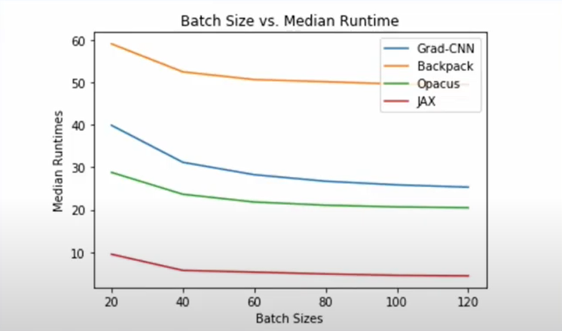
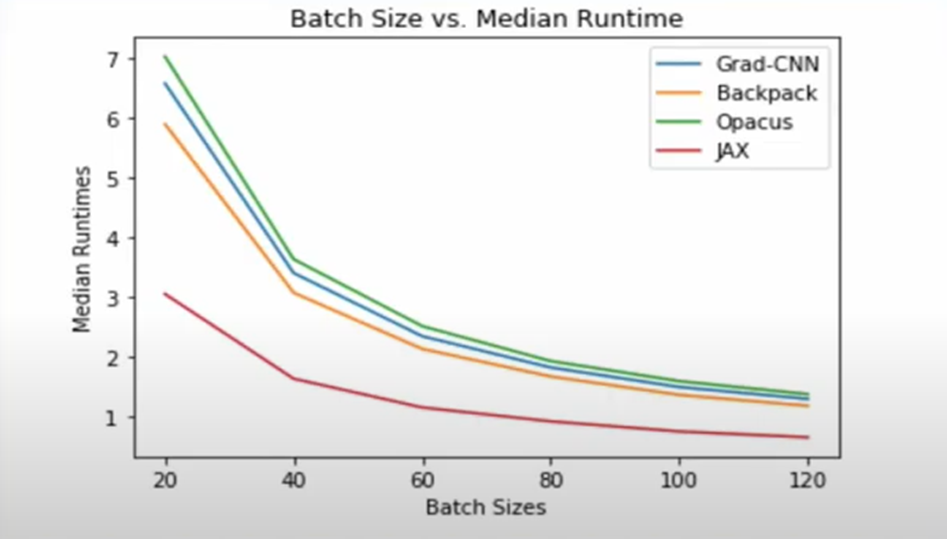

<!-- TODO(a11y): 2 localized body image(s) have empty alt text -->

This is a summary of the [talk](https://youtu.be/k7ew0Rz8pTg) by Pranav Subramani at the OpenMined Privacy Conference 2020.

## Agenda of the talk :

1\. How to run fast differentially-private machine learning algorithms on modern hardware.

2\. JAX, a popular framework developed by Google is much faster than its existing competing frameworks in tasks centering DP-SGD. JAX is well suited to prototype differentially private machines learning code.

## What is Differential Privacy?

A randomized algorithm M with the domain N|k|  is  (∊, ∂) – differentially private if for all S ⊆ Range(M) and for all x,y ∊ N|k| such that ||x – y || <= 1:

Pr \[ M(x) ∊ S\] <= e ∊ Pr\[ M(y) ∈ S\] + ∂

It simply states that if we have a neighboring set of points that are close to one another x and y then a randomized algorithm will output a value or will observe a value extremely close to the value that we observe for M(y). And our aim is to show that this randomized algorithm M(x) is differentially private.

## Algorithm for Differentially Private Stochastic Gradient Descent :

1\. Sample data from the training set

2\. Apply the model to the data

3\. (Gradients are computed in step 2)

**4\. Clip the Gradient**

**5\. Add noise to the gradient (noise is carefully chosen)**

6\. Backpropagate on the noise gradient

It is simply adding two extra steps to the regular SGD algorithm (the two steps being highlighted in bold)

## Slowness of Individual Gradients:

The actual problem lies in the inaccessibility of individual gradients in Pytorch and Tensorflow in the initial days. This happened because when deep learning was brought to the market, we wanted to process batches one at a time. Thus, there was no point in extracting individual gradients because the loss was computed by aggregating the loss over the entire batch and then processing the gradient for the loss.

But differential privacy algorithms state that we need to clip individual gradients instead of clipping the average of gradients. This resulted in the requirement of access to the individual gradients for dealing with differential privacy algorithms.

## JAX – High-Performance Machine Learning Research:

JAX is a superfast machine-learning library built on top of Python. Its primary features include –

1\. JAX uses a Just in Time (JIT) compiler that compiles the code efficiently. It also uses its own accelerated linear algebra optimizer to optimize the code and gives us a kernel to use that is extremely fast.

2\. JAX API resembles NumPy to a great extent, which means that if someone is familiar with the deep learning ecosystem in Python then they automatically become familiar with JAX API to a large extent.

3\. JAX also gives the facility to prototype in pure python instead of prototyping in some unfamiliar framework or library.

4\. One of JAX’s core functions called Vectorized Map(vmap) allows us to parallelize across the batch dimensions and it essentially allows us to get individual gradients.

In short, we can conclude that JAX gives us access to individual gradients in a faster way.

## Experimental Results:

Here we will try to compare JAX with the competing frameworks mentioned before with the 2 important deep learning architectures as follows –

### 1\. Convolutional Neural Networks

Conv->ReLU->Maxpool->Conv->ReLU->MAxpool->Flatten->Linear->ReLU->Linear

<figure class="">

<figcaption>Convolutional Neural Network Comparison Plot</figcaption></figure>

We can figure out the drastic difference between JAX and other competing models from the plot in terms of Median Runtimes. This huge difference is due to the XLA Compiler of JAX which allows the compilation of certain portions of JAX code into highly optimized kernels that are extremely fast while running. JAX proved to be 5x faster than its closest competitor – Opacus.

### 2\. Feed Forward Neural Networks

Linear->ReLU->Linear

<figure class="">

<figcaption>Feed Forward Neural Network Comparison Plot</figcaption></figure>

We see that JAX significantly beats other algorithms in Median Runtimes. Now we considered Median Runtimes instead of Mean Runtimes because JAX has a slightly higher Mean Runtime due to the longer time taken by the first epoch of JAX as compared to the rest of the epoch of JAX. This happens because, during the first epoch, the Just in Time(JIT) compiler of JAX is warming up.

Apart from these metrics, there are other factors too that can be considered like Memory Utilization and GPU Efficiency.

## Conclusion:

1\. Differentially Private Machine Learning is not slow with all algorithms

2\. Algorithms like JAX provide us with tools to make it faster

3\. A thorough experimental evaluation of different models in JAX vs other frameworks proves the efficiency and superfast nature of JAX. It also proves how JAX can be used in Differential Privacy for faster results.

4\. JAX outperforms other models not only in Classification problems but also in Regression problems.
