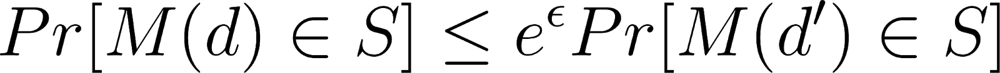
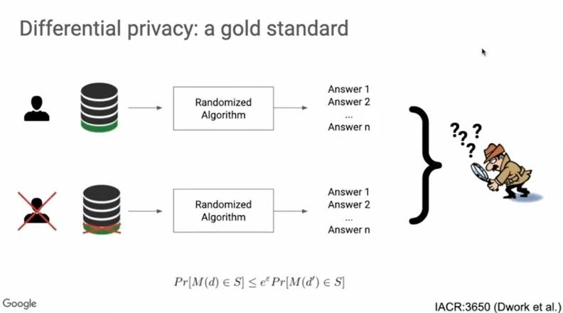
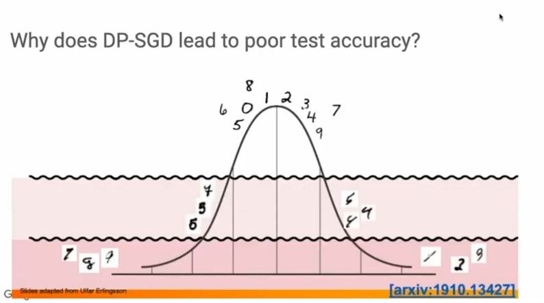
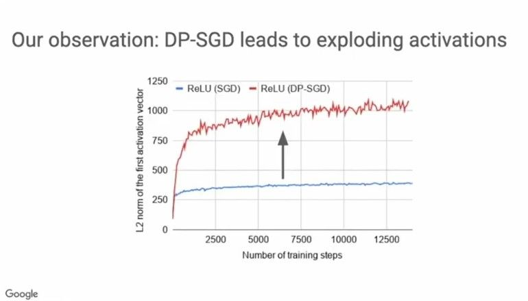
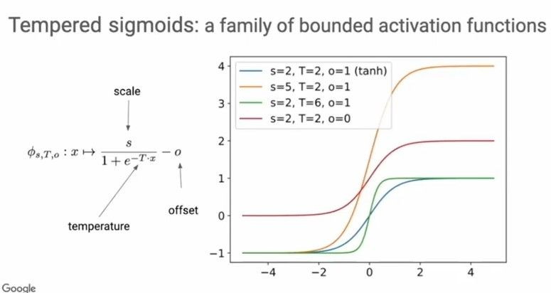
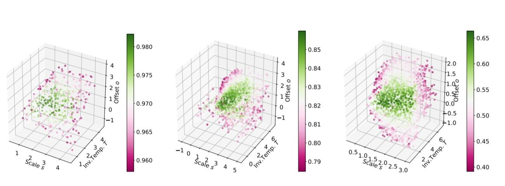
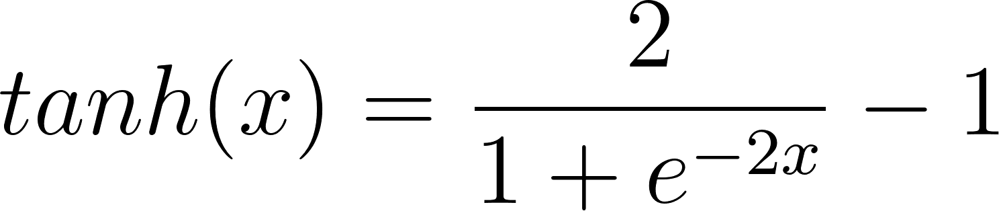
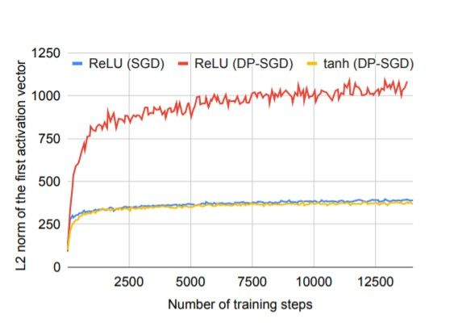
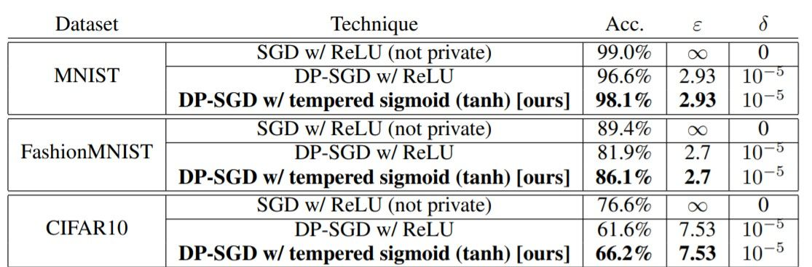

<!-- TODO(a11y): 9 localized body image(s) have empty alt text -->


> This is a summary of the talk by [Dr.Nicolas Papernot at the OpenMined Privacy Conference 2020.](https://medium.com/r/?url=https%3A%2F%2Fwww.youtube.com%2Fwatch%3Fv%3DYRVBSx0mpO8)

### Why is Privacy-Preserving Machine Learning important?

Today, machine learning models are widely used in several applications, including those involving sensitive data, such as deep learning systems in the healthcare industry, language models trained over private correspondence data etc.

There have been adversarial attacks that demonstrate the ability to infer whether or not a particular example was included in the training data, typically known as membership inference attacks. In a language model that is trained with an unusual sequence of words inserted in the training corpus, by feeding the beginning of the sentence to the resulting model, the rest of the sentence can be recovered.

Such vulnerabilities emphasize the need to ensure that the machine learning systems also come with rigorous privacy guarantees, whilst providing optimal performance. These guarantees are typically expressed in the framework of **Differential Privacy**.

### Differential Privacy

Differential Privacy has been the gold standard in the machine learning research community working on privacy guarantees. As shown in the illustration below,

> If the output of the learning algorithm to two different training datasets that differ by a single training example is indistinguishable to an adversary, then we’ve succeeded in ensuring differential privacy.

Mathematically,

<figure class="">



</figure>

Here, `d` and `d’` are two subsets of data that differ by a single training example. `M(d)` is the output of the training algorithm for the training subset `d` and `M(d’)` is the output of the training algorithm for the training subset `d’`. The probabilities that these outputs belong to a specific set S under both these conditions should be arbitrarily close. The above equation should hold for all subsets `d` and `d’`.

> **Smaller the value of Ɛ, stronger the privacy guarantees.**

<figure class="">



<figcaption>Illustration of Differential Privacy <a href="https://www.youtube.com/watch?v=YRVBSx0mpO8" rel="noopener">(Image Credits: Dwork et al.)</a></figcaption></figure>

### Differentially Private Stochastic Gradient Descent (DP-SGD)

In order to train a model with differential privacy, Differentially Private Stochastic Gradient Descent (DP-SGD) is used; the steps involved are shown below.

```python
Training a Model with Differentially Private SGD

Intialize parameters θ
for t= 1,2,...T, do
	Sample batch B of training examples
    Compute per-example loss L on batch B
    Compute per-example gradients of loss L wrt parameters θ
    Ensure L2 norm of gradients < C by clipping
    Add Gaussian noise to average gradients (as a function of C)
    Update parameters θ by a multiple of noisy gradient average
   
```

In DP-SGD, computing **per example loss** instead of average loss across all examples in the batch B, helps bound the sensitivity of the learning algorithm to each individual example and also facilitates the computation of the **per example gradients**. The gradients are clipped such that their L2 norm is below C and Gaussian noise, whose standard deviation proportional to the sensitivity of the learning algorithm, is added in the subsequent step to the average value of gradients.

In general, the test accuracy of DP-SGD is much lower than that of non-private SGD and this loss is often inevitable. In datasets whose distributions are heavy-tailed, because of the addition of noise, DP-SGD hinders visibility of examples that lie in the tail regions, as illustrated below.

<figure class="">



<figcaption>Hindered visibility of training examples in tail region on addition of noise <a href="https://www.youtube.com/watch?v=YRVBSx0mpO8" rel="noopener">(Image Credits: Nicolas Papernot et al.)</a></figcaption></figure>

### Exploding activations in DP-SGD

Another approach to assess the sensitivity of a learning algorithm is to attempt to quantify how much an individual learning point can, in the worst case, affect the learning algorithm’s output. In other words, we would like to bound the sensitivity strongly.

However, in DP-SGD we observe the problem of exploding activations which is why it’s often difficult to control the training algorithm’s sensitivity with minimal impact on the model’s performance. This is because, exploding activations cause the unclipped gradient magnitude to explode and clipping the gradient then leads to loss of information.

Here’s an example showing the increase in L2 norm by about 3–4 times even in the first activation layer, when ReLU is the activation function used.

<figure class="">



<figcaption>Exploding Activations when using ReLU <a href="https://www.youtube.com/watch?v=YRVBSx0mpO8" rel="noopener">(Image Credits: Nicolas Papernot et al.)</a></figcaption></figure>

### Introducing Tempered Sigmoids — a family of bounded activations

Tempered Sigmoids are a family of bounded activations given by the equation shown below. The `scale **s**`, `inverse temperature **T**` and `offset **o**` are the parameters that describe the family of tempered sigmoids.

<figure class="">



<figcaption>Tempered Sigmoids <a href="https://arxiv.org/pdf/2007.14191.pdf">(Image Credits: Nicolas Papernot et al.)</a></figcaption></figure>

As tempered sigmoids can approximate ReLU in their limits, the model trained using  DP-SGD with such activations, should perform no worse than the models trained with ReLU as the default choice of activation function.

The following plot shows the various accuracy scores corresponding to the different values of scale `s`, Inverse Temperature `T` and offset `o`, for models trained on MNIST, FashionMNIST and CIFAR10 datasets.

<figure class="">



<figcaption>Improved privacy-utility trade-offs with tempered sigmoids <a href="https://arxiv.org/pdf/2007.14191.pdf">(Image Credits: Nicolas Papernot et al.)</a></figcaption></figure>

It is observed that there’s a subset of tempered sigmoids that give better model performance; The average value of the 10% percent of best performing triplets (`scale s`, `inverse temperature T` and `offset o`) gives values approximately equal to `s=2,T=2,o=1`, and substituting these values in the equation for tempered sigmoids gives us the expression for `tanh`.

<figure class="">



</figure>

Subsequently, the model was trained using DP-SGD with `tanh` activation and it was observed that there was no problem of exploding activations and the performance was similar to that under non-private training, as shown in the plot below.

<figure class="">



<figcaption>DP-SGD with tanh activation does not lead to exploding activations <a href="https://arxiv.org/pdf/2007.14191.pdf">(Image Credits: Nicolas Papernot et al.)</a></figcaption></figure>

#### Hyperparameter Search

> The hyperparameters that optimize model performance under non-private need not necessarily be the optimal choice under differentially private training.

As constraints on privacy budget limit the number of steps that we can have for DP-SGD, tuning the learning rate to maximize performance given a privacy budget is the optimal approach to hyperparameter search.

The following table gives the summary of results comparing ReLU to tempered sigmoids (represented here by `tanh`) in their respective best performing setting (i.e., each row is the result of a hyperparameter search).

<figure class="">



<figcaption>Improving DP-SGD state-of-the-art with tanh (Image Source: <a href="https://arxiv.org/pdf/2007.14191.pdf">arxiv.org/pdf/2007.14191.pdf)</a></figcaption></figure>

It is observed that DP-SGD with `tanh` activation yields better results. In practice, bypassing non-private training altogether and focusing on exploring architectures more amenable to differentially private training can often be beneficial.

#### Reference

\[1\] [Tempered Sigmoid Activations for Deep Learning with Differential Privacy](https://arxiv.org/pdf/2007.14191.pdf)

Cover Image of Post: [Photo](https://unsplash.com/photos/iar-afB0QQw) by [Markus Spiske](https://unsplash.com/@markusspiske?utm_source=ghost&utm_medium=referral&utm_campaign=api-credit) on Unsplash.
