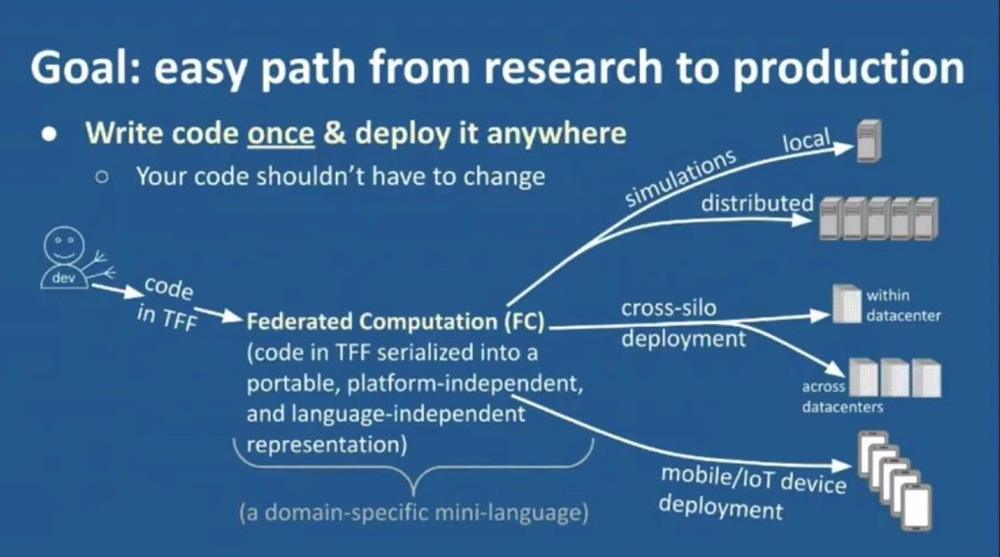
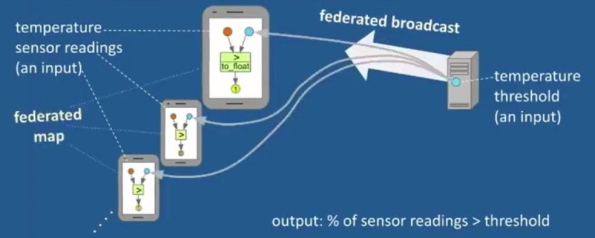

<!-- TODO(a11y): 2 localized body image(s) have empty alt text -->


> **Krzysztof Ostrowski** is a Research Scientist at Google, where he leads the **TensorFlow Federated** development team. This blog post is inspired by his talk at the OpenMined Privacy Conference.

### What is TensorFlow Federated?

**TensorFlow Federated(TFF)** is a new development framework for Federated Computations, that typically involve computations on data that is **born decentralized and stays decentralized**. TFF provides a common framework for federated computations in both research and production and is an open source project within the TensorFlow ecosystem.

> **What’s in the TensorFlow Federated library?**

-   **Federated Computation API(FC API)** that provides new abstractions, execution models and language designed for federated computations.
-   **Higher-level libraries and canned APIs** that provide implementations of federated learning algorithms.
-   **Runtime and Simulation Components** that provide datasets, canned training loops and single to multi-machine runtime, including flexible integration points for custom backend.

### Design Goals for TFF

The TFF library has been designed so as to facilitate an **easy path from research to production**. In TFF, the code is serialized into a portable, language-independent and platform-independent representation.  
The design is, therefore, motivated by the dictum:

> **Write code once, and deploy it anywhere**;  
> **Your code shouldn’t have to change!**

<figure class="">



<figcaption>Easy path from research to production <a href="https://www.youtube.com/watch?v=1MjHVELLpO0">(Image Credits:Krzysztof Ostrowski)</a></figcaption></figure>

### Understanding the characteristics of Federated Computations(FC)

In this section, we shall seek to understand some of the characteristics of federated computations.

-   **Distributed Programming for privacy, anonymity** and **scale:** In such systems, the **client stays on-device**, because it’s very sensitive. We can have millions of clients coming and going continuously. The clients are assumed to be **anonymous, unreliable** and **stateless**. No client IDs are allowed in computation. There are no one-to-one interactions between clients, only **collective operations** are involved.  
    Let us consider the example given in the illustration below.  
    Let us assume that _**temperature sensor readings**_ of client devices are **_sensitive_**; The server wishes to get the percentage of client devices whose temperature sensor readings **exceed a certain threshold**. There’s **federated broadcast** of the _**threshold**_ to all client devices. The client devices run a simple threshold check and send out a `1/0` depending on whether **temperature > threshold** is `True/False` respectively. The server then does federated averaging on the values from the clients, which gives the fraction of devices whose temperature exceeds the threshold.

<figure class="">



<figcaption>Illustration of federated broadcast and local processing on client devices <a href="https://www.youtube.com/watch?v=1MjHVELLpO0">(Image Credits:Krzysztof Ostrowski)</a></figcaption></figure>

-   **Clients** and **Server** bear **complementary responsibilities —** the server orchestrates the training process, while the clients perform the bulk of processing, such as model training.
-   **Slicing** and **Dicing** distributed (federated) values: A value is ‘federated’ if it can exist in multiple places. In our example, we may think of ‘_temperature readings_’ as `federated float32@clients`
-   Involves communication and orchestration  —  collective operations, known as **federated ops**, rather than dealing with individual client’s data.

#### TFF’s Federated Computation API

The program flow is expressed in a Pythonic way for better interpretability; As stated in an earlier section, all code is traced and serialized at definition time to a platform-independent representation. Here’s the code snippet showing the **collective operations** and **on-device processing** for the temperature sensor example discussed above.

```python
@tf.function
def exceeds_threshold_fn(reading,threshold):#on-device processing    
	return tf.to_float(reading > threshold)
    
@tff.federated_computation
def get_fraction_over_threshold(readings, threshold):    
return tff.federated_mean( #collective operations            				
	   tff.federated_map( #collective communication                    	
            tff.tf_computation(exceeds_threshold_fn),               		
            [readings, tff.federated_broadcast(threshold)]))
```

#### TFF’s Canned and Simulation APIs

We shall enumerate some of the features of TFF’s Canned and Simulation APIs.

-   One-line call to create portable TFF code for federated training.

```python
# Just plug in your Keras model
train = tff.learning.build_federated_averaging_process(...)
```

-   To run a simulation, we can invoke just like a Python function, similar to the example below; By default, a single-machine in-process TFF runtime is spawned in the background.

```python
state = train.initilaize()
for _ in range(5):    
	train_data = _ #pick random clients    
    state, metrics = train.next(state, train_data)    
    print(metrics.loss)
```

#### Canned TFF Executors

Canned TFF Executors provide support for the most common scenarios. A single-machine, multi-threaded execution is spawned by default in the background, and the Canned TFF Executors facilitate remote and distributed execution. TFF executor building blocks are reusable, stackable modules that add to individual capabilities and are specifically designed for extensibility and customizability.

### Collaboration opportunities for Open Source contributors

There are opportunities to contribute to the _federated algorithms suite,_ _simulation infrastructure_ and more _flexible runtime integrations_.

---

### References

\[1\] [https://www.tensorflow.org/federated](https://www.tensorflow.org/federated)

\[2\] Krzysztof Ostrowski, [TensorFlow Federated](https://www.youtube.com/watch?v=1MjHVELLpO0), OpenMined PriCon, 2020

\[3\] Cover Image of Post: [Photo](https://unsplash.com/photos/1FxMET2U5dU) by [Héctor J. Rivas](https://unsplash.com/@hjrc33?utm_source=ghost&utm_medium=referral&utm_campaign=api-credit) on Unsplash.
