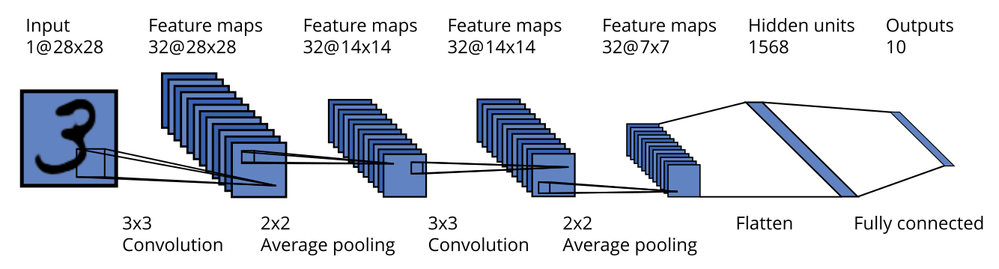
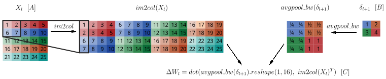
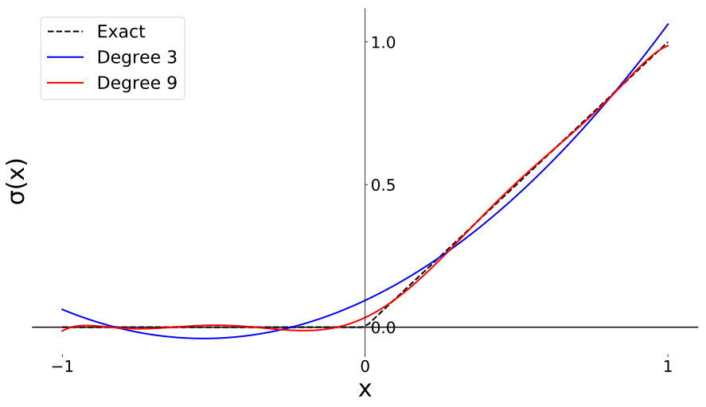

Most efforts to privately train machine-learning models either use homomorphic encryption or secure multi-party computation (MPC). Recent insights indicate that the latter has the most potential. Here we will describe the implementation of Convolutional Neural Networks (CNNs) using MPC. This post is heavily inspired by [earlier work](http://mortendahl.github.io/2017/09/19/private-image-analysis-with-mpc/) that describes how CNNs can be privately fine-tuned after first training on a public dataset. As this post builds upon concepts in that previous post, it might be wise to take a look at that first. The focus of this post is slightly different: What if we want to train a CNN from scratch without transfer learning? This requires some complex private operations with substantial consequences for the CPU time and communication complexity (the number of bits send between the participants). We won’t dive deep into the proposed setting and security guarantees, as they are already extensively described in Morten Dahls post mentioned above. Furthermore, some notable papers on the topic are [SecureML](https://eprint.iacr.org/2017/396.pdf) and [DeepSecure](https://arxiv.org/abs/1705.08963). Here, the focus will be on the needed operations and how to reduce the communication complexity.

Many thanks to [Christian Schaffner](https://homepages.cwi.nl/~schaffne/) and [@mortendahl](https://twitter.com/mortendahlcs) for guidance, feedback and discussion on the topic and [@iamtrask](https://twitter.com/iamtrask?ref_src=twsrc%5Egoogle%7Ctwcamp%5Eserp%7Ctwgr%5Eauthor) and the OpenMined community for providing a platform for this blogpost. **TL;DR:** An extension of the original code is available [here](https://github.com/koenvanderveen/privateml/blob/master/image_analysis/Convnet.ipynb) if you want to get your hands dirty, or skip the technical stuff and find out [what this all means](#communication).[  
<video src="/blog/training-cnns-using-spdz/convnet-jupyter.mp4" autoplay loop muted playsinline aria-label="Training a convnet in Jupyter Notebook."></video>  
](https://github.com/koenvanderveen/privateml/blob/master/image_analysis/Convnet.ipynb)

## Existing parts

To enable private machine learning, computations can be distributed over multiple machines using MPC. Many forms of MPC exist, based on different mechanisms. Some of them use [binary circuit evaluation](https://arxiv.org/abs/1705.08963), which is nice as it is Turing complete, meaning that it can perform all computations a normal computer could do. However, machine learning uses many computations on floating points, making it very costly to express them as binary operations. SPDZ is an example of an MPC approach that uses secret-sharing to mask the values used in the computations. This allows for arithmetic circuit evaluation, which is greatly more efficient for training neural nets. However, arithmetic circuits aren’t well suited for all necessary computations: additions and multiplications are perfectly fine, exponents and nonlinear functions are very expensive.

Morten Dahl’s post describes how multiplication and addition is performed privately for tensors using SPDZ, directly enabling the dot products and element-wise multiplications used in dense layers and sigmoid layers, essential building blocks for neural networks.

For the dot products, [specialized triples](http://mortendahl.github.io/2017/09/19/private-image-analysis-with-mpc/#dense-layers) are created, ensuring that every value used in a dot product is only masked once. Masking values once is an important concept that will be reused throughout this post. Besides dot products, an activation function is introduced by approximating the sigmoid function using a polynomial, which also exclusively uses multiplications and additions.

## New operations

With dense layers and sigmoid functions you can build a multilayer perceptron, but [CNNs](https://www.tensorflow.org/tutorials/deep_cnn) also require convolutional layers. Typically, a convolutional layer is combined with an activation function and max pooling. For deep convnet architectures, the sigmoid activation function is not the most favorable option, as the [vanishing gradient problem](https://en.wikipedia.org/wiki/Vanishing_gradient_problem) may arise. One of the most widely used alternatives to prevent this is the [ReLU](https://en.wikipedia.org/wiki/Rectifier_\(neural_networks\)) function. Both the ReLU and max pooling are nonlinear operations, which are expensive to compute in MPC. Therefore, the ReLU is approximated using a polynomial and the max pooling is replaced by average pooling. The following sections describe how these operations are implemented, and how their communication complexity can be reduced.



  
The architecture consists of two conv + pool layers and one fully connected layer.

### Convolutions in SPDZ

An efficient forward phase of convolutional layers can be implemented by extracting patches from an input tensor (in the first layer this is a batch of images), reshaping the result, and performing a dot product with the weights of the convolutional layer, which are often called filters. A simple implementation of a convolutional layer can be found [here](https://wiseodd.github.io/techblog/2016/07/16/convnet-conv-layer/), which is used as a basis for our implementation.

```python
def conv2d(x, filters, strides, padding):
    # shapes, assuming NCHW
    h_filter, w_filter, d_filters, n_filters = filters.shape
    n_x, d_x, h_x, w_x = x.shape
    h_out = int((h_x - h_filter + 2 * padding) / strides + 1)
    w_out = int((w_x - w_filter + 2 * padding) / strides + 1)

    X_col = x.im2col(h_filter, w_filter, padding, strides)
    W_col = filters.transpose(3, 2, 0, 1).reshape(n_filters, -1)
    out = W_col.dot(X_col).reshape(n_filters, h_out, w_out, n_x).transpose(3, 0, 1, 2)

    return out
```

Extracting the patches from an image is done by an operation called [im2col](https://github.com/koenvanderveen/privateml/blob/master/image_analysis/im2col/im2col.py), explained [here](http://cs231n.github.io/convolutional-networks/). Typically, patches are overlapping and hence the output of this operation contains many duplicates. For example, for a convolutional layer with input (X) of shape (128, 32, 14, 14) (NCHW), (im2col(X)) has shape (288, 25088). (X) has 802,816 values, while (im2col(X)) has 7,225,344 values.

When implemented naively, all outputs are masked and broadcast to the other party during the successive dot product with the weights, resulting in large communication overhead. But we can optimize this fairly simple: We create a specialized triple for the convolution for which holds: (im2col(A) cdot B = C). Therefore, only a masked version of both the inputs (masked with (A)) and the weights (masked with (B)) are communicated, without any duplicates.

```python
def generate_conv2d_triple(x_shape, y_shape, strides, padding):
    h_filter, w_filter, d_filters, n_filters = y_shape
    a = np.random.randint(Q, size=x_shape)
    b = np.random.randint(Q, size=y_shape)

    a_col = im2col(a, h_filter, w_filter, padding, strides)
    b_col = b.transpose(3, 2, 0, 1).reshape(n_filters, -1)
    # c = conv2d(a, b)
    c = np.dot(b_col, a_col).reshape(n_filters, h_out, w_out, n_x).transpose(3, 0, 1, 2)
    return a, b, c
```

In the backward phase of a convolutional layer, we compute two things: The gradient of the weights (Delta W), and the backpropagated error (delta\_l). For the gradient of the weights (Delta W\_l), (omitting the required reshape and transpose operations) we compute:

$$ Delta W\_l = im2col(X\_l) cdot delta\_l text{x}$$

where (X) is the original input of the layer and (delta\_{l+1}) is the backpropagated error of the next layer. As here the im2col operations is used again, we can similarly create a specialized triple for this operation, eliminating duplicates.

For the backpropagated error (delta\_l), we compute:

$$ delta\_l = delta\_{l+1} cdot W\_{l+1} text{,} $$

followed by the col2im operation, which transforms the resulting patches back to an image.

The formulas given here are a bit simplified, as we see in the pseudocode, in practice the matrices are reshaped and transposed to enable the correct computations. Check out the code for the actual implementation.

### Average pooling

In contrast to max pooling, [average pooling](https://en.wikipedia.org/wiki/Convolutional_neural_network#Pooling) can be trivially implemented using SPDZ. In the forward phase, patches are extracted and their values are averaged: summed and divided by a public constant. In the backward phase we use the col2im operation followed by the same public division to create the appropriate back-propagated error. This col2im operation on itself does not include any communication, but it does introduce copies in the backpropagated error, resulting in communication overhead in the rest of the backward phase.

To reduce this communication overhead, we can combine the average-pooling layer with its preceding layer. As explained in the next section, instead of inserting activation functions after convolutional layers, we insert them after pooling. Therefore, the average pooling is combined with a convolutional layer. As explained in the previous section, the backpropagated error from the average pooling is now used twice in the convolutional layer: To compute the weight gradients, and to compute the backpropagated error. One of the operations already has a specialized triple, but we can alter the triple to optimize for communication even further. The values in the incoming backpropagated error in the average-pooling layer are broadcast first. Then, every broadcast value is repeated through the pool window and we take a dot product with either the weights or the input of the convolutional layer, to compute the backpropagated error or the gradients of the convolutional weights respectively. To enable this we create a triple ((A),(B),(C)) with the following properties, again ommiting reshape and transpose operations for the sake of simplicity:

$$ C = im2col(A) cdot avgpooltext{\_}bw(B) text{,} $$

where (A) is used to mask the input of the convolutional layer (X\_l), (B) is used to mask the incoming backpropagated error (delta\_{l+1}) of the average-pooling-layer and (C) is used to mask the resulting weight gradients (Delta W\_l).



  
Triple (A, B, C) for the backward conv pool operation. Masking the smaller matrices (before the im2col and avgpool\_bw operations) reduces the communication cost.

```python
def generate_conv_pool_backward_triple(xshape, yshape, n_filter):
    a = np.random.randint(Q, size=xshape)
    a_col = im2col(a)

    b = np.random.randint(Q, size=y_shape)
    b_expanded = np.repeat(np.repeat(b, poolsize, axis=2), poolsize, axis=3)
    b_expanded_flat = b_expanded.transpose(1, 2, 3, 0).reshape(n_filter, -1)

    c = dot(b_expanded_flat, a_col.transpose())

    return a, b, c
```

### ReLU activations

Similarly to sigmoid functions, the ReLU function can be [approximated by a polynomial](https://github.com/koenvanderveen/privateml/blob/master/image_analysis/ReLU.ipynb):

$$ y = a\_0 + a\_1 x + a\_2 x^2 + … + a\_{d} x^{d} text{,}$$

where the regular ReLU simply sets all negative values to zero, a rather cheap operation, a polynomial requires computation of several powers of (x) up to the degree of the polynomial, and a dot product with the public coefficients of the approximation. When we normalize the inputs between \[-1, 1\] and initialize the weights with zero mean and small standard deviation ((<<1)) we can get away with approximating the ReLU on the \[-1,1\] interval. Choosing a larger interval might be a necessary for other applications, especially when inputs aren’t normalized.



  
ReLU approximations, degree 3 is used in all experiments.

Using private tensors, the usually cheap ReLU operation becomes expensive in terms of communication. Therefore, we replace the regular ReLU with a low degree approximation, degree = 3, which already reaches 83% accuracy with a single layer convolutional architecture after training one epoch. When using a regular ReLU this is 86%, and the difference appears to get smaller when training longer.

Because of the approximation, the ReLU is an expensive layer in terms of communication. We can partly reduce this overhead quite easily by performing the ReLU approximation after the average-pooling layer. The pooling layer reduces the dimension of the input tensor significantly: An average-pooling layer with a pooling window of 2×2 reduces the number of values by a factor 4.

When computing the degree 3 polynomial needed for the ReLU approximation, we compute (x^2) and (x^3). When (x cdot x) is computed, we do not need to share (x) twice: we can create a triple for which holds (A cdot A = B) and only broadcast (A). Moreover, when we compute (x^3 = x^2 cdot x), we are again using (x) and therefore we can again reuse the same (A) to mask (x). Instead of broadcasting (x) three times, we can now broadcast (x) once.

```python
def generate_square_triple(xshape):
    a = np.random.randint(Q, size=xshape)
    aa = np.power(a, 2) % Q
    return a, aa
```

## Reusing triples

As we saw with ReLU activations, using a private variable for different operations may also introduce opportunities to reduce communication. This is occurring across many places in the network. When a variable (A) is used in two operations with (B) and (C) to create (D) and (E), we can create triples such that:

$$ operationtext{\_}1(A,B) = D ~text{ and }~ operationtext{\_}2(A,C) = E text{.}$$

When implemented naively, the backward phase of learning is much more expensive in terms of communication than the forward phase. In the forward phase, every layer except the activation consists of one multiplication. However, in the backward phase the backpropagated error is typically used in two operations: once to compute the backpropagated error for the previous layer, and once to compute the weight updates. Moreover, both the weights and the layer inputs have been used already in operations in the forward phase to compute the layer output, and can therefore be reused in the backward phase.

## Communication

How much did we gain from our optimization? To gain insight we compare the number of values communicated per participant in one iteration for a batch size of 128 images from [MNIST](http://yann.lecun.com/exdb/mnist/) of a simple two layer convnet with the optimized version. The baseline does use specialized triples for dot products, but none of the other specialized triples and it does not reuse any triples.

From this table, we can conclude that the backward phase provides most opportunity for optimization. For the baseline, the backward phase is more expensive than the forward phase. For the optimized model, it is the other way around. This is mainly because we can reuse the masks created in the forward phase.

We see that this approach **reduces communication of the total network by about a factor 6**. For some layers, the reduction is much larger, depending on the size of the input, output and weights (and a few other hyperparameters). Especially for the second convolutional layer, which is also easily the most expensive layer in terms of communication, where the reduction is 16x (!). Note that this layer uses many of the various optimization tricks: 1) For both the forward and the backward phase, we use specialized triples; 2) For the backward phase we can reuse the backpropagated error, as it is used in two operations; and we can reuse the layer inputs and the weights, as they are already used in the forward phase; 3) We use combined specialized triples with the average-pooling layer, and therefore we do not communicate the duplicates in the backpropagated error of the average-pooling layer.

|  | Baseline | Optimized |
| --- | --- | --- |
| Layer | Forward | Backward | Total | Forward | Backward | Total |
| --- | --- | --- | --- | --- | --- | --- |
| conv2D (32,3,3) | 903K | 4,114K | 5,018K | (17%) | 101K | 803K | 903K | (18%) |
| avg\_pooling2D (2,2) | – | – | – |  | – | – | – | – |
| ReLU (approx) | 3,211K | 3,211K | 6,423K | (22%) | 1,606K | 803K | 2,408K | (47%) |
| conv2D (32,3,3) | 7,235K | 8,840K | 16,075K | (54%) | 812K | 201K | 1,013K | (20%) |
| avg\_pooling2D (2,2) | – | – | – |  | – | – | – | – |
| ReLU (approx) | 803K | 803K | 1,606K | (5%) | 401K | 201K | 602K | (12%) |
| dense (10,1568) | 216K | 219K | 435K | (1%) | 216K | 1K | 218K | (4%) |
| total | 12,368K | 17,188K | 29,556K | (100%) | 3,136K | 2,008K | 5,144K | (100%) |

Communicated # of 128 bit values per iteration in the double convlayer architecture.

## What’s next?

When executing the code, it might strike you that this implementation is very slow. Since 128-bit integers are used to represent floating points, we make use of the numpy object dtype, which results in a slowdown of roughly a factor 100 compared to numpy float operations. But there are [solutions](http://mortendahl.github.io/2018/03/01/secure-computation-as-dataflow-programs/#basics) that largely reduce this overhead. Moreover, SPDZ introduces extra operations for multiplications and additions, and, as this is a simulation, both are carried out on the same machine, resulting in a combined overhead of about a factor 8.

This blog and the accompanying code is meant to explore the current challenges and limitations of machine learning using MPC. Moreover, the proposed optimizations might be adopted by real frameworks implementing ML on MPC. There already exist real implementations [here](https://mortendahl.github.io/2018/03/01/secure-computation-as-dataflow-programs/) and [here](https://github.com/OpenMined/Grid/blob/master/grid/lib/MPCModelDemo.ipynb), which distribute the work over multiple machines, but there is still a lot of work to be done to be able to use these implementations as a framework for private machine learning.

The field of private machine learning is developing rapidly. Spreading new ideas and making them accessible is key for rapid adoption by the machine learning community. We hope that this blogpost is a small step in the right direction. For any questions or discussion, please join the [OpenMined slack](http://slack.openmined.org).
