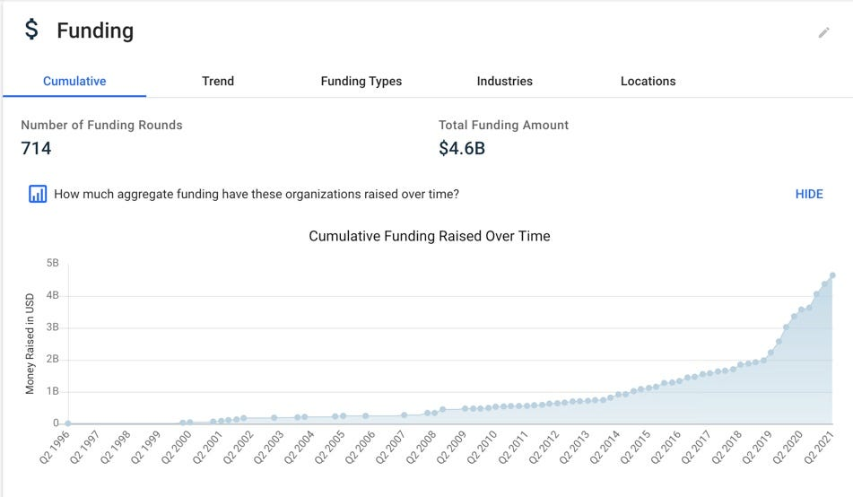
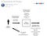

<!-- TODO(a11y): 2 localized body image(s) have empty alt text -->

<!-- TODO(content): shortcode(s) present (verify) -->

### An attempt to avoid talking past each other so we can instead direct our efforts towards moving the needle on privacy through privacy innovation

<figure class="">

<figcaption>Cumulative funding towards privacy companies. Source: Crunchbase.</figcaption></figure>

\[**Originally published by [Lourdes M. Turrecha](https://twitter.com/LourdesTurrecha) in the [Privacy & Technology Medium blog](https://medium.com/privacy-technology/defining-privacy-tech-ae7b022888ec). Part 2 of this privacy tech series will provide a framework for __assessing privacy tech__. Part 3 will cover the __privacy problems that are solvable/not solvable through technology__.**\]

There is increasing interest in the nascent privacy tech landscape.

Entrepreneurs are building solutions in response to privacy and data protection problems. As of the publication of this post, Crunchbase lists [824 self-described privacy companies](https://www.crunchbase.com/hub/privacy-companies).

Investor interest in funding privacy tech startups is also strong, even in the midst of the pandemic when funding was reportedly stalled. Crunchbase reports that investors have poured $4.6B in cumulative funding towards emerging privacy companies.

2020 saw the first two privacy tech startups gaining unicorn status: OneTrust and BigID.

In the midst of the pandemic, COVID-19 tool developers came out touting privacy features, including Apple and Google’s joint contact tracing proposal.

In the consumer space, people’s concern over their privacy led to their increased adoption of the Signal messaging app, which made it the top downloaded app during last year’s wave of national protests in support of the Black Lives Matters movement. Signal downloads surged again during the recent US national elections and in early 2021 after Elon Musk urged his Twitter followers to “Use Signal.” Users are also increasingly using privacy tech tools like Brave and DuckDuckGo, which have reported similar increased adoption as privacy preserving alternatives to existing privacy invasive browsers and search engines.

Clearly, privacy tech is on the rise, but understanding of what constitutes privacy tech remains low.

What exactly is privacy tech? And how nascent is it, really?

## **What is privacy?**

To define and understand privacy tech, it is important to understand the operative term: privacy. There are different branches of privacy: physical, behavioral, decisional, and information privacy. In today’s digital world, the other branches of privacy often feed into information privacy.

Thanks to many privacy scholars, privacy is a well-covered and explored concept. Perhaps the most widely accepted definition of privacy centering on individual control over personal information. That said, different scholars have offered varying conceptions of privacy beyond individual control: secrecy, trust, obscurity, power, contextual integrity, just to name a few. We briefly expand on some of these conceptions below.

## Privacy as Secrecy

Privacy as secrecy underpins the US constitutional right to privacy, stemming from SCOTUS cases, __Griswold__ and __Roe__. While valid, this conception is a narrow and limited one, failing to recognize that individuals want to keep things private in some contexts, but not others.

## Privacy as Control

Alan Westin defined information privacy as “the claim of individuals, groups, or institutions to determine for themselves when, how, and to what extent information about them is communicated to others.” This is perhaps the most commonly accepted definition of information privacy: individuals retain ultimate control over their personal data, including how much of it is disclosed and to whom, as well as how it should be maintained and disseminated.

## Privacy as Power

Building on the privacy as choice school of thought, Carisa Veliz argues that privacy is power. In a world where personal data is constantly being harvested and exploited through a surveillance economy, she urges users to exercise their power and take back control over their personal data.

## Privacy as Trust

In contrast, Neil Richards and Woodrow Hartzog conceptualize privacy as trust. Trust, here, includes building information relationships over time. Trust allows us to develop more long-term relationships when it comes to information by having sincere exchanges with the confidence that the data we’ve shared will be used for our benefit, not to our detriment.

Ari Ezra Waldman furthers this point by explaining that what makes expectations of privacy reasonable are expectations of trust. Waldman defines trust as a social fact of cooperative behavior, manifested by reciprocal exchanges, assumptions about intentions, and expectations regarding future action. Trust is described here as a functional necessity of society because it “greases the wheels of effective sharing,” or in other words, trust encourages interactions. Tying this concept to privacy, Waldman argues that when we trust, we share our personal information.

## Privacy as Obscurity

Evan Selinger and Woodrow Hartzog also explore the concept of obscurity and how it applies to privacy. They explain that obscurity is the idea that information or people are safe, when they are hard to obtain or understand. If information is hard to access or understand, the only people who will take advantage of it are those who are sufficiently motivated to break barriers or expend effort and resources to access or understand it.

## Privacy as Contextual Integrity

Helen Nissenbaum offers contextual integrity as an alternative conception of privacy, accounting for privacy norms or expectations in different contexts. Nissenbaum explains that contextual integrity links privacy protection to norms for specific contexts, so that “information gathering and dissemination \[are\] appropriate to that context and obey the governing norms of distribution within it.”

## A Broader Conception of Privacy Based on Privacy Problems

Daniel Solove argues that instead of forcing a unified conception of privacy, we should conceive privacy in a more pluralistic way, focusing on __privacy problems__. Solove provides a taxonomy of privacy problems broken down into four main categories: information collection, information processing, information dissemination, and invasion.

<figure class="">

<figcaption>Solove’s A Taxonomy of Privacy. Source: TeachPrivacy.</figcaption></figure>

As explored by the privacy thinkers cited above, privacy is a complex, multi-faceted concept that encompasses secrecy, individual control, trust, obscurity, power, and context. Because many of these conceptions of privacy are limited and do not fully represent privacy on their own, it makes sense to adopt a broader conception of privacy by looking at privacy problems.

## **What is (and isn’t) privacy tech?**

P****__rivacy tech is the broad term used to describe technology solutions that solve privacy problems.__****

> _Privacy tech is the broad term used to describe technology solutions that solve privacy problems._

That said, solving a privacy problem doesn’t necessarily need to be a privacy tech tool’s primary purpose. Privacy tech can have a privacy solution be a key differentiating feature. Examples of these are the aforementioned Brave, Signal, and DuckDuckGo products, which are primarily browsing, searching, and messaging tools that are built with privacy as a key differentiating feature.

The privacy tech landscape might be nascent from funding and market viability standpoints, but privacy tech is the culmination of decades’ worth of developments from privacy academia and thought leadership (as covered above), the privacy regulatory landscape, the privacy engineering field, the maturing of early privacy enhancing technologies, the development of consumer privacy sentiment, and, most recently, VC interest in privacy tech solutions. All of these paved the way for privacy innovation and created a market for tools that solve privacy problems.

To further illustrate privacy tech’s scope, in addition to defining it, we explore its relationships to the following existing concepts that are often used alongside or interchangeably with it: security, privacy enhancing technologies, privacy by design, privacy engineering, data protection compliance tools, and privacy-first tech.

## Privacy tech is **not the same as cybersecurity tech**, but they do intersect

The information privacy and security domains intersect, but there is also a clear distinction between the two. The two domains intersect where: information privacy requires that personal information be secured during its entire lifecycle — from collection and use, to transit, storage, and destruction. But the privacy domain covers a breadth of inquiries beyond security, such as transparency (notice and consent), data minimization, purpose specification, individual rights, etc.

There are existing bodies of literature defining privacy and security. But for the purpose of this article, we refer back to the complex and multi-faceted conceptions of privacy that encompass individual control, trust, obscurity, power, context, and anonymity. Whereas, information security is concerned with the confidentiality, integrity, and availability of information (not just personal information, but also trade secrets, intellectual property, and other information that warrants securing) and the systems that process such information.

Given privacy’s breadth of inquiry beyond security, the privacy and security conflation is oftentimes an indicator that a self-proclaimed privacy tech company may not understand privacy, or that it may not really be a privacy tech company (but is a security company capitalizing on the rising privacy tech marketplace).

## Privacy tech **covers privacy enhancing technologies (PETs)**

Privacy tech encompasses privacy enhancing technologies (PETs), but also more. It’s hard to definitively claim that privacy tech is merely PETs because there is currently no universally accepted definition for PETs.

That said, the Organisation for Economic Co-operation and Development’s (OECD) definition of PETs is illuminating: __PETs commonly refer to a wide range of technologies that help protect personal privacy. PETs aim to give the individual user or technology manager the capability of controlling if, how much or under what circumstances information is disclosed.__

PETs’ primary aim is to protect __personal__ privacy, whereas privacy tech covers solutions that solve for __organizational data protection problems__. In addition, PETs’ __primary aim__ is to solve for personal privacy by giving the individual user or technology manager the capability of controlling if, how much or under what circumstances information is disclosed; in contrast, privacy tech covers solutions that may have other __primary__ purposes in addition to solving a privacy problem. Therefore, based on this commonly used OECD PETs definition, PETs are privacy tech, but privacy tech tools are not necessarily always PETs. Privacy tech also covers tools whose primary aim may not be to solve for privacy, but instead do so through a key differentiating feature.

Another second widely cited definition of PETs is: a coherent system of technology measures that protect privacy by eliminating or reducing personal data or by preventing unnecessary and/or undesired processing of personal data; __all without losing the functionality of the data system__.

Under this second definition for PETs, a technology that blocks online ad tracking would not be a PET because it interferes with system functionality, but it would certainly be privacy tech because it solves for a privacy problem: a user’s choice not to be tracked. In comparison, a technology that allowed ad personalization while giving users control over their personal data would be a PET under this second definition for PETs and, in turn, would also be privacy tech because it both solves for a privacy problem (user control over their personal data) without losing ad functionality.

PETs have also been used to cover computational tools such as differential privacy, homomorphic encryption, secure multi-party computation, and zero-knowledge proofs.

For a long time, PETs rarely made it to market due to challenges surrounding tech maturity and business model. The broader umbrella of privacy tech, on the other hand, covers some tools that are already out in the marketplace, ready for users.

## Privacy tech also **includes “privacy-first” tools**

In addition to PETs, privacy tech also includes “privacy-first” tools, a term used to describe tools that provide their service in a privacy-forward way. Their primary purpose is not to solve for a privacy problem. Instead, their primary purpose could be anything else, including search (in the case of DuckDuckGo), browsing (Brave), and messaging (Signal). That said, these tools offer privacy solutions despite their non-privacy primary purpose. Brave solves for privacy problems in web browsing; DuckDuckGo, in search; and Signal, in messaging.

Because their primary purpose is not privacy, one could argue that the term “privacy-first” is an ill-fitting term for such tools. Other more appropriate terms could be “privacy-forward,” “privacy-friendly,” or simply, “privacy tech.”

Setting aside the appropriate label, at the end of the day, these tools solve privacy problems (albeit as a secondary purpose), and therefore fall under the broader umbrella of privacy tech.

## Privacy is not anonymity, but privacy overlaps with anonymity, which means privacy tech **overlaps with and covers anonymity tech**

With today’s government surveillance and surveillance capitalism double whammy, it’s not surprising that a slew of anonymity tech have popped up. Anonymity tech are tools that help users maintain anonymity online. These include [Tor](https://www.torproject.org/), certain Zero Knowledge Proofs roll-ups to Blockchain, and other cryptographic technologies that solve for anonymity.

As covered above, privacy is by no means anonymity. Anonymity is an incomplete take on privacy. Under the privacy as choice school of thought, privacy covers other individual choices and exercises of power over personal information, beyond the choice to remain anonymous. Anonymity is merely one way to exercise privacy choice — it’s an incomplete take on privacy but still an important aspect of it.

Anonymity tech solves for an individual’s problem stemming from a desire to remain anonymous in certain situations in this highly connected and surveilled world. Because privacy includes individual choice and context, the choice to remain anonymous in certain contexts is a privacy problem. This means that anonymity tech is covered under the broader umbrella of privacy tech.

## Privacy tech is **neither privacy by design nor privacy engineering**, but good privacy tech requires both

Privacy tech is neither privacy by design nor privacy engineering. It is a distinct concept on its own, but it does require both.

Lowercase privacy by design means privacy aforethought. Building upon this, Ann Cavoukian [coined](https://www.ipc.on.ca/wp-content/uploads/Resources/7foundationalprinciples.pdf) uppercase __Privacy by Design__, which covers the following set of privacy design principles: (1) proactive and preventative, not reactive or remedial; (2) privacy as the default setting; (3) privacy embedded into design; (4) positive-sum full-functionality; (5) end-to-end security; (6) visible and transparent; and (7) respect for user privacy. In short, PbD articulates seven goals for privacy design, but does not tell us how to get there.

Enter __privacy engineering__, the “how” to PbD’s “what.” Coined by Thomas Finneran, privacy engineering refers to “a discrete discipline or field of inquiry and innovation … using engineering principles and processes to build controls and measure into processes, systems, components, and products that enable the authorized, fair, and legitimate processing of personal data.” Privacy engineering provides a discipline for achieving Privacy by Design principles.

Bringing these concepts together, privacy tech is one of the tangible outputs of theoretical privacy by design. Privacy engineering provides the discipline (or the __ho__w) for translating privacy by design principles (or the __what__)__,__ to an output, such as a process, a feature, or even a privacy tech tool. (In a subsequent piece, we further explore privacy by design’s and privacy engineering’s roles in assessing quality privacy tech.)

## Privacy tech covers B2B **data protection compliance tools**

Privacy tech includes B2B data protection compliance tools, which may not necessarily or directly improve personal privacy, unlike PETs. Instead, these B2B privacy compliance tools help companies solve their privacy or data protection compliance problems. These compliance tools may not directly address individual privacy, but the argument is as follows: because data protection laws are supposed to improve individual privacy, these compliance tools are helping companies improve their data protection practices, which in turn should then improve these companies’ own users’ privacy.

## Privacy tech also covers B2C **consumer privacy tools**

Although privacy tech has gained more momentum in the B2B space, tools that protect consumer privacy qualify as privacy tech because they solve consumer privacy problems. Some examples of these consumer privacy tech tools that we’ve already mentioned and include private browser, search, and messaging tools such as Brave, DuckDuckGo, and Signal. We’re also seeing more and more data subject request (DSR) tools and digital wallets for consumers.

Interestingly, the consumer privacy tech space is playing catch up to the enterprise privacy tech space. This is likely due to a combination of several factors. First, it’s only been recently that we’ve seen consumer sentiment change to demand privacy tech tools. It wasn’t until last year that more than half of Americans reported rejecting online services based on privacy concerns, as reported by Pew Research in their annual consumer privacy study. The pandemic further highlighted this sensitivity, with various studies reporting up to 90% of consumers refusing to use contact tracing tools due to privacy concerns. Second, it wasn’t also until recently when Big Tech platforms like Apple and Google stepped in to require app developers on their platforms to build increased privacy features. Lastly, while there have been privacy laws in the books for decades, it hasn’t been until the last few years when we saw the passing of comprehensive privacy laws that explicitly provide individual privacy rights to access, correction, portability, deletion, etc.

We covered B2B data protection compliance tools and B2C consumer privacy tools, but note that there are other types of B2B privacy tech and that there are also emerging B2B2C privacy tech solutions.

## **Why is defining privacy tech so important?**

Perhaps most telling of its rise, maturity, and increasing introduction to the marketplace, privacy tech is also used to describe the emerging market of privacy tech solutions: both at the consumer and enterprise levels. This is analogous to how cybersecurity not only refers to tools that protect our computer systems, but also the market of cybersecurity tech solutions. In contrast to the mature cybersecurity landscape, there simply wasn’t much of a niche market for privacy tech until recently.

As the privacy tech landscape continues to grow, it’s critical to define and understand what qualifies as privacy tech for several reasons:

-   ****To facilitate healthy debate and avoid talking past each other.**** One could argue that definitions are mere semantics, but being clear about what we’re talking about has significant implications, as further outlined in the below bulletpoints. Most importantly, it will help us avoid talking past each other, saving us valuable time and resources, and enable us instead to focus on the greater goal of moving forward privacy and true privacy tech solutions.
-   ****To practice transparency.**** Transparency is a key privacy principle. Consumer and enterprise customers deserve to know whether the privacy-branded tools they’re using actually solve privacy problems, including which problems they’re trying to solve.
-   ****To quash “privacy washing.”**** It’s important to learn from other movements like the green movement and the diversity & inclusion movement, which have suffered “greenwashing” and “diversity washing” and quash “privacy washing” at its tracks. We expect companies purporting to solve privacy problems through technology to actually build these privacy tech solutions, not just advertise them.
-   ****To assess privacy tools.**** Privacy tech boundaries help customers better identify true privacy tech from tools that don’t actually solve privacy problems. For example, while tools in the adjacent data, advertising, and cybersecurity industries may sometimes overlap with privacy tech, we want to know when they are and aren’t providing tech solutions to privacy problems.
-   ****To fuel the privacy tech industry’s success.**** It’s unlikely that each one of the 824 self-described privacy companies listed in Crunchbase builds technologies that meet the definition of privacy tech. By being clear about what privacy tech is, we weed out technologies that don’t actually solve for privacy problems. This improves the privacy tech landscape’s success as it matures and strengthens the privacy tech market’s viability in the long-run. In turn, this means better privacy tech tools for both businesses and consumers.
-   ****To safeguard our fundamental right to privacy.**** As many privacy advocates believe, individuals have a fundamental right to privacy. But this fundamental right hasn’t materialized in the technologies that we use, perhaps partly due to regimes like the US treating privacy as a consumer protection issue, instead of a fundamental rights issue. We shouldn’t have to choose between functionality and privacy. While we wait for laws to catch up to innovation, we can do our part by building tools that solve privacy problems.

To continue solving privacy problems and fueling privacy innovation, we need to begin with understanding and defining what constitutes privacy tech.
