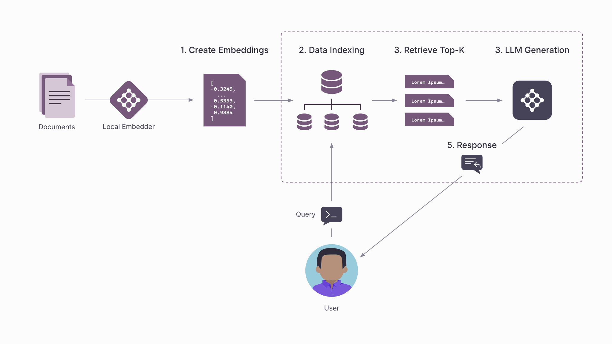
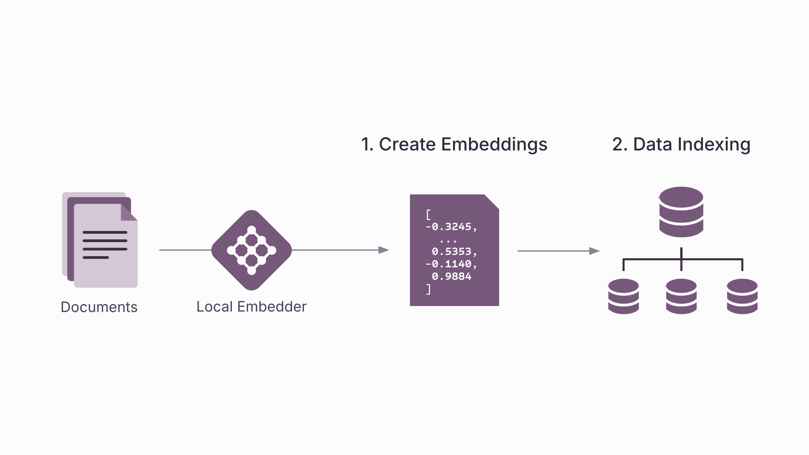
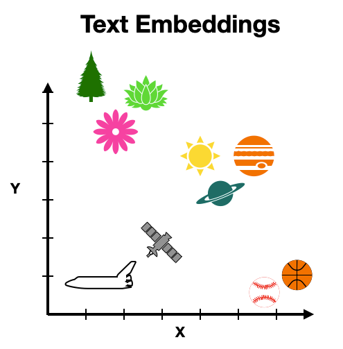
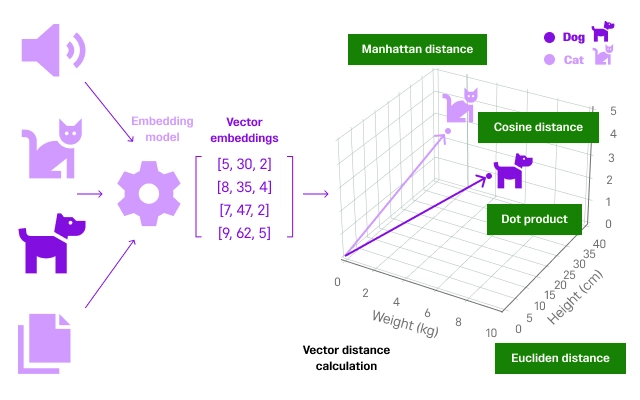
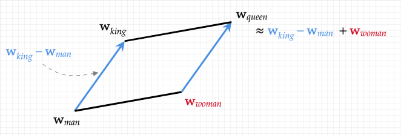
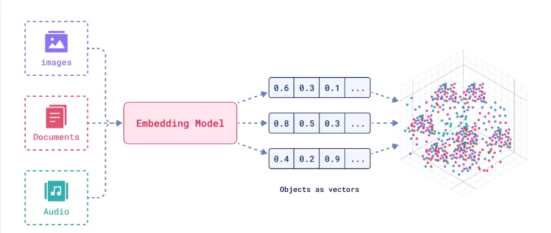
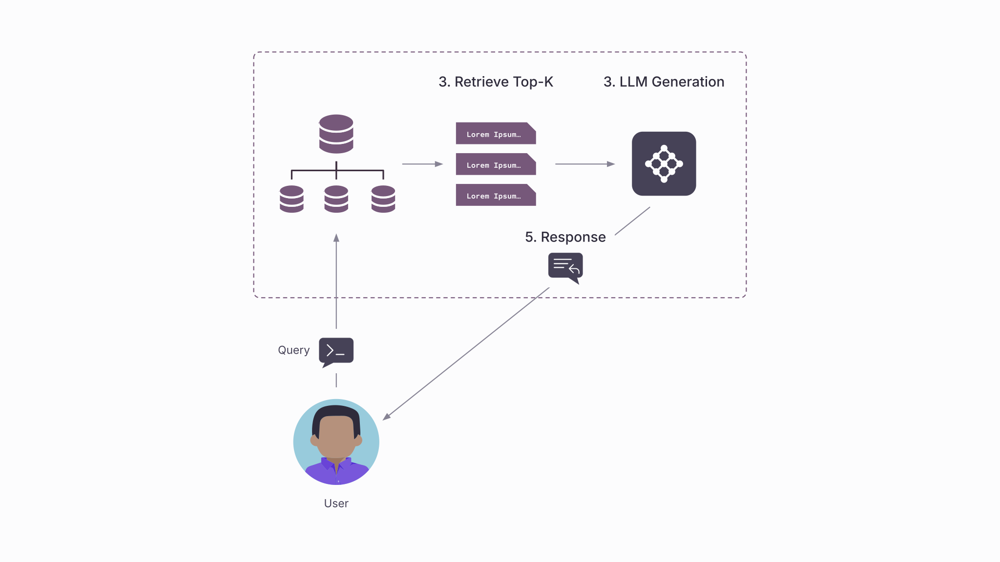

<!-- TODO(a11y): 7 localized body image(s) have empty alt text -->


<!-- TODO(content): easy-tabs block (flattened — verify tab structure); toc_offset_top_px=875 (TOC start offset — maps to TocAnchor) -->

**TL;DR:** In this post, you’ll learn why LLMs hallucinate, how RAG helps keep them grounded in real data, what goes into building a RAG pipeline, and why this technique has become so widely used, from startups to major tech companies, making it a must-have skill for anyone working with or building AI systems today.

**Just Give Me The Code:**

```python
from llama_index.core import VectorStoreIndex, SimpleDirectoryReader
from llama_index.llms.openai import OpenAI
from llama_index.embeddings.openai import OpenAIEmbedding

documents = SimpleDirectoryReader("data").load_data()
embedding_model = OpenAIEmbedding(model="text-embedding-ada-002")
index = VectorStoreIndex.from_documents(documents, embed_model=embedding_model)

llm = OpenAI(model="gpt-3.5-turbo")
query_engine = index.as_query_engine(llm=llm, similarity_top_k=3)

response = query_engine.query("Summarize the key insights from the documents.")
print(response)
```

<p class="has-text-align-center prose-divider">⬩⬩⬩</p>

## Why hallucinations happen?

LLMs don’t “look up” facts in real time, they generate answers based on patterns learned during training. That training is frozen at a point in time and limited to the data the model has seen. When you ask a question that requires recent, niche, or private information, the model has two choices: admit it doesn’t know (which it rarely does), or fill in the gaps by guessing.

This guessing is what we call **hallucination**. The model strings together words that sound plausible, but the content may be incomplete, outdated, or flat-out wrong. In other words, it’s not lying intentionally, but, it’s just doing what it was built for: predicting the next most likely token, even if the underlying knowledge isn’t there.

That’s why hallucinations are so common: the model isn’t retrieving truth, it’s generating probability-weighted text. Without a grounding mechanism, the line between fact and fiction easily blurs.

<p class="has-text-align-center prose-divider">⬩⬩⬩</p>

## A Primer on RAG

_Large language models can be brilliant, but they also hallucinate. How do we keep the brilliance, but fix what’s broken?_

That’s where retrieval-augmented approaches come in. Instead of relying solely on what the model “remembers”, it can reach outward, pulling facts from trusted sources, private notes, or curated databases and then reason on top of that. Think of it as giving the model a grounding wire so it doesn’t drift too far into imagination – which can take multiple forms:

1.  **For open-world facts** → Retrieval ensures the answer is backed by canonical, universally trusted knowledge (e.g., history, geography, literature).
2.  **For closed-domain expertise** → Retrieval pulls in the right technical sources like medical journals, legal contracts, internal reports, hence, reducing the risk of fabricated details in high-stakes contexts.
3.  **For private, personal knowledge** → Retrieval connects the model to your unique world like chats, notes, preferences which enables the answers that no public knowledge base could ever provide.

In summary, RAG is a grounding method, that ensures a legitimate, yet high quality response.

Here are few advantages of any RAG application:

-   **Reduces hallucinations:** by pulling from verified sources at query time, the model produces more trustworthy responses
-   **Domain Adaptability:** by pulling a specialised corpora (medical, legal, financial, scientific, etc.), the model speaks with authority in areas where open-world training data falls short.
-   **Personalisation & Privacy:** by pulling private notes, documents, or organizational knowledge bases, the model produces context-aware answers that are unique to the user.
-   **Race towards intelligent systems:** Most companies are racing to build systems that are not only intelligent, but also trustworthy and personalized. Here, RAG play a foundational role: the demand for professionals who can design, implement, and optimize such RAG systems is soaring.

That said: what if you didn’t just know what RAG is, but learned to build it step-by-step?

Before heading towards a real-world framework, let’s start with a toy example. The code is simple, with core components to mimic how to store data, embed it, retrieve relevant pieces, and generate an answer. Think of it as a miniature sketch of RAG, echoing what tools like LlamaIndex or LangChain do at scale (which we’ll try out shortly!).

```python
import json

# 1. Users with their info
users = {
    "Alice": "Alice likes cats",
    "Bob": "Bob enjoys pizza",
    "Charlie": "Charlie codes in Python"
}

# Simple embedding (converting into a vector of numbers)
def create_embedding(text):
    return sum(ord(c) for c in text)

# Fake LLM
def LLM(ctxs):
    return "[LLM-Answer] " + " | ".join(ctxs)

def save_index(index, path="index.json"):
    with open(path, "w") as f:
        json.dump(index, f)
def load_index(path="index.json"):
    with open(path) as f:
        return json.load(f)

# 2. Indexing -> save
index = {u: create_embedding(info) for u, info in users.items()}
save_index(index)
loaded_index = load_index()

# 3. New user query
query = "Who likes cats?"
q_vec = create_embedding(query)

# 4. Retrieval: check all users, rank by distance
top_k = 1
relevant_nodes = sorted(index.items(),
key=lambda x: abs(x[1]-q_vec))[:top_k]

# 5. Fetch text from top nodes
contexts = [users[u] for u, _ in relevant_nodes]    
print(LLM(contexts))
```

The code above represents a simplified Retrieval-Augmented Generation (RAG) pipeline which helps us look into the **three key steps of RAG**:

1.  Data processing phase: collection, indexing and storage
2.  Retrieving relevant documents
3.  Generating response using the documents

<figure class="wp-block-image size-full has-custom-border is-style-default">



</figure>

<p class="has-text-align-right">RAG Pipeline</p>

Let’s go through each component one-by-one…

<p class="has-text-align-center prose-divider">⬩⬩⬩</p>

## Step 1. User Knowledge Base (Documents)

Every RAG system starts with **knowledge sources like** text, documents, or structured data that you want your model to pull from. For example, it could be your friend’s resume or his Linkedin profile data, for in other cases, it could be your own medical documents. To illustrate this, instead of large PDFs or databases, we’re keeping it tiny: each user brings a simple fact about them.

<div class="tabs tabs--bordered" data-tabs data-base="rag-step1" data-initial="0">
<div class="tabs__list" role="tablist" aria-label="Implementation approach">
<button type="button" class="tabs__tab" role="tab">Simple Version</button>
<button type="button" class="tabs__tab" role="tab">Using Llama Index</button>
</div>
<div class="tabs__panels">

<div>

```python
# 1. users with their info
users = {
    "Alice": "Alice likes cats",
    "Bob": "Bob enjoys pizza",
    "Charlie": "Charlie codes in Python"
}
```

**Explanation**

-   `users` is our knowledge base.
-   Each entry is like a “document” tied to a user.
-   In real RAG, this could be research papers, contracts, medical notes, or private documents.

</div>

<div>

```python
from llama_index.core import Document

docs = [
    Document(text="Alice likes cats"),
    Document(text="Bob enjoys pizza"),
    Document(text="Charlie codes in Python"),
]
```

LlamaIndex gives a structured `Document` abstraction instead of raw strings,  
making it easier to manage metadata like sources, authors, or timestamps.  
It also supports multiple document formats like PDFs, DOCX, etc., which makes onboarding smoother.

</div>

</div>
</div>

---

<p class="has-text-align-center prose-divider">⬩⬩⬩</p>

## Step 2. Indexing (Embedding + Storage)

Before we can search, we must convert text into **vector embeddings** (numerical form). But, why do we even want to do this conversion? Can’t we just match all the keywords in our saved documents and return the best? There are two primary reasons for it:

-   **Beyond keywords** – Keyword search only matches exact words, so “doctor’s note” won’t match “medical certificate.” Embeddings capture **semantic meaning**, so conceptually related text is still retrieved even if the wording differs.
-   **Easier comparison** – Converting text into vector embeddings gives us numerical representations. Numbers are easier to compare using distance metrics (like cosine similarity), which makes retrieval fast and precise.

<figure class="wp-block-image size-full has-custom-border is-style-default">



</figure>

In our toy code, we will attempt a fake embedding (sum of ASCII codes + a key). In practice, embeddings capture **semantic meaning**.

<div class="tabs tabs--bordered" data-tabs data-base="rag-step2" data-initial="0">
<div class="tabs__list" role="tablist" aria-label="Implementation approach">
<button type="button" class="tabs__tab" role="tab">Simple Version</button>
<button type="button" class="tabs__tab" role="tab">Using Llama Index</button>
</div>
<div class="tabs__panels">

<div>

```python
simple embedding (converting into a vector of numbers)
# Toy example
def create_embedding(text):
    return sum(ord(c) for c in text)

# Create an index (dictionary of user -> embedding)
index = {u: create_embedding(info) for u, info in users.items()}
```

</div>

<div>

```python
# Build an index
from llama_index.core import VectorStoreIndex

# NOTE: if you created docs = [...], use docs here (not "documents")
index = VectorStoreIndex.from_documents(docs)
```

</div>

</div>
</div>

---

Here, each user’s text is mapped to a number -> a fake embedding. Real embeddings (e.g. created using OpenAI, HuggingFace models) capture meaning such as _“cats ≈ kittens”_, not just text similarity.

**A primer on embeddings and representations**

1\. What are embeddings and why do we need them?

Embeddings turn text (or other data) into numbers that capture **meaning**, not just characters. Instead of comparing words letter by letter, embeddings place them in a high-dimensional space where related concepts sit close together. For example, _“dog”_ and _“puppy”_ will naturally end up near each other because they share meaning, even if they look different.

<figure class="wp-block-image">



<figcaption class="wp-element-caption"><em>reference :&nbsp;<a href="https://www.google.com/url?sa=i&amp;url=https%3A%2F%2Ftowardsdatascience.com%2Ftext-embeddings-classification-and-semantic-search-8291746220be%2F&amp;psig=AOvVaw3djMZQC79-qmrNWvXqu6Ux&amp;ust=1756461914100000&amp;source=images&amp;cd=vfe&amp;opi=89978449&amp;ved=0CBgQjhxqFwoTCNjRp9WgrY8DFQAAAAAdAAAAABAL">TDS</a></em></figcaption></figure>

Another benefit is **compression**: instead of storing huge chunks of text, embeddings distill their essence into compact vectors. This makes storage and retrieval faster and more efficient. They also make **search measurable**. Once everything is a vector, computers can quickly compare items using distance measures (like cosine similarity), making it easy to find the most relevant information.

<figure class="wp-block-image"><a href="https://www.singlestore.com/blog/distance-metrics-in-machine-learning-simplfied/">



</a><figcaption class="wp-element-caption">reference :&nbsp;<a href="https://www.singlestore.com/blog/distance-metrics-in-machine-learning-simplfied/">https://www.singlestore.com/blog/distance-metrics-in-machine-learning-simplfied/</a></figcaption></figure>

Finally, embeddings act as a **common language across formats and languages**. Text, images, audio – even code- can be mapped into the same space. That’s why an image of a cat and the word _“cat”_ can align, or why “chat” in English and _“bille”_ in French can connect.

2\. How are embeddings even generated?

Embeddings didn’t just appear overnight, they’re the result of decades of progress in how machines learn to represent language:

<figure class="wp-block-image size-full">



</figure>

**Decoder-only models (today):** Generative systems like GPTgenerate embeddings not just for words, but for entire sequences like sentences, paragraphs, or even documents. Trained on massive data, they compress meaning, style, and intent at multiple levels. These embeddings emerge naturally as a byproduct of predicting the next token on massive amounts of diverse data, making them broad and generalizable.

<figure class="wp-block-image size-full">



</figure>

**Word2Vec (2013):** Introduced the idea of learning word vectors by predicting context. In _skip-gram_, the model guessed surrounding words from a target; in _CBOW_, it did the reverse. The beauty was that words ended up arranged in a space where relationships emerged naturally: _king – man + woman ≈ queen_. But Word2Vec had one limitation: each word had a single fixed vector—“bank” was the same for rivers and finance.

**BERT (2018):** A major leap came with _contextual embeddings,_ replacing the static ones. A word’s representation (i.e. _“bank”)_ now changed with its sentence. BERT achieved this using transformers and bidirectional attention, looking left and right in a sentence at the same time. This meant embeddings were not just about the word itself, but its meaning _in context_, which was a massive step forward for tasks like question answering and sentiment analysis.

<p class="has-text-align-center prose-divider">⬩⬩⬩</p>

## Step 3. Saving the Data Index

We now understand that neural networks are the building blocks for generating these embeddings. However, you can imagine how computing them every time would be an expensive operation. Luckily, in real-world use, we don’t rebuild them every time. Instead, we **persist** it as an index (to JSON, SQLite, or vector DBs like Pinecone, Weaviate, FAISS).

<div class="tabs tabs--bordered" data-tabs data-base="rag-step3" data-initial="0">
<div class="tabs__list" role="tablist" aria-label="Implementation approach">
<button type="button" class="tabs__tab" role="tab">Simple Version</button>
<button type="button" class="tabs__tab" role="tab">Using Llama Index</button>
</div>
<div class="tabs__panels">

<div>

```python
# Simple persistence, but enough for this toy example.
import json

def save_index(index, path="index.json"):
    with open(path, "w") as f:
        json.dump(index, f)

def load_index(path="index.json"):
    with open(path) as f:
        return json.load(f)

index = {"foo": "bar"}
save_index(index)
loaded_index = load_index()
print(loaded_index)
```

</div>

<div>

LlamaIndex supports advanced backends (FAISS, Pinecone, Qdrant) so you can scale beyond a JSON file.

```python
# Persist to disk
index.storage_context.persist("./storage")

# Later: load from storage
from llama_index.core import StorageContext, load_index_from_storage

storage = StorageContext.from_defaults(persist_dir="./storage")
index = load_index_from_storage(storage)
```

</div>

</div>
</div>

---

Optional primer: What is a _vector database_?

A **vector database** is built to store and search embeddings efficiently. Unlike traditional SQL databases with rows and columns, it manages **high-dimensional vectors** representing text, images, audio, or other data.

Its core strength is **similarity search**: given a query vector, it quickly finds the closest semantic matches (using metrics like cosine similarity or Euclidean distance). This makes vector databases the backbone of modern retrieval: powering semantic search, recommendations, and RAG pipelines. Popular examples include **FAISS, Pinecone, Weaviate, and Qdrant**.

<p class="has-text-align-center prose-divider">⬩⬩⬩</p>

## Step 4. Retrieval (fetching relevant documents)

Now, we are done with our data processing phase. We collected data, we converted it into embeddings, indexed it and then saved it into memory to preserve compute and time.

Hence, we are ready to start using our system. Given a query, we must find the **closest embeddings/similar information** in the index. This step is critical because a bad retrieval leads to an bad answer, even if the model is great.

<figure class="wp-block-image size-full has-custom-border is-style-default">



</figure>

<p class="has-text-align-right">Query Answering</p>

<div class="tabs tabs--bordered" data-tabs data-base="rag-step4" data-initial="0">
<div class="tabs__list" role="tablist" aria-label="Implementation approach">
<button type="button" class="tabs__tab" role="tab">Simple Version</button>
<button type="button" class="tabs__tab" role="tab">Using Llama Index</button>
</div>
<div class="tabs__panels">

<div>

```python
query = "Who likes cats?"
q_vec = create_embedding(query)

top_k = 1 # How many relevant documents you want to fetch
relevant_documents_chunks = sorted(index.items(), key=lambda x: abs(x[1]-q_vec))[:top_k]
```

Here, we sort all users by the distance between their embedding and the query’s embedding. More similar embeddings, have smaller distance between them.

</div>

<div>

```python
# This loads the indexes and makes the query engine
retriever = index.as_retriever()
document_chuncks = retriever.retrieve("Who is Paul Graham?")
print(document_chuncks)
```

LlamaIndex handles vector similarity search internally (cosine similarity, ANN indexes), and scales to millions of documents fairly easily.

</div>

</div>
</div>

<p class="has-text-align-center prose-divider">⬩⬩⬩</p>

## Step 5. Generation (LLM with Context)

Finally, we have the most relevant document chunks retrieved, we introduce them into the LLM’s context, to help it generate a more factual response in its typical conversational response. In this toy code, the “LLM” is just a string joiner. In reality, this could be GPT, Claude, or Llama.

<div class="tabs tabs--bordered" data-tabs data-base="rag-step5" data-initial="0">
<div class="tabs__list" role="tablist" aria-label="Implementation approach">
<button type="button" class="tabs__tab" role="tab">Simple Version</button>
<button type="button" class="tabs__tab" role="tab">Using Llama Index</button>
</div>
<div class="tabs__panels">

<div>

```python
# mock LLM
def LLM(ctxs):
    return "[LLM-Answer] " + " | ".join(ctxs)

contexts = [users[u] for u, _ in relevant_nodes]
print(LLM(contexts))
```

</div>

<div>

```python
# loading as query engine
query_engine = index.as_query_engine()
response = query_engine.query("Who is Paul Graham.")
print(response)
```

LlamaIndex provides a more streamlined way to handle prompt construction, chunking, and context window management automatically, which makes the query process much simpler.

</div>

</div>
</div>

---

At its core, a RAG system works in three stages:

1.  **Indexing** → Knowledge (documents, notes, FAQs) is converted into embeddings and stored, often in a vector database for efficient retrieval.
2.  **Retrieval** → When a query comes in, it’s also embedded, and the system finds the most relevant chunks by comparing vector similarity.
3.  **Generation** → The retrieved context is passed into a language model, which uses it to produce an answer that is grounded in real information.

Our toy code simulated all three: a small knowledge base (users), fake embeddings, saving/loading the index, retrieval by distance, and a dummy “LLM” stitching the context into an answer. Libraries like **LlamaIndex** or **LangChain** handle these steps with real embeddings, scalable storage, and automated query pipelines, making them more reliable and production-ready.

_Maybe a quick activity for you?_

1.  Try to change the way we currently embed the data, instead of using ASCII code, what about we use something like [word2vec](https://www.geeksforgeeks.org/python/python-word-embedding-using-word2vec/).
2.  Try [removing stopwords](https://www.geeksforgeeks.org/nlp/removing-stop-words-nltk-python/) like “He”, “the”, “or”, etc. to make keywords more significant.
3.  Finally, try to implement your own top-k finder, instead of retrieveing by best-k, what if we pick all relevant document chunks with above 75% confidence match.

<p class="has-text-align-center prose-divider">⬩⬩⬩</p>

## Key Limitations of Traditional RAG

Retrieval-Augmented Generation (RAG) is a powerful way to make large language models (LLMs) more reliable. By grounding the model’s reasoning in external data – company documents, PDFs, or internal wikis- we avoid hallucinations and enable domain-specific expertise. It’s an elegant solution when all relevant information lives in one accessible place.

But as soon as you start building with RAG, one truth becomes obvious: **your system is only as smart as the data it can reach.** Most RAG setups rely on centralized data repositories. That works well for isolated use cases, but it introduces several key challenges:  

1.  _Data Quality Is Everything:_ The effectiveness of RAG depends entirely on the quality of the retrieved information. However, individuals and organizations typically have access only to their own data, while valuable insights remain locked away behind privacy and ownership barriers. As a result, RAG often struggles to build a complete picture or learn from broader patterns.  
    
2.  _Fragmented Context:_ Knowledge is rarely contained in one place. Because RAG systems usually retrieve only the top few results, critical context spread across multiple domains or institutions is often missed. This leads to answers that appear relevant but lack depth or nuance.  
    
3.  _Scalability and Performance Limits:_ Managing large document repositories (storing, indexing, and keeping them updated) can be resource-intensive. As datasets grow, retrieval becomes slower and more expensive, limiting real-time performance at scale.  
    
4.  _Privacy, Compliance, and Ownership Risks:_ Centralized RAG systems aggregate data from multiple users or organizations. Even without direct exposure of raw data, this centralization raises legitimate concerns around privacy, compliance, and data ownership.

Together, these challenges reveal a clear limitation: traditional RAG works only within isolated data silos. While it’s effective at reducing hallucinations, it cannot solve the problem entirely. In our upcoming blogs, we’ll explore federated approaches to RAG, with methods that address these challenges by preserving privacy, improving scalability, building trust, and ultimately breaking down data silos.

<p class="has-text-align-center prose-divider">⬩⬩⬩</p>

## Conclusion

Retrieval-Augmented Generation (RAG) has become the go-to solution (as we saw above) for working with specific data. Instead of asking the model to “know everything,” we fetch the right context (from company docs, PDFs, wikis) and then let the LLM reason with it. It’s a powerful setup, as long as all the necessary information lives in one place you can access.

But once you start building with RAG, a fundamental limitation emerges: _your system is only as capable as the data it can reach_. Most of us operate within narrow data boundaries, i.e. our personal files, organizational repositories, or isolated datasets. This means that many important questions, whether in healthcare, law, or broader interdisciplinary fields, often go unanswered because the relevant data is either inaccessible or too sensitive to be shared.

In our upcoming blog, we’ll explore how **federated RAG** can overcome these barriers, linking knowledge across data silos while maintaining privacy, security, and trust.

<p class="has-text-align-center prose-divider">⬩⬩⬩</p>

**Resources**

-   [Retrieval-Augmented Generation for Knowledge-Intensive NLP Tasks](https://arxiv.org/abs/2005.11401) (Lewis et al., 2020) _— The original RAG paper from Facebook AI_
-   [Introduction to Retrieval Augmented Generation (RAG)](https://huggingface.co/blog/rag) (Hugging Face Blog) — _A beginner-friendly walkthrough with examples_
