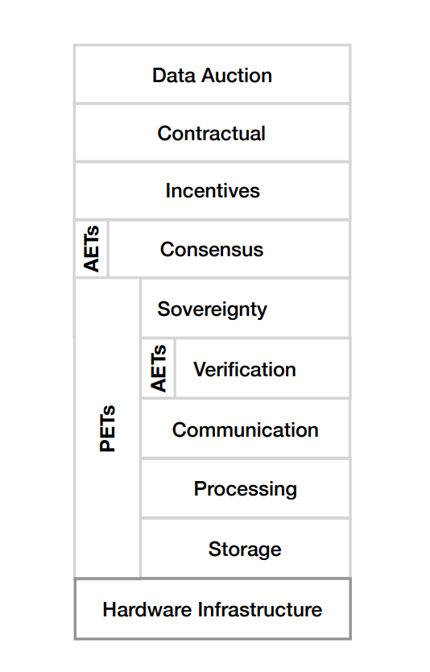

<!-- TODO(a11y): 1 localized body image(s) have empty alt text -->

The data generated by the Internet of Things (IoT) is leading a positive transformation across industries, not only in traditional ones such as manufacturing but also in healthcare, wearables, and other consumer products and services.

However, while we already enjoy the upsides of the IoT in our lives, there exist other dimensions where the IoT can bring disadvantages. This article focuses on the IoT’s challenges to our privacy and the technologies available to tackle them, the so-called privacy-enhancing technologies (PET) \[1\].

By the time you finish reading this article, you will understand the impact and challenges of PETs in IoT data marketplaces. To learn more about privacy techniques in the future, please follow [Callis Ezenwaka](https://twitter.com/callezenwaka) and [OpenMined](https://twitter.com/openminedorg).

## IoT Data Marketplaces

The IoT has brought another scale to data, which has enabled businesses to rely more heavily on data-driven strategies to introduce new business models, products, or services. The bigger the data, the more accurate insights and predictions one may produce with analytics models, enabling more innovation.

Given the context of the IoT, it is commonly said that access to large amounts of data is more important than having a good model; however, we argue that, in the future, it is not the one with the most amount of data that will succeed, but the one capable of training models best on privacy-enhanced data.

Perceiving data as a company’s asset has created a deep-seated aversion by data owners to share them, both in the industry and among customers. Once one lets go of one’s data, one loses control over it. This conundrum is captured by the _copy problem_, the fear of potentially forgoing the benefits derived from such data or releasing information that could be potentially used against someone.

However, large data repositories could expand or create new business models or trade data for profit. On the other hand, small organizations like startups may benefit from an increase in data accessibility. Such vision can be achieved through IoT data marketplaces, which can unlock the untapped potential of siloed data or data too sensitive to be used broadly, like in healthcare.

## Privacy

To better understand the role PETs play, it is pertinent to know what privacy is. However, the definition of privacy is varied as it is a multifaceted concept. Some of the most acknowledged definitions include: “_the claim of individuals to determine for themselves when, how and to what extent information about them is communicated”_ \[4\].

Within computer science, privacy _could be “defined not by what it is, but by what it is not – it is the absence of a privacy breach that defines a state of privac_y” \[5\]. While these definitions by researchers have gained prominence, practitioners are yet to reach a consensus about what privacy truly is (if it is even possible).

Currently, thanks to regulation and increased awareness, privacy is seen as a human right. Nonetheless, we might fall into the trap of obscuring data that otherwise could be employed, for example, to cure cancer. Thus, we need technologies that allow us to enhance people’s privacy while enabling us to learn from data. Privacy-enhancing technologies (PETs) enable the achievement of such a goal.

Commonly employed PETs include differential privacy (DP), syntactic anonymization techniques like k-anonymity, homomorphic encryption (HE), trusted execution environments (TEE), secure multiparty computation (SMC), zero-knowledge proofs (ZKP), secure aggregation (SA) \[3\] and a set of conventional de-identification approaches such as masking, rounding, or hashing.

The use of PETs in the IoT data market is yet to attain maturity, and not many frameworks exist to enhance privacy in data markets. The figure below depicts one of the few extant layered frameworks for designing privacy-enhancing IoT data markets \[1\].

<figure class="">

<figcaption>Fig. 1 Reference model for the layers of privacy enhancing technologies in the IoT data market. [<a href="https://arxiv.org/abs/2107.11905">Image source</a>]</figcaption></figure>

## **Key Findings in the Field of Privacy-Enhancing IoT Data Markets**

The following are a set of key findings that I distilled from G. M. Garrido et al.’s “Revealing the Landscape of Privacy-Enhancing Technologies in the Context of Data Markets for the IoT: A Systematic Literature Review”.

1.  PETs need more maturity to impact data markets positively.
2.  Coupled with the lack of privacy-enhancing data markets in production, there is evidence to conclude that privacy-enhancing IoT data markets are yet to attain maturity. Recently, there has been a notable increase in research towards PETs in data markets for IoT devices.
3.  However, researchers in the field should not reinvent the wheel but instead collaboratively build on and extend the existing body of knowledge.
4.  Furthermore, individual PETs cannot enhance the privacy of individuals at all levels; rather a combination of various PETs should be deployed to construct architectures that enhance both anonymity and confidentiality.
5.  Solving the issue of the ‘_copy problem’_ will encourage data owners to share their data. Since _anonymization_ PETs do not sufficiently address the copy problem, a more robust solution that includes _confidential computation_ would reduce the sharing aversion by data owners.
6.  While Distributed Ledger Technologies (DLTs) have added capabilities to enhance authenticity, and guarantee data integrity without any intermediary, a suitable architecture that enhances privacy in IoT data markets is yet to be identified. Added to this are their inherent drawbacks, which include storage capacity, computation power, and constant data replication, which could raise privacy concerns.
7.  Data markets contain three dimensions, all of which bring privacy concerns: _the degree of centralization_ – The degree of decentralization and replication poses the risks of data leakage; _types and number of data domains_ – An increase of data domains could lead to data de-anonymization across databases; _types of sellers and consumers_ – The nature of PETs applied to any data market should depend on the type of participants.

## Conclusion

Society and data owners have a lot to benefit from trading data on IoT data markets. While the threat of data breaches stands as an obstacle, deploying multiple PETs in an IoT data market architecture could offer a way out and should be further explored by researchers.

Further research is needed around solving the copy problem. If this is properly addressed, more data owners will be encouraged to share their data repositories without the fear of losing control of the shared data or potential information leakage.

A review of recent studies on the use of PETs in IoT data markets revealed many proposals that strive to strike a balance between meeting privacy and compliance requirements and maintaining the utility, profitability and fair and seamless exchange of data \[1\].

While many of these proposals are at the early stage of their development, expectations abound on the level of impact these technologies, or a combination of them, will exert on the IoT data markets at their full maturity.

Therefore, it calls for more collaborative research among practitioners to build on the existing body of knowledge or open-source libraries in the field rather than reinvent the wheel. Furthermore, privacy-oriented data markets will advance when there is fair reporting of research objectives and outcomes.

As earlier mentioned, the intrinsic constraints within IoT infrastructure should be explored and addressed. Since there seems to be no canonical or consensus PET exists in the market \[1\], eliminating the inherent constraints and combining multiple PETs could ameliorate these various privacy challenges.

Additionally, the creation of data market standards such as a language to describe privacy requirements, universal APIs to interact between different IoT devices with various degrees and techniques for privacy protection, and machine-readable definitions of privacy should be researched.

Privacy should be enhanced by design and optimally in any system without trade-offs. Therefore, researchers should reflect on how monetized privacy in a competitive market could impact and benefit society.

More still, practitioners, lawyers, social scientists, and economists alike have various roles to play in investigating privacy legislation, clarifying data sovereignty and data pricing, and decentralized market interactions \[1\].

Understanding the role of PETs on IoT data markets could spur knowledge transfer to other research areas such as privacy-by-design software engineering, policymaking, data governance, politics, and economics \[1\].

For data owners, it is recommended that they invest adequate resources in the research and adoption of PETs to remain competitive. Equally, proficiently analyzing privacy-enhanced data might become more important than having the most data.

Worthy of mentioning is the importance of the sovereignty layer in data market design, as depicted in figure 1. The selection of the rest of the layers for a particular PET is highly dependent on the ownership and management rules for the participants’ data impact.

**_IoT data markets can flourish if data ownership is defined, privacy is enhanced, and the authenticity of data is guaranteed._**

## Acknowledgements

Big thanks to [Shaistha Fathima](https://www.linkedin.com/in/shaisthafathima/) for thorough editing and [Gonzalo Munilla Garrido](https://www.linkedin.com/in/gonzalo-munilla/) for holistic review of this article.

## Resources:

\[1\] Garrido, G. M., Sedlmeir, J., Uludağ, Ö., Alaoui, I. S., Luckow, A. and Matthes, F. (2021). Revealing the Landscape of Privacy-Enhancing Technologies in the Context of Data Markets for the IoT: A Systematic Literature Review.

\[2\] Cavoukian, A. (2012). Privacy by Design and the Emerging Personal Data Ecosystem.

\[3\] So, J., Ali,  R. E., Guler, B., Jiao, J., Avestimehr, S. (2021). Securing Secure Aggregation: Mitigating Multi-Round Privacy Leakage in Federated Learning.

\[4\] A. F. Westin, Privacy and Freedom, IG Publishing, New York, 1967. URL https://scholarlycommons.law.wlu.edu/wlulr/vol25 /iss1/20/

\[5\] F. T. Wu, Defining privacy and utility in data sets, 84 University of Colorado Law Review 1117 (2013); 2012 TRPC (2012) 1117–1177doi: 10.2139/ssrn.2031808.
