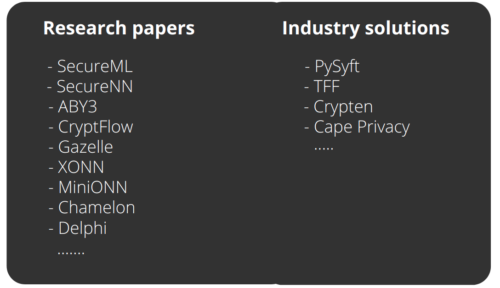
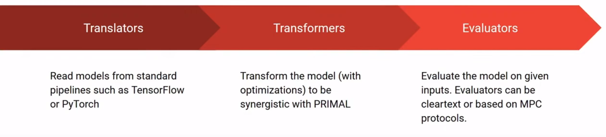

<!-- TODO(a11y): 2 localized body image(s) have empty alt text -->


> This is a summary of the talk by Daniel Escudero at the [OpenMined Privacy Conference 2020.](https://www.youtube.com/watch?v=F46lX5VIoas&list=PLUNOsx6Az_ZGKQd_p4StdZRFQkCBwnaY6&index=14)

Daniel Escudero talked about PRIMAL, a framework for Private Machine Learning. In particular, he discussed the features of PRIMAL, its architectural design, and a set of examples illustrating  its capabilities. Before presenting PRIMAL, he briefly discussed the state of the art of academic and industry efforts to solve data privacy concerns raised by Machine Learning.

### What is Privacy-Preserving Machine Learning?

Privacy-Preserving Machine Learning (PPML) consists of training and evaluating machine learning models in a way that the privacy of data is preserved. For many years now, researchers, organizations, and institutions have been working on this problem. On their side, researchers thrive to improve the state of the art, protocols, timing, communication while organizations like OpenMined, Facebook Research, Cape Privacy use academic results to create easy-to-use frameworks.  In this way, machine learning experts and practitioners can make secure counterparts of the methods and techniques they currently use to implement ML models.

<figure class="">



<figcaption>Some research and industry works in PPML (Image by Pamely ZANTOU)</figcaption></figure>

Though these solutions help make big steps in Privacy-Preserving  Machine Learning, some things are currently missing and can be improved.

### What are the Current Challenges?

The following are the concerns with currently used Privacy-Preserving Machine Learning tools.

On one hand, it is difficult to assess which protocols perform better in terms of accuracy, timing, or communication they involve. The reason for this is very natural. These protocols are different and designed by different teams. Some of them have access to software developers who can do a very industry-great implementation. Sometimes, they have access to better machines or different things that can affect the protocols’ outcomes.

On the other hand, it is difficult to experiment with different models to find optimal accuracy or efficiency trade-offs. In cryptography, there is a set of different constraints that are not examined in clear computation. For example, floating-point computation is not a problem at all in clear text computation. However, for Secure Multiparty Protocols (MPC) or cryptography in general, it is important to care about these kinds of computations. So, a framework that enables playing with all these different things and a wide variety of models in an efficient and usable way is vital.

### Solution: PRIMAL

**PRIMAL** stands for Private Machine Learning. It is a lightweight Python framework that enables easy experimentation with different MPC protocols and variations to ML models. PRIMAL is written with flexibility, usability, extensibility, and efficiency in mind.

The goal of this framework is to provide practitioners and researchers with a wide variety of Neural Networks and MPC protocols, easily performing changes and analyzing their effects in both accuracy and performance. PRIMAL allows loading a vast amount of networks from a wide variety of ML pipelines (TensorFlow, PyTorch) which can be later modified to explore different accuracy-performance trade-offs. Furthermore, different MPC protocols can be easily implemented, which allows researchers to determine the best MPC protocol for a particular use case.

Additionally, PRIMAL provides an easy-to-use interface. PRIMAL is completely written in Python and very easy to extend to  include multiple MPC protocols. Although, its current version only supports three-party computation, using replicated sharing, extending it is very easy.

Finally, PRIMAL only uses lightweight dependencies such as NumPy. It therefore has a simple yet powerful modular design, and careful implementation of both its computation and communication components to achieve considerable efficiency.

### Architecture

<figure class="">



<figcaption>Illustration of Primal architecture by Daniel Escudero</figcaption></figure>

PRIMAL has a very simple architecture that combines three components: **translators**, **transformers**, and **evaluators**. First of all, translators load models from different frameworks such as TensorFlow or PyTorch. Then, transformers mold and optimize the model to be synergistic with PRIMAL. For example, a transformer can take all linear activations and turn them into matrix multiplications. A transformer can also take certain age locations and turn them into probabilistic truncations. Finally, evaluators run the networks to evaluate them. The evaluation can be a text evaluation to test accuracy or a specific emphasis protocol ( two-party or three-party).

### Code demo

The demo goes over three examples to show how to use PRIMAL in the context of secure inference.

1.  **How to run PRIMAL: Perform inference on a small MNIST network.**

This can be done in three steps. First, you load the model using the _**read\_input**_ function. This function takes the path to the model file and the storing format. Second, you construct the network with your ids (passed in the command line) and the other parties’ ids. Third, you construct an evaluator. In this case, it is an evaluate-based replicated sharing. Then, the model is passed in the network. The output is the network evaluation time. The steps described are shown in the code below:

```python
from example_base import *

# files with a secret-shared model and image, respectively 
model_file = f'data/mnist_model{id}.bin' 
input_file = f'data/mnist_input{id}.bin'

# construct model object from file containing a secret-shared model
model = read_input(model_file, FileType.NATIVE)

# set up network of 3 parties, all running locally (the default)
nw = Network(id, [Peer(i) for i in range(3)])

def run():
    # construct an evaluator based on replicated secret-sharing
    ev = ReplicatedEvaluator(model, nw)
    
    # load the secret- shared image
    image = read_input(input_file, FileType.IMAGE_SS, share_cls=ev.sharecls)
    
    # run everything  
    ev.sync()
    with Timer('eval', mode='ms'):
        ev.run(image)
    
    # print the result 
    print(argmax(ev.get_outputs()))

if __name__ == '__main__':
    run()
    
```

**Output**

```batch
(venv) a - primal $ ./run.sh examples/example1.py
eval in 10.18636 MS 
[7]
(venv) a - primal $ ./run.sh examples/example1.py
eval in 12.54630 ms
[7]
(venv) a - primal $ ./run.sh examples/example1.py
eval in 13.44369 ms
[7]
(venv) a - primal $ ./run.sh examples/example1.py
eval in 7.71257 ms
[7]
```

2.  **How to time specific parts of a network: Time matrix multiplication layers.**

This use case follows the same principles as the one discussed above except that now you want to time a matrix multiplication. Forefront, you create a new evaluator by subclassing the replicated evaluator used before. After that, you use the decorator functions, _**@call\_before(Matmul)**_ and **_@call\_afer(Matmul)_**, to tell the evaluator to check how long it takes for matrix multiplication to finish. This is shown in the code below:

```python
from example_base import *
from primal.layer import Matmul
from example1 import *

# make a new evaluator based on the replicated one, which performs timing on all
# Matrix multiplication layers
class TimedEvaluator (ReplicatedEvaluator):
	
    @call_before(Matmul)
    async def (self, layer, _):
    	self.tm = Timer(layer.cname, mode='ms')
        self.tm.start()
    
    @call_after(Matmul)
    async def _(self, layer, _):
    	self.tm.stop() 
        print(self. tm)

def run():
	# same deal as before ...
    ev = TimedEvaluator(model, nw)
    image = read_input(input_file, FileType.IMAGE_SS, share_cls=ev. sharecls)
    
    ev.sync()
    ev.run(image)
    print(argmax(ev.get_outputs()))

if __name__ == '__main__':
	run()
```

**Output**

```batch
(venv) a - primal $ ./run.sh examples/example2.py
matmul in 7.82452 ms
matmul in 4.16884 ms
[7]
(venv) a - primal $ ./run.sh examples/example2.py
matmul in 4.98761 ms 
matmul in 1.92405 ms 
[7]
```

3.  **How can certain actions affect the time taken?**

In this example we shall make some modifications to the way things are evaluated and measure the result. As before, you  subclass an evaluator. In this case the times evaluator to get the timings for matrix multiplications. Then, you  construct a new primitive like a new MPC one. This primitive is faster and better than that used earlier. So the **clamp** function  is essential for the TensorFlow (tf) light models at the end of a matrix multiplication to ensure that the output value is between 0 and 255, a byte value. Everything in the **clamp** function is like computing on secure shared data thanks to the truncation of the matrix and some communications involved in the MPC. The only thing that changed in this example is the evaluator. After running, it is slightly faster.

```python
from example_base import *
from examplel import *
from example2 import TimedEvaluator

# new evaluator based on TimedEvaluator from before, this time with a
# (hopefully) faster MPC primitive

class FastAndLooseEvaluator(TimedEvaluator):

	# better and hopefully faster primitive for evaluation
    async def clamp(self, x, minval=0, maxval=255):
    	y = await self._ptrunc(x, 8, signed=True)
        y_sar = await self._mul(y, y)
        y_sqr_X = await self._mul(y_sqr, x)
        
        return x.sub(y_sar_x)
        		.add(y_sqr.mul_const(128)
                .add(y.mul_const(128))

def run():
	ev = FastAndLooseEvaluator(model, nw)
    image = read_input (input_file, FileType.IMAGE_SS, share_cls=ev.sharecls)
    
    ev.sync()
    ev.run(image)
    print(argmax(ev.get_outputs()))
    
if _name__ == '__main__':
	run()
```

**Output**

```batch
(venv) a - primal $ ./run.sh examples/example3.py
matmul in 5.72659 ms
matmul in 1.86112 ms
[7]
(venv) a - primal $ ./run.sh examples/example3.py
matmul in 7.59301 ms
matmul in 3.32768 ms
[7]
(venv) a - primal $ ./run.sh examples/example3.py
matmul in 6.60150 ms
matmul in 3.23303 ms
[7]
(venv) a - primal $ ./run.sh examples/example3.py
matmul in 3.68745 ms
matmul in 1.58484 ms
[7]
(venv) a - primal $ ./run.sh examples/example3.py
matmul in 6.94111 ms
matmul in 2.26509 ms
[7]
(venv) a - primal $ ./run.sh examples/example3. py
matmul in 10.09356 ms
matmul in 3.08464 ms
```

### Concluding remarks

We’ve gone through some of the capabilities of Primal. During the last decade a lot of progress has been done in the field of PPML. We hope to make AI applications all the more privacy-preserving in the future.

### References

\[1\] Talk by Daniel Escudero at the [OpenMined Privacy Conference 2020](https://www.youtube.com/watch?v=F46lX5VIoas&list=PLUNOsx6Az_ZGKQd_p4StdZRFQkCBwnaY6&index=14).

\[2\] Cover Image of Post: [Photo](https://unsplash.com/photos/uPXs5Vx5bIg) by [Markus Spiske](https://unsplash.com/@markusspiske?utm_source=ghost&utm_medium=referral&utm_campaign=api-credit) on Unsplash.
