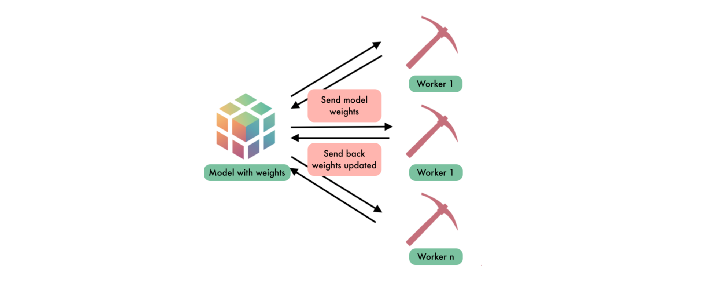

<!-- TODO(a11y): 2 localized body image(s) have empty alt text -->


**_Update as of November 18, 2021: The version of PySyft mentioned in this post has been deprecated. Any implementations using this older version of PySyft are unlikely to work. Stay tuned for the release of PySyft 0.6.0, a data centric library for use in production targeted for release in early December._**

**Summary:** Simple code examples make learning easy. Here, we use the MNIST training task to introduce Federated Learning the easy way.

**Note:** If you want more posts like this I’ll tweet them out when they’re complete at [@theoryffel](https://twitter.com/@theoryffel) and [@OpenMinedOrg](https://twitter.com/openminedorg). Feel free to follow if you’d be interested in reading more and thanks for all the feedback!

<figure class="">

<video src="/blog/upgrade-to-federated-learning-in-10-lines/gif-fl-train.mp4" autoplay loop muted playsinline></video>

<figcaption>Federated Learning with PySyft and PyTorch</figcaption></figure>

### So, why Federated Learning?

Federated Learning is a very exciting and upsurging Machine Learning technique for learning on decentralized data. The core idea is that a training dataset can remain in the hands of its producers (also known as _workers_) which helps improve privacy and ownership, while the model is shared between workers. One popular application of Federated Learning is for learning the [“next word prediction” model on your mobile phone](https://ai.googleblog.com/2017/04/federated-learning-collaborative.html) when you write SMS messages: you don’t want the data used for training that predictor — i.e. your text messages — to be sent to a central server.

The rise of Federated Learning is therefore tightly connected to the spread of data privacy, and the GDPR in EU (which enforces data protection) has acted as a catalyst since May 2018. Furthermore, large actors such as Apple and Google have started investing heavily in this technology with special focus on preserving the privacy of data stored on users’ smartphones.

At OpenMined, we believe that anyone willing to conduct a Machine Learning project should be able to implement privacy preserving tools with very little effort. We have built tools for encrypting data in a single line [as mentioned in our blog post](https://blog.openmined.org/training-cnns-using-spdz/), but they require a good interface to communicate encrypted values between workers. Therefore, we have released [PySyft](https://github.com/OpenMined/PySyft/), the first open-source Federated Learning framework for building secure and scalable models. As an added bonus, if you know how to use PyTorch, you already know how to use most of PySyft as well, as PySyft is simply a hooked extension of PyTorch (and we are now compatible with [the new PyTorch 1.0 release](https://code.fb.com/ai-research/pytorch-developer-ecosystem-expands-1-0-stable-release/)).

In this blog post, we’ll use [the canonical example of training a CNN on MNIST using PyTorch](https://github.com/pytorch/examples/blob/master/mnist/main.py) as is, and show how simple it is to implement Federated Learning on top of it using the [PySyft library](https://github.com/OpenMined/PySyft/). Indeed, we only need to change 10 lines (out of 116) and the compute overhead remains very low.

We will walk step-by-tep through each part of PyTorch’s original code example and underline each place where we change code to support Federated Learning. The code is also available for you to run it in the [PySyft tutorial section](https://github.com/OpenMined/PySyft/tree/master/examples/tutorials), Part 8.

**Ok, let’s get started!**

---

<figure class="">



<figcaption><strong>Figure 1</strong>: Schema of a Federated Learning task</figcaption></figure>

### Imports and model specifications

Nothing special here, we keep the official imports.

```python
import torch
import torch.nn as nn
import torch.nn.functional as F
import torch.optim as optim
from torchvision import datasets, transforms
```

And we also add those specific to PySyft. In particular we define the remote workers `alice` and `bob`, which will hold the remote data while a local worker (or _client_) will orchestrate the learning task, as shown on the schema in _Figure 1_. Note that we use _virtual_ workers: these workers behave exactly like normal remote workers except that they live in the same Python program. Hence, we still serialize the commands to be exchanged between the workers but we don’t _really_ send them over the network. This way, we avoid all network issues and can focus on the core logic of the project.

```python
import syft as sy  # <-- NEW: import the Pysyft library
hook = sy.TorchHook(torch)  # <-- NEW: hook PyTorch ie add extra functionalities to support Federated Learning
bob = sy.VirtualWorker(hook, id="bob")  # <-- NEW: define remote worker bob
alice = sy.VirtualWorker(hook, id="alice")  # <-- NEW: and alice
```

We define the setting of the learning task (this is an adaptation of the official example as we don’t run the code in the terminal and therefore don’t need to handle argument parsing): the parameters are the same.

```python
class Arguments():
    def __init__(self):
        self.batch_size = 64
        self.test_batch_size = 1000
        self.epochs = 10
        self.lr = 0.01
        self.momentum = 0.5
        self.no_cuda = False
        self.seed = 1
        self.log_interval = 10
        self.save_model = False

args = Arguments()

use_cuda = not args.no_cuda and torch.cuda.is_available()

torch.manual_seed(args.seed)

device = torch.device("cuda" if use_cuda else "cpu")

kwargs = {'num_workers': 1, 'pin_memory': True} if use_cuda else {}
```

### Data loading and sending to workers

We first load the data and transform the training Dataset into a Federated Dataset using the `.federate` method: it splits the dataset in two parts and send them to the workers alice and bob. This federated dataset is now given to a Federated DataLoader which will iterate over remote batches.

The test dataset remains unchanged as the local client will perform the test evaluation.

```python
federated_train_loader = sy.FederatedDataLoader( # <-- this is now a FederatedDataLoader 
    datasets.MNIST('../data', train=True, download=True,
                   transform=transforms.Compose([
                       transforms.ToTensor(),
                       transforms.Normalize((0.1307,), (0.3081,))
                   ]))
    .federate((bob, alice)), # <-- NEW: we distribute the dataset across all the workers, it's now a FederatedDataset
    batch_size=args.batch_size, shuffle=True, **kwargs)

test_loader = torch.utils.data.DataLoader(
    datasets.MNIST('../data', train=False, transform=transforms.Compose([
                       transforms.ToTensor(),
                       transforms.Normalize((0.1307,), (0.3081,))
                   ])),
    batch_size=args.test_batch_size, shuffle=True, **kwargs)
```

### CNN specification

Here we use exactly the same CNN as in the official example.

```python
class Net(nn.Module):
    def __init__(self):
        super(Net, self).__init__()
        self.conv1 = nn.Conv2d(1, 20, 5, 1)
        self.conv2 = nn.Conv2d(20, 50, 5, 1)
        self.fc1 = nn.Linear(4*4*50, 500)
        self.fc2 = nn.Linear(500, 10)

    def forward(self, x):
        x = F.relu(self.conv1(x))
        x = F.max_pool2d(x, 2, 2)
        x = F.relu(self.conv2(x))
        x = F.max_pool2d(x, 2, 2)
        x = x.view(-1, 4*4*50)
        x = F.relu(self.fc1(x))
        x = self.fc2(x)
        return F.log_softmax(x, dim=1)
```

### Define the train and test functions

For the train function, because the data batches are distributed across alice and bob, you need to send the model to the right location for each batch using `model.send(...)`. Then, you perform all the operations remotely with the same syntax like you’re doing local PyTorch. When you’re done, you get back the model updated and the loss to look for improvement using the `.get()` method.

```python
def train(args, model, device, train_loader, optimizer, epoch):
    model.train()
    for batch_idx, (data, target) in enumerate(federated_train_loader): # <-- now it is a distributed dataset
        model.send(data.location) # <-- NEW: send the model to the right location
        data, target = data.to(device), target.to(device)
        optimizer.zero_grad()
        output = model(data)
        loss = F.nll_loss(output, target)
        loss.backward()
        optimizer.step()
        model.get() # <-- NEW: get the model back
        if batch_idx % args.log_interval == 0:
            loss = loss.get() # <-- NEW: get the loss back
            print('Train Epoch: {} [{}/{} ({:.0f}%)]tLoss: {:.6f}'.format(
                epoch, batch_idx * args.batch_size, len(train_loader) * args.batch_size, #batch_idx * len(data), len(train_loader.dataset),
                100. * batch_idx / len(train_loader), loss.item()))
```

The test function does not change as it is run locally!

```python
def test(args, model, device, test_loader):
    model.eval()
    test_loss = 0
    correct = 0
    with torch.no_grad():
        for data, target in test_loader:
            data, target = data.to(device), target.to(device)
            output = model(data)
            test_loss += F.nll_loss(output, target, reduction='sum').item() # sum up batch loss
            pred = output.argmax(1, keepdim=True) # get the index of the max log-probability 
            correct += pred.eq(target.view_as(pred)).sum().item()

    test_loss /= len(test_loader.dataset)

    print('nTest set: Average loss: {:.4f}, Accuracy: {}/{} ({:.0f}%)n'.format(
        test_loss, correct, len(test_loader.dataset),
        100. * correct / len(test_loader.dataset)))
```

### Launch the training !

The training is now done as usual.

```python
model = Net().to(device)
optimizer = optim.SGD(model.parameters(), lr=args.lr) # TODO momentum is not supported at the moment

for epoch in range(1, args.epochs + 1):
    train(args, model, device, federated_train_loader, optimizer, epoch)
    test(args, model, device, test_loader)

if (args.save_model):
    torch.save(model.state_dict(), "mnist_cnn.pt")
```

```
Train Epoch: 1 [0/60032 (0%)]	Loss: 2.305134
Train Epoch: 1 [640/60032 (1%)]	Loss: 2.273475
Train Epoch: 1 [1280/60032 (2%)]	Loss: 2.216173
Train Epoch: 1 [1920/60032 (3%)]	Loss: 2.156802
Train Epoch: 1 [2560/60032 (4%)]	Loss: 2.139428
Train Epoch: 1 [3200/60032 (5%)]	Loss: 2.053060
...
Train Epoch: 10 [56960/60032 (95%)]	Loss: 0.006612
Train Epoch: 10 [57600/60032 (96%)]	Loss: 0.010964
Train Epoch: 10 [58240/60032 (97%)]	Loss: 0.036587
Train Epoch: 10 [58880/60032 (98%)]	Loss: 0.134881
Train Epoch: 10 [59520/60032 (99%)]	Loss: 0.011405

Test set: Average loss: 0.0000, Accuracy: 9894/10000 (99%)
```

Et voilà! Here you are, you have trained a model on remote data using Federated Learning!

## One Last Thing

I know there’s a question you’re dying to ask: **how long does it takes to do Federated Learning compared to normal PyTorch?**

The computation time is actually less than twice the time used for normal PyTorch execution! More precisely we have a +91% overhead, which is a very good performance compared to all the features that we support over PyTorch. And just for the sake of comparison, our previous version was 41 times slower…

## Conclusion

As you observe, we only had to modify 10 lines of code to upgrade the official Pytorch example on MNIST to a real Federated Learning task!

Of course, there are dozen of improvements we could think of. We would like the computation to operate in parallel on the workers and perform federated averaging, to update the central model every `n` batches only, to reduce the number of messages we use to communicate between workers while orchestrating the training, etc. These are features we’re working on to make Federated Learning ready for a production environment and we’ll write about them as soon as they are released!

You should now be able to do Federated Learning by yourself! If you enjoyed this and would like to join the movement toward privacy preserving, decentralized ownership of AI and the AI supply chain (data), you can do so in the following ways!

### Star PySyft on GitHub

The easiest way to help our community is just by starring the repositories! This helps raise awareness of the cool tools we’re building.

-   [Star PySyft](https://github.com/OpenMined/PySyft)

### Pick our tutorials on GitHub!

We made really nice tutorials to get a better understanding of what Federated and Privacy-Preserving Learning should look like and how we are building the bricks for this to happen.

-   [Checkout the PySyft tutorials](https://github.com/OpenMined/PySyft/tree/master/examples/tutorials)

### Join our Slack!

The best way to keep up to date on the latest advancements is to join our community!

-   [Join slack.openmined.org](http://slack.openmined.org)

### Join a Code Project!

The best way to contribute to our community is to become a code contributor! If you want to start “one off” mini-projects, you can go to PySyft GitHub Issues page and search for issues marked `Good First Issue`.

-   [Good First Issue Tickets](https://github.com/OpenMined/PySyft/issues?q=is%3Aopen+is%3Aissue+label%3A%22good+first+issue%22)

### Donate

If you don’t have time to contribute to our codebase, but would still like to lend support, you can also become a Backer on our Open Collective. All donations go toward our web hosting and other community expenses such as hackathons and meetups!

-   [Donate through OpenMined’s Open Collective Page](https://opencollective.com/openmined)
