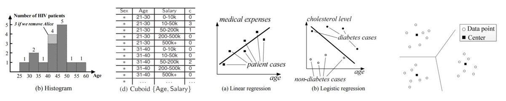
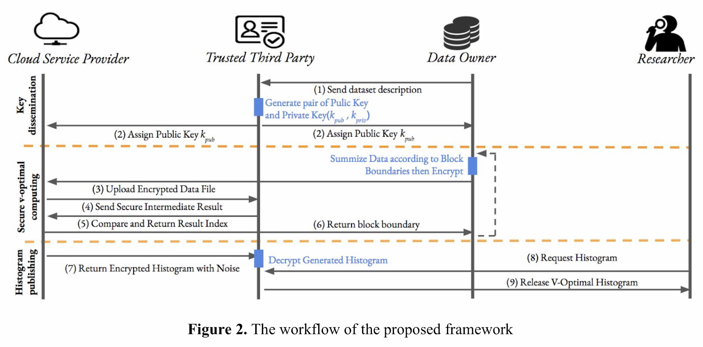
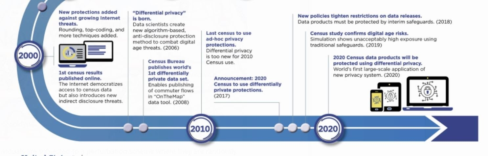

<!-- TODO(content): 7 unrecoverable figure(s) removed — dead Google-Docs/social paste artifacts (404 on live for years, no archive). Recreate if valuable. -->

In this blog post, we will cover a few use cases of differential privacy (DP) ranging from biomedical dataset analysis to geolocation. For the slide deck associated with this post, created for the SG OpenMined Explorers Study Group, please see [Use cases of Differential Privacy and Federated Learning by @Ria](https://docs.google.com/presentation/d/15Mzb0mGKrBSDULTuha-TXHp-rdHppLi8MQGTuiwfKlU/edit?usp=sharing).

Let’s start with the application of differential privacy for genomics.

#### Genomics

Machine learning has important implications for genomics applications, such as for precision medicine (i.e., treatment tailored to a patient’s clinical/genetic features) [1](#f1) and detecting fine-grained insights in data collected from a diverse population [2](#f2).

Given the rapid creation of numerous genomics datasets to fuel statistical analyses and machine learning research for these applications, one of the primary privacy risks for such an application are linkage attacks using auxiliary information. Linkage attacks involve exploiting the scenario where information in a public database overlaps with a sensitive dataset (which is usually anonymized/de-identified to censor the dataset). We’ll cover de-identification and k-anonymization in a moment.

There are many illustrated examples of linkage attacks, such as a linkage attack being deployed on de-identified hospital records and a voter registration database which resulted in successfully finding the Governor of Massachusetts’s patient profile [2](#f2).

Furthermore, consider the following quote:

> _“It has been demonstrated that even coarse-level information such as minor allele frequencies (MAF) can reveal whether a given individual is part of the study cohort, potentially disclosing sensitive clinical phenotypes of the individual.”_ [2](#f2)

This is concerning in light of genetic discrimination, where individuals can be treated differently because they might have a genetic mutation [1](#f1).

Prior solutions to this issue include [1](#f1):

-   De-identification, which involves removing unique identifiers from the data such as names, phone numbers, and even vehicle identifiers. The disadvantage of this approach is that you could lose meaningful information that is useful for the analyses.
-   K-anonymization, which involves removing information from the released data until a data record belong in the same equivalence class with at least (k − 1) other records. The disadvantage of this approach is that it offers no formal privacy guarantees and is vulnerable to linkage attacks, among other attacks.

The benefits associated with Differential Privacy [1](#f1):

-   Protects against linkage attacks
    
-   Enables two types of settings:
    
    -   Interactive setting, where you can query non-public database – answers are injected with noise or only summary statistics are released
    -   Non-interactive setting, where the public data is injected with noise

The disadvantages associated with DP for this application:

-   Balancing Privacy vs. Utility (i.e., considering the accuracy of the results).
-   Only preset queries are allowed with DP approaches such as: ‘return p-value’, ‘return location of top K SNPs’

#### Uber User Data

Before discussing the use case, let’s quickly define the different types of sensitivity for a query.

##### Definitions of Sensitivity [9](#f9):

-   _Sensitivity of a query:_ Amount query’s results change when database changes.
    
-   _Global sensitivity:_ Maximum difference in the query’s result on any two neighboring databases.
    
-   _Local sensitivity:_ Maximum difference between the query’s results on the true database and any neighbor of it. Local sensitivity is often much lower than global sensitivity since it is a property of the single true database rather than the set of all possible databases. Smoothing functions are important to consider with local sensitivity.
    

Many differential privacy mechanisms are based on global sensitivity, and do not generalize to joins (since they can multiply input records).

Techniques using local sensitivity often provide greater utility, but are computationally infeasible.

##### Use Case

For this use case, let’s consider a sample application by Uber – determine the average trip distance for users [9](#f9). Smaller cities might have fewer trips, so an individual trip is likely to influence the analysis, which differential privacy can help address.

Per the notes from the previous section, it is valuable to consider local sensitivity given global sensitivity-based DP mechanisms do not generalize to joins. The below image from the paper “Towards Practical Differential Privacy for SQL Queries” [9](#f9) shows a large number of queries utilize joins, which motivates the need for a method that takes advantage of local sensitivity.

**Side note:** I highly recommend reading the paper “Towards Practical Differential Privacy for SQL Queries” [9](#f9) (link in the References) for similar analyses of queries, and a detailed definition of Elastic Sensitivity.

The authors propose Elastic Sensitivity as a method to leverage local sensitivity. The purpose of the approach is to “model the impact of each join in the query using precomputed metrics about the frequency of join keys in the true database”. Please see the below table for a comparison between Elastic Sensitivity with other DP mechanisms – we see Elastic Sensitivity supports different types of equijoins, which “are joins that are conditioned on value equality of one column from both relations.”

The authors demonstrate FLEX, a system that utilizes elastic sensitivity, depicted in the figure below. Here are the benefits described in the paper:

-   Provides (ε, δ)-differential privacy and does not need to interact with the database.
-   Only requires static analysis of the query and post-processing of the query results.
-   Scales to big data while incurring minimal performance overhead.

#### Healthcare + Internet of Things: Heartrate monitoring

Let’s now turn to a healthcare application involving wearable technology and the Internet of Things. The use case here is to collect health data streams measured at fixed intervals (e.g. collecting heart rates measured every minute during business hours) [3](#f3) by a device such as a smart watch.

In the system pipeline described in the corresponding paper, data is perturbed using Local Differential Privacy, where the data contributor adds noise. Per the pipeline shown below, the user’s smart watch identifies salient points in the data streams and then perturbs them with noise, followed by sending the noisy data to the server for reconstruction and storage.

#### Biomedical Dataset Analysis

For the next use case, we will consider handling large data for biomedical applications with differential privacy guarantees. DAMSEN [4](#f4) is a system that supports differential privacy guarantees for numerous data analysis tasks and utilizes a effective query optimization engine to achieve high accuracy and low privacy costs.

As demonstrated in the below figure, DAMSEN [4](#f4) offers differential privacy for data analysis tasks, such as histograms, cuboids, machine learning algorithms (e.g. linear and logistic regression, potentially generalizable to neural networks), and clustering tasks.

Note: In the context of data analysis tasks apropos queries, histograms do not represent the traditional visualization of the data distribution. Histograms are a special type of query that involves sorting data points into buckets [11](#f11). You can think of such queries as similar to Pandas’ groupby() function with more functionality. A cuboid is an analysis task that involves multiply summary datasets and tables – please see the DAMSEN paper [4](#f4) for detailed examples.

**Potential Project Idea:** Ensure differential privacy guarantees for visualizations. Two resources I have found on the topic are [“Privacy-aware Visualization of Personal Data”](https://users.cs.duke.edu/~hexi88/privacy-aware_visualization/index.html) [12](#f12) and [“Challenges of Visualizing Differentially Private Data”](https://people.cs.umass.edu/~miklau/assets/pubs/viz/zhang16challenges.pdf) [13](#f13).

An interesting note is that DAMSEN incorporates a compressive mechanism, which is useful for minimizing the amount of noise needed for DP:

> _“Instead of adding noise to the original data, CM first encodes the data as in compressive sensing; then, CM adds noise to the encoded data, decodes the result as in compressive sensing, and publishes it. Because the transformed data are highly compressed, they require much less noise to achieve differential privacy.”_ [5](#f5)

It is important to reduce the amount of noise because we would like to ensure the query results perturbed by the DP mechanism are still as accurate as possible.

#### Analyzing Electronic Health Records

For this use case, we consider DP-perturbed histograms with Homomorphic Encryption [10](#f10). The overall system proposed in the paper [10](#f10) is depicted in the figure below:

We can see the system involves researchers, trusted third parties, and cloud service providers as entities that each have their own specific roles in the framework.

The concept of the proposed framework is depicted in the below figure. We can see the parts of the framework required for the homomorphic encryption components for key dissemination and the secure histogram generation. In terms of the DP part of the framework, the system adds encrypted Laplace noises to the count of each bin of the histogram, where the sensitive of histogram computation is 1.

As mentioned previously, histograms are a type of query and the results can be used to train models.

As shown in the below figure, the authors found that while the classifier trained on the raw dataset achieved the highest performance, the authors’ classifier trained on the dataset sampled based DP-perturbed V-optimal histogram performed similar to the classifier trained on the dataset sampled based on the noise-free V-optimal histogram. The exception for this finding occurred when the privacy budget was reduced to less than 0.1, which led to large amounts of noise added to the data and a drop in the AUC and increase in the query missing rate.

Therefore, one of the authors’ conclusion is that the privacy budget needs to be carefully chosen. They also explain that their security model prevents against various leakages in terms of information exchange between the entities discussed – please see the paper for more details.

#### Geolocation

Microsoft’s PrivTree system [6](#f6) utilizes differential privacy to mask the location of individuals in their geolocation databases. The approach involves the partitioning of a map into sub-regions, followed by applying location perturbation to each sub-region, as demonstrated in the figures below. Their system, given the original data and a few other parameters (the scale of Laplacian noise to be used, a threshold used to decide whether the splitting of a node should occur, etc.), can implement a differentially private algorithm and output noisy data for almost any kind of location data.

#### U.S. Census Bureau

An interesting use case that we will only cover briefly is the U.S. Census Bureau’s decision to incorporate differential privacy as part of their privacy strategy [7](#f7), [8](#f8). Per the figure below, they intend to adopt differential privacy through the “world’s first large-scale application of new privacy system” in 2020.

#### DP Research Challenges

Let’s consider a few research challenges (Borrowed from DAMSEN[5](#f5)) that are common to the use cases we have discussed in this blog post:

-   “How can we minimize the noise added / maximize the utility of the analysis results?”
    
-   “The privacy budget is a parameter chosen by the data owner that controls the hardness for an attacker to infer sensitive information from the published dataset. Each analysis uses up some of the “privacy budget”. How can we make the budget last as long as possible?”
    
-   **Question to the reader:** Are there any other research challenges to consider? Share your thoughts in the comments below or in the sg-om-explorers Slack channel!
    

**Differential Privacy References**

1.  [Machine learning and genomics: precision medicine versus patient privacy](https://royalsocietypublishing.org/doi/full/10.1098/rsta.2017.0350?url_ver=Z39.88-2003&rfr_id=ori%3Arid%3Acrossref.org&rfr_dat=cr_pub++0pubmed&) [↩](#a1)
    
2.  [Emerging technologies towards enhancing privacy in genomic data sharing](https://genomebiology.biomedcentral.com/articles/10.1186/s13059-019-1741-0) [↩](#a2)
    
3.  [Privacy-preserving aggregation of personal health data streams](https://journals.plos.org/plosone/article?id=10.1371/journal.pone.0207639) [↩](#a3)
    
4.  [Demonstration of Damson: Differential Privacy for Analysis of Large Data](http://differentialprivacy.weebly.com/uploads/9/8/6/2/9862052/pid2574139.pdf) [↩](#a4)
    
5.  [Compressive Mechanism](https://differentialprivacy.weebly.com/compressive-mechanism.html) [↩](#a5)
    
6.  [Project PrivTree: Blurring your “where” for location privacy](https://www.microsoft.com/en-us/research/blog/project-privtree-blurring-location-privacy/) [↩](#a6)
    
7.  [A History of Census Privacy Protections](https://www.census.gov/library/visualizations/2019/comm/history-privacy-protection.html) [↩](#a7)
    
8.  [Protecting the Confidentiality of America’s Statistics: Adopting Modern Disclosure Avoidance Methods at the Census Bureau](https://www.census.gov/newsroom/blogs/research-matters/2018/08/protecting_the_confi.html) [↩](#a8)
    
9.  [Towards Practical Differential Privacy for SQL Queries](https://arxiv.org/pdf/1706.09479.pdf) [↩](#a9)
    
10.  [Privacy-preserving biomedical data dissemination via a hybrid approach](https://www.ncbi.nlm.nih.gov/pmc/articles/PMC6371369/pdf/2977168.pdf) [↩](#a10)
     
11.  [Making Histogram Frequency Distributions in SQL](http://www.silota.com/docs/recipes/sql-histogram-summary-frequency-distribution.html) [↩](#a11)
     
12.  [“Privacy-aware Visualization of Personal Data”](https://users.cs.duke.edu/~hexi88/privacy-aware_visualization/index.html) [↩](#a12)
     
13.  [“Challenges of Visualizing Differentially Private Data”](https://people.cs.umass.edu/~miklau/assets/pubs/viz/zhang16challenges.pdf) [↩](#a13)
     

Additional resource: [Differential privacy: its technological prescriptive using big data](https://link.springer.com/content/pdf/10.1186/s40537-018-0124-9.pdf)

**Differential Privacy Code Repositories**

-   [Uber SQL Differential Privacy](https://github.com/uber-archive/sql-differential-privacy)
-   [TensorFlow – Differential Privacy](https://blog.tensorflow.org/2019/03/introducing-tensorflow-privacy-learning.html?m=1)
-   [Google’s C++ Differential Privacy library](https://github.com/google/differential-privacy)
-   [OpenMined Differential Privacy](https://blog.openmined.org/making-algorithms-private/)
