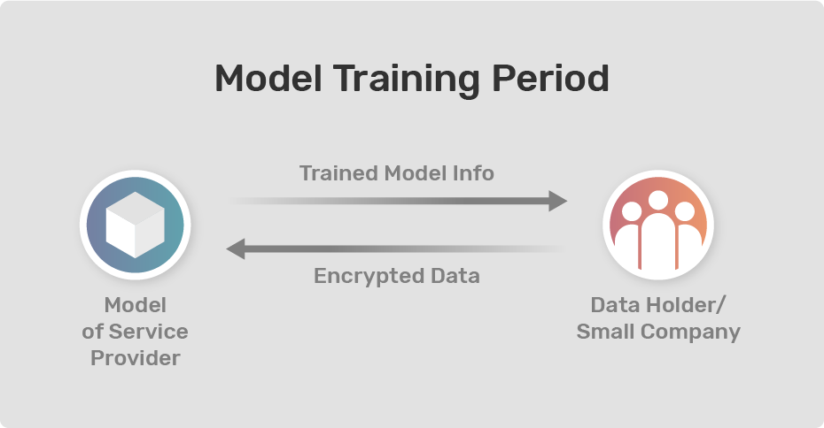
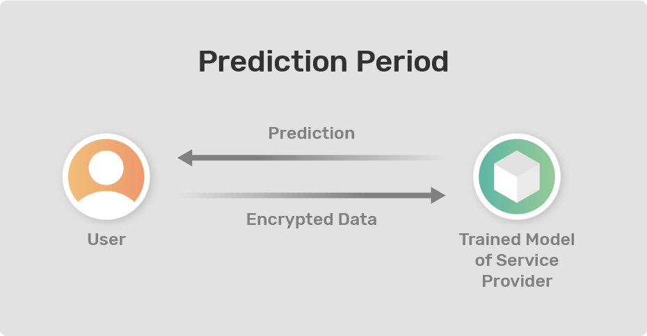

<!-- TODO(a11y): 2 localized body image(s) have empty alt text -->

_**This post is part of our [Privacy-Preserving Data Science, Explained](https://blog.openmined.org/private-machine-learning-explained/) series.**_

In the era of XaaS(Anything as a Service), many companies provide different technologies as a service. Nowadays big cloud operators, such as Google, AWS, and Microsoft, and startups alike are offering Machine Learning as a Service(MLaaS). These services help small companies that lack the ML expertise or required infrastructure to build a predictive model with the data from the small companies. These data are valuable and sensitive. The customers get their services via API calls. Service providers don’t want to open up about their model, which are black boxes to the customers. And because of the data sensitivity, customers may not be interested to share their raw data through API calls. **Here comes the trust worthy “Encrypted Machine Learning” concept that helps protect the data and the model by encrypting it.** Instead of merely providing MLaaS that might be leaky, service providers can introduce EMLaaS(Encrypted Machine Learning as a Service) to assure customers about their data security.

Generally speaking, there are two kinds of MLaaS these days. **One type of service provider focuses on solving a set of common problems for which many companies can use to solve different problems based on their applications.** Their MLaaS services consist of a model trained on a specific type of data tailored to these use cases. Take Google Cloud Vision API for an example, which can detect/recognise common objects. A potential customer to [Google Cloud Vision API](https://cloud.google.com/vision) does not need to upload any training data to acquire the services they seek. As long as their needs can be fulfilled by the service, they can use the model via API calls to get predictions on the new data at hand. In this case, introducing encrypted machine learning is valuable for both parties. On the one hand, the model (intellectual property) of the service provider is encrypted and secure from reverse engineering; on the other hand, the data that a customer wishes to analyze will also be encrypted and private.

**The other type of service is when our data at hand is different from what the given model is trained for, in which case a user wants to train a new model from scratch with the data.** [AWS Rekognition](https://aws.amazon.com/rekognition/?blog-cards.sort-by=item.additionalFields.createdDate&blog-cards.sort-order=desc) and [Google AutoML](https://cloud.google.com/automl) are examples for this type of service. A potential client to these services, naturally, would have little to no control over the model training process. Since the service providers possess valuable intellectual properties in their service stack, they have a vested interest in keeping the service in a black box. But the customer would be concerned if the data and insights they provide to train the new model would be retained by the service provider. As in the first case, there is the issue of trust. If the service utilizes Encrypted Machine Learning, then the new model will be trained on encrypted data and make predictions over encrypted data to protect individual privacy as well as trade secrets.

In both cases mentioned above, the data will reside on local machines. Potential users can use the SDK provided by the service(e.g. AWS Sagemaker) to encrypt the data locally and train predictive models based on the encrypted data with a chosen service provider according to its business needs (whether to use it for training or for prediction).

### Example:

<figure class="">

</figure>

Let’s say we want to build a cardiovascular heart disease prediction system. We will need highly sensitive medical data from medical patients. Imagine that we obtained a valuable [heart disease dataset](https://archive.ics.uci.edu/ml/datasets/Heart+Disease), which could help us build a medical predictive model detecting whether a patient has heart disease. . There are several regulations (e.g HIPPA or GDPR) to follow and ensure if one is working on health care data. Now imagine further that we do not have enough knowledge on Encrypted Machine Learning and can not afford to hire a full-time employee with the required experience. Later, we find out that there is a service for training the medical model we desire and, even better, the service fees are significantly less than hiring someone full-time. We start to read the documentation for the service and download their SDK, which we use to encrypt our data on our local machine. After encryption, we send the protected data to the service provider’s server for training.

<figure class="">

</figure>

Once the model is prepared, we can send new data points(which will be encrypted as well) from potential heart disease patients to the trained model for predictions. With such an encrypted MLaaS, we comply with healthcare data regulations and protect the privacy of patients whose data we use! Even if someone is able to intercept and examine the data that we are sending or receiving over the internet, that person will not be able to extract anything meaningful out of the encrypted data.

In conclusion,  EMLaaS can help small companies to ensure data security and create amazing AI driven solutions with minimal cost. In an era when aggregated data has the power to propel research and innovation in many fields, encrypted and private AI could help protect data privacy, build trust, and enable different parties to collaborate together.

_OpenMined is an open source community where people from all around the world are working to make the world more privacy-preserving. If you want to become one of the code contributors, please visit our [OpenMined Github Repositories Page](https://github.com/OpenMined) and choose the project according to your interest. You can also join our [Slack](http://slack.openmined.org/) workspace to keep up with the community initiatives. There is always someone to help you to get started with your journey in OpenMined._

_**Acknowledgments:** I’m extremely grateful to Nahua, for helping me in improving my writing. I’m also grateful to Jacob for his amazing work with the graphics._

### References:

-   **[Chiron: Privacy-preserving Machine Learning as a Service](https://arxiv.org/abs/1803.05961)**
-   **[PyGrid Examples](https://github.com/OpenMined/PyGrid/tree/dev/examples)**
-   **[Section: Encrypted Deep Learning](https://github.com/udacity/private-ai/blob/master/Section%204%20-%20Encrypted%20Deep%20Learning.ipynb)**
-   **[ENCRYPTED DEEP LEARNING CLASSIFICATION WITH PYTORCH & PYSYFT](https://blog.openmined.org/encrypted-deep-learning-classification-with-pysyft/)**
-   **[WHAT IS MACHINE LEARNING AS A SERVICE (MLAAS)?](https://analyticsindiamag.com/what-is-machine-learning-as-a-service-mlaas/)**
-   **[XaaS (Anything as a Service)](https://searchcloudcomputing.techtarget.com/definition/XaaS-anything-as-a-service)**
-   **[Private Machine Learning as a Service using PySyft](https://devpost.com/software/private-machine-learning-as-a-service-on-top-of-pysyft)**
