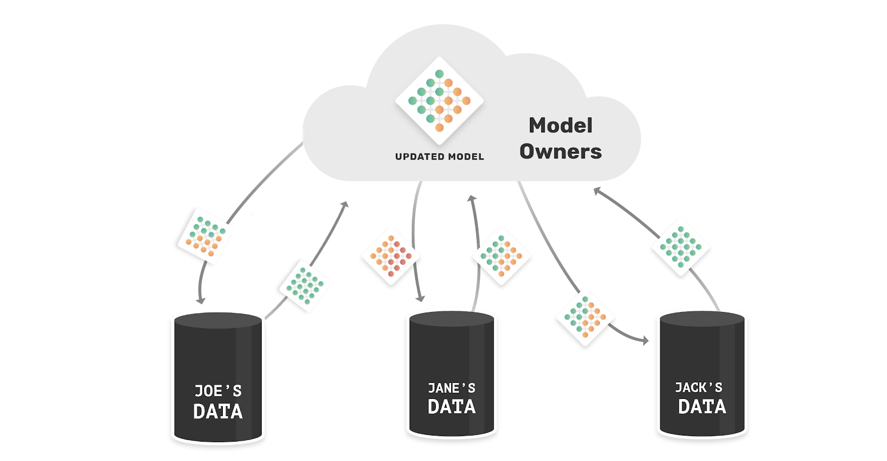
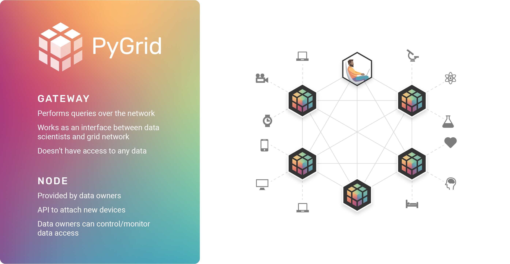

<!-- TODO(a11y): 2 localized body image(s) have empty alt text -->


_**This post is part of our [Privacy-Preserving Data Science, Explained](https://blog.openmined.org/private-machine-learning-explained/) series.**_

**_Update as of November 18, 2021: The version of PySyft mentioned in this post has been deprecated. Any implementations using this older version of PySyft are unlikely to work. Stay tuned for the release of PySyft 0.6.0, a data centric library for use in production targeted for release in early December._**

In this article of the introductory series on Private ML, we will introduce Federated Learning (FL), explaining what FL is, when to use it, and how to implement it with OpenMined tools. The information in this article will be digestible for a broad audience, but section by section, we will go more into the weeds to understand and use Federated Learning.

For more info about the series, check out the intro article or take a look at the other posts to learn more about the techniques that can enable privacy-preserving ML with OpenMined’s libraries.

## **Introduction**

Initially proposed in 2015, federated learning is an algorithmic solution that enables the training of ML models by **sending copies of a model to the place where data resides  and performing training at the edge**, thereby eliminating the necessity to move large amounts of data to a central server for training purposes.

The data remains at its source devices, a.k.a. the clients, which receive a copy of the global model from the central server. This copy of the global model is trained locally with  the data of each device. The model weights are updated via local training, and then the local copy is  sent back to the central server. Once the server receives the updated model, it proceeds to aggregate the updates, improving the global model without revealing any of the private data on which it was trained.

## **Use cases**

One of the first applications of FL was to improve word recommendation in [Google’s Android keyboard](https://ai.googleblog.com/2017/04/federated-learning-collaborative.html) without uploading the data, i.e. a user’s text, to the cloud. More recently, Apple has detailed how it employs [federated learning to improve Siri](https://www.technologyreview.com/2019/12/11/131629/apple-ai-personalizes-siri-federated-learning/)‘s voice recognition. Besides, intuitively, **keeping the data at its source is valuable in any privacy-preserving applications**, especially when [applied in healthcare](https://blog.openmined.org/federated-learning-differential-privacy-and-encrypted-computation-for-medical-imaging/) or on confidential data in business and government.

<figure class="">



</figure>

### **Advantages:**

-   Researchers can train models using private and sensitive data without having to worry about handling the data – the data remains on the device and only learned model updates are transferred between the lab and the data owners.
-   Compliant with [data protection regulations like GDPR](https://youtu.be/8YCB8nbTxKY?t=178).

### **Disadvantages:**

-   The cost for implementing federated learning is higher than collecting the information and processing it centrally, especially during the early phases of R&D when the training method and process are still being iterated on.
-   Requires data owners to perform computations on the device that holds data – for some devices with limited computation capacity this may not be possible or economic.
-   Implementing FL is not enough to guarantee privacy, as model updates may include traces that can be used to infer private and sensitive information, thus requiring mixing with other techniques.

## Implementation

To get started we will use t[he classical MNIST data set](https://blog.openmined.org/upgrade-to-federated-learning-in-10-lines/) that will stand in for our clients’ data, PySyft will provide all the components needed to demo federated learning and test it locally on this data set.

If you want to imagine a reasonably close application, we could conceive that the MNIST characters are part of the digital signatures of our clients, produced when signing documents on their smartphone and we would like to use them to train a character recognition model. In this scenario we would like to provide strong privacy assurances to our users by not uploading their signatures to a central server.

In PySyft, the clients’ devices, that is, the entities performing model training, are called workers.

```python
bob = sy.VirtualWorker(hook, id="bob")  # <-- define remote worker bob
alice = sy.VirtualWorker(hook, id="alice")  # <-- remote worker alice
```

At this point in or mock example we have to send the data to the workers using PySyft’s Federated Data Loader.

```python
federated_train_loader = sy.FederatedDataLoader( # <-- this is now a FederatedDataLoader 
    datasets.MNIST('../data', train=True, download=True,
                   transform=transforms.Compose([
                       transforms.ToTensor(),
                       transforms.Normalize((0.1307,), (0.3081,))
                   ]))
    .federate((bob, alice)), # <-- NEW: we distribute the dataset across all the workers, it's now a FederatedDataset
    batch_size=batch_size, shuffle=True)
```

The Federated Data Loader, like the standard torch data loader on which is based, enables lazy loading during training and so in the train function, because the data batches are now distributed across Alice and bob, you need to send the model to the right location for each batch using `model.send(...)`. Then you perform all the operations remotely with the same syntax as if you were doing everything locally on PyTorch. When you’re done, you get back the model updated and the loss that can be logged using the `.get()` method.

```python
def train(args, model, device, train_loader, optimizer, epoch):
    model.train()
    for batch_idx, (data, target) in enumerate(federated_train_loader): # <-- now it is a distributed dataset
        model.send(data.location) # <-- NEW: send the model to the right location
        data, target = data.to(device), target.to(device)
        optimizer.zero_grad()
        output = model(data)
        loss = F.nll_loss(output, target)
        loss.backward()
        optimizer.step()
        model.get() # <-- NEW: get the model back
        if batch_idx % args.log_interval == 0:
            loss = loss.get() # <-- NEW: get the loss back
            print('Train Epoch: {} [{}/{} ({:.0f}%)]tLoss: {:.6f}'.format(
                epoch, batch_idx * args.batch_size, len(train_loader) * args.batch_size, #batch_idx * len(data), len(train_loader.dataset),
                100. * batch_idx / len(train_loader), loss.item()))
```

At this point, the model has been trained on the data of both Alice and Bob by the respective workers, and their data has not left their devices.

Federated learning alone, however, is not enough to ensure privacy because using the model updates, an “honest-but-curious” server could reconstruct the samples from which the updates were computed. This is where Secure MultiParty Computation, homomorphic encryption, and differential privacy come to provide stronger guarantees of security to data owners. We will explore all these topics in this series.

## PySyft + PyGrid for Federated Learning at scale

As we mentioned above the larger vision for the technology goes beyond any single application or service. With the help of federated learning data owners can more easily maintain control of their data that can be used to train models without leaving the owners’ systems. These guarantees, besides being positive for all users of data-intensive applications, have the potential to make available whole new data sets in sectors like healthcare where, to follow HIPPA or the health related provisions of GDPR, privacy is the top priority.

To contribute to making this vision a reality OpenMined is working on **PyGrid a peer-to-peer platform that uses the PySyft framework for Federated Learning and data science.**

<figure class="">



<figcaption>The Gateways are like DNS routing to the nodes that provide the desired datasets&nbsp;</figcaption></figure>

Data owners and data scientists can connect on the platform, where the data owners can feel safe in the knowledge that their data will never leave their node, and data scientists can perform their analysis without infringing on anyone’s privacy rights.

Today, this type of interaction could take from weeks to months in sectors working on sensitive data, but with PyGrid it could all be just a few lines of code away. To learn more about PyGrid, [here is a deeper dive in the platform and the use cases it enables](https://blog.openmined.org/what-is-pygrid-demo/).

---

____OpenMined would like to thank Antonio Lopardo, Emma Bluemke, Théo Ryffel, Nahua Kang, Andrew Trask, Jonathan Lebensold, Ayoub Benaissa, and Madhura Joshi__,_ Shaistha Fathima, Na_te Solon, Robin Röhm, Sabrina Steinert,_ _Michael Höh_ and Ben Szymkow_ ____for their__ contributions to various parts of __this series.____
