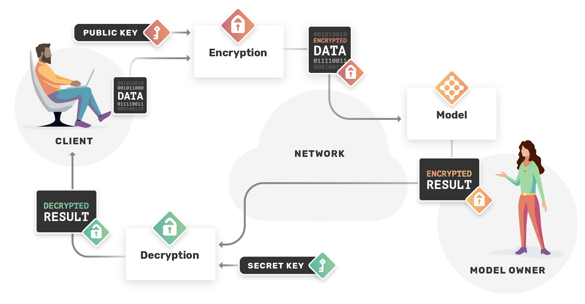
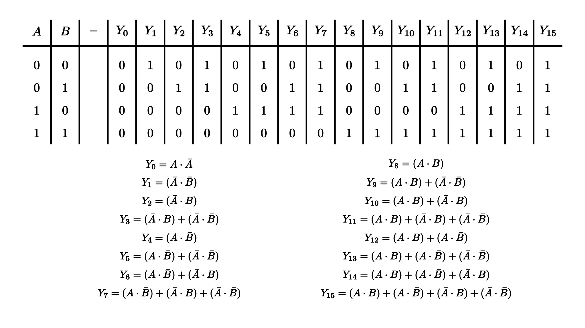
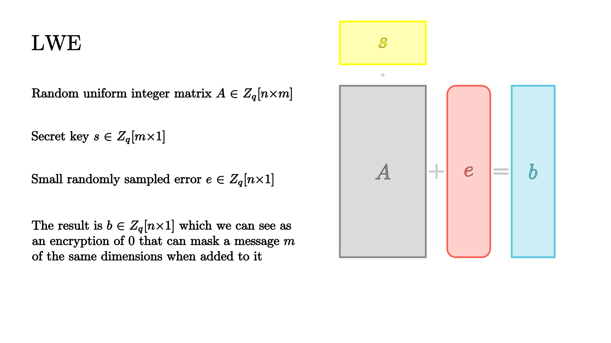

<!-- TODO(a11y): 3 localized body image(s) have empty alt text -->


__**This post is part of our [Privacy-Preserving Data Science, Explained](https://blog.openmined.org/private-machine-learning-explained/) series.**__

**_Check out the companion video to this article on [youtube](https://youtu.be/2TVqFGu1vhw)._**

<div style="position: relative; padding-bottom: 56.25%"><iframe style="width: 100%; height: 100%; position: absolute; left: 0px; top: 0px;" src="https://www.youtube.com/embed/2TVqFGu1vhw" width="100%" height="100%" frameborder="0" allowfullscreen="allowfullscreen"></iframe></div>

## Introduction

Input privacy is one of the most relevant issues in private ML. We explored one solution to this problem in Secure Multi-Party Computation. However, if secret sharing was not an option due to the limited number of participants, what’s the alternative? [**Homomorphic encryption(HE)**](https://en.wikipedia.org/wiki/Homomorphic_encryption) is a kind of encryption that allows computation on encrypted data. In short, HE ensures that performing operations on encrypted data and decrypting the result is equivalent to performing analogous operations without any encryption. So like SMPC, we can use HE to achieve input privacy but with only one party needed to encrypt and decrypt the data.

HE is not only used to protect data owners; model owners have some of the same privacy concerns around their valuable intellectual property (IP) as clients do around their data. Therefore it is crucial when using a model in an untrustworthy environment, to keep its parameters encrypted.

## Use cases

Homomorphic encryption has numerous applications that range from healthcare to smart electric grids; from education to machine learning as a service (MLaaS). All sectors where input privacy is paramount and making use of the data is usually already complex due to: regulations, the significance of the data, and security concerns. Other notable uses of the technology involve non-intrusive, privacy-preserving security, i.e., systems capable of detecting nefarious activity from an encrypted and private data source. A useful metaphor for these systems is to think of them as the sniffer dogs of digital data sources. They don’t infringe upon anyone’s privacy thanks to the encryption, their accuracy can be empirically verified, and since their parameters are kept private, they are not easily reverse engineered. [Here’s a link to Andrew Trask’s article on privacy-preserving security](http://iamtrask.github.io/2017/06/05/homomorphic-surveillance/) if you want to dive deeper.

<figure class="">



<figcaption>MLaaS is one of the most exciting applications of Homomorphic Encryption.</figcaption></figure>

#### Advantages:

-   Can perform inference on encrypted data, so the model owner never sees the client’s private data and therefore cannot leak it or misuse it.
-   Doesn’t require interactivity between the data and model owners to perform the computation.

#### Disadvantages:

-   Computationally expensive.
-   Restricted to certain kinds of calculations.

## Implementation

PySyft supports the **CKKS** leveled homomorphic encryption scheme and the [**Paillier** partially homomorphic encryption scheme](https://blog.openmined.org/the-paillier-cryptosystem/) which is limited to addition but is much faster.

More details on CKKS and Paillier are available below in the “theory behind the implementation” section. Here we’ll focus on how to use HE in PySyft.

#### Paillier

After importing and hooking torch with syft’s additional functionalities we generate the private and public keys. Using the public key we can encrypt syft tensors and with the `+`  operator we can homomorphically sum them. Intuitively, the private key allows us to decrypt the result of our operations which we can easily print.

```python
import syft as sy
import torch as th

hook = sy.TorchHook(th)

#public and private key generation
pub, pri = sy.keygen() 

#encrypting with Paillier
x = th.tensor([1, 2, 3]).encrypt(protocol="paillier", public_key=pub) 
y = th.tensor([2, 2, 2]).encrypt(protocol="paillier", public_key=pub)

#encrypted sum
sum = x + y 

#decryption with private key
print(sum.decrypt(protocol="paillier", private_key=pri))

#tensor([3, 4, 5])
```

#### CKKS

To use the more complex and powerful CKKS scheme we can follow similar steps. Besides importing syft and torch for CKKS we also use functions from `syft.frameworks.tenseal` which integrates the [TenSEAL](https://github.com/OpenMined/TenSEAL) package for performing HE operations on tensors.

```python
import syft as sy
import torch as th
import syft.frameworks.tenseal as ts

hook = sy.TorchHook(th)

#Public and private key generation
pub, pri = ts.generate_ckks_keys() 

#Encrypting with CKKS
x = th.tensor([1.2, 2.2, 3.2]).encrypt(protocol="ckks", public_key=pub) 
y = th.tensor([2.0, 2.0, 2.0]).encrypt(protocol="ckks", public_key=pub)

#encrypted addition, substraction and multiplication
encrypted_add = x + y
encrypted_sub = x - y
encrypted_mul = x * y

#decryption with private key
print(encrypted_add.decrypt(protocol="ckks", private_key=pri))
print(encrypted_sub.decrypt(protocol="ckks", private_key=pri))
print(encrypted_mul.decrypt(protocol="ckks", private_key=pri))

#tensor([3.2, 4.2, 5.2])
#tensor([-0.8, 0.2, 1.2])
#tensor([2.4, 4.4, 6.4])
```

## Theory behind the implementation

Since 1978, when the idea of Fully Homomorphic Encryption (FHE) was first formalized, several cryptosystems have been invented to get closer to computing arbitrary functions on ciphertext. However, until **Craig Gentry introduced the crucial technique of [bootstrapping in ’09](https://dl.acm.org/doi/pdf/10.1145/1536414.1536440)**, they were all partially or somewhat homomorphic encryption schemes. To understand why that is the case, it’s important to define more precisely what “computing arbitrary functions” means.

At the level of bits and logic gates, successive combinations of **AND** and **XOR** can express any boolean function. Since these two gates behave respectively as operations of binary multiplication and addition we can conclude that a scheme under which we can perform homomorphic addition and multiplication on ciphertext should be capable of achieving FHE, with some caveats.

<figure class="">



<figcaption>Using the XOR gate we can easily make a NOT gate and with XOR, AND and NOT we can make any of the 16 possible functions that combine 2 binary variables.</figcaption></figure>

The operations of addition and multiplication suggest the use of a **ring** as the underlying algebraic structure. **A set of objects, like integers, is considered a ring if we can perform on it an “addition-like” and a “multiplication-like” operation and if it admits neutral elements for both operations, respectively** `**0**` **and** `**1**`. Examples of rings are, as we have said, the set of all integers but also the set of **all possible remainders of an integer division by a specific n**, known as “all integers modulo n”. For instance the set of integers modulo 5 `Z_5 = {0, 1, 2, 3, 4}`, is a ring because we have both `0` and `1` and the addition-like operation that after summing two numbers takes as its result **the remainder** of the integer division by 5 of that sum. So `3+4 = 7 -> 7%5 = 2`. Multiplication works in the same way. `4*4 = 16 -> 16%5 = 1`. As we’ll detail later we can also build rings with polynomials.

Besides homomorphic addition and multiplication what are the other characteristics common to most FHE schemes?

#### Somewhat homomorphic encryption (SWHE)

They tend to be based on schemes that are capable of “somewhat” homomorphic encryption. These schemes can only perform a limited number of successive multiplication and addition operations on ciphertext before the results become unreliable and impossible to decrypt. This limitation arises directly from the way these systems guarantee security by relying on noise or error to **make relatively simple problems computationally intractable.**

Using **multiplication** we can operate in a similar way because `C(m1)*C(m2) = m1m2 + 2(r2m1+r1m2+r1r2) + p(m1q2+2r1q2+q1m2+2q1r2+q1q2)`is a valid encryption of `m1*m2`. **Here the noise grows much faster than in addition.**

Before talking about why a growing noise term is such a crucial issue let’s focus on **why we need it in the first place**. If we were to remove the noise from our scheme it would still be capable of performing homomorphic addition and multiplication. However, to break the noise-less scheme an attacker would just need to get a hold of two encrypted messages and proceed by simply calculating the **greatest common divisor** for which there is the Euclidean algorithm that runs linearly with the number of digits in the smallest input.

If we add noise, the problem becomes much more difficult. In the literature it is known as the **Approximate Greatest Common Divisor (GCD) or Approximate Common Divisor (ACD) problem** and with reasonable parameters it is considered hard to solve.

#### Learning with Errors

Approximate GCD is not the only problem used to secure FHE, in fact numerous recent schemes employ the **[Learning With Errors](https://en.wikipedia.org/wiki/Learning_with_errors)** problem which is also conjectured to be hard to solve.

<figure class="">



</figure>

In its most basic formulation the problem states that, given a random uniform integer matrix `A` and a very small integer vector error `e`, if we multiply A by a secret vector `s` and then sum `e`, **recovering `s` from the resulting vector `b` without `e` is computationally intractable even if knowing the matrix `A`**. Similarly to the scheme we explained before, `As + e` can be thought of as an encryption of `0` and, from that starting point, a different scheme can be developed as presented by [prof. Daniele Micciancio in this talk](https://www.youtube.com/watch?v=TySXpV86958) with intuitive addition and multiplication.

#### Dealing with Error/Noise

Even schemes that rely on LWE however, we see the noise rise as successive additions are performed and even more so with multiplications. To understand why that is a problem we’ll go back to our first scheme with an example.

Let’s say, to keep things simple, that we would like to add to itself a number three times `Cp(0) =  0 + 2 * 5 + 68 * 29 = 1982` the number is `m=0` encrypted with secret key `p=29`.

`Cp(0)+Cp(0)+Cp(0) = 5946 = 0 + 2*(15) + (204)*29` as always `5946` doesn’t tell us much about the result of our calculation but with `p` we can decrypt it as we detailed above. We start with `5946%29 = 1` and then we check whether the result is even or odd, `1`  is odd so we conclude `3m=1` but of course we know that is not the case so what went wrong?

<div style="position: relative; padding-bottom: 56.25%"><iframe style="width: 100%; height: 100%; position: absolute; left: 0px; top: 0px;" src="https://www.youtube.com/embed/xzHF8lMmqsw" width="100%" height="100%" frameborder="0" allowfullscreen="allowfullscreen"></iframe></div>

The error term has gotten too big and instead of being even it’s now odd. Since `30` is bigger than `p=29` the modulo `p` operation that usually doesn’t effect the error because it’s too small has now changed it, corrupting the encryption. This example is specific to our scheme and the noise was a little too high to begin with. The behavior of all SWHE schemes become unpredictable as the error grows larger.

#### Bootstrapping

So is there a way to decrease the error? Yes, **bootstrapping** is a technique that involves running the decryption procedure homomorphically without revealing the message and using the encrypted secret key.

To give a sense of how this is possible we should keep in mind that we can produce a series of **XOR** and **AND** gates or additions and multiplications that perform the decryption operation. In our scheme, the modulo `p` followed by modulo `2`. Furthermore, the scheme we presented here encrypts binary messages. To get an encryption of the secret key we simply need to have an ordered set of encryptions of its bits.

With these two ingredients we can perform homomorphic decryption and eliminate the noise produced by previous operations. Homomorphic decryption however injects some noise of its own, like any other function. As long as we can still perform reliably one operation of addition or of multiplication before needing bootstrapping again we have reached FHE.

>  This is the recipe for most proposed FHE schemes, an underlying SWHE scheme that supports addition and multiplication, usually secured by adding noise, and a way to reduce the noise when it grows too large, usually by bootstrapping.

### Some notable HE schemes and where to learn more about them

The following are some examples of HE schemes: some partial, others fully homomorphic. I have provided short descriptions and links to resources to understand them better.

#### Paillier

In 1999 Pascal Paillier invented a partially homomorphic, asymmetric cryptosystem now bearing his last name. Paillier’s scheme is homomorphic with respect to addition. For more details on the actual algorithm take a look at the [article dedicated to it on our blog](https://blog.openmined.org/the-paillier-cryptosystem/).

In short, it achieves HE with respect to addition by encrypting the message as an exponent of the public key. This way when multiplying two ciphertexts encrypted with the same key the result is a valid encryption of the sum.

**Original paper:** _[Public-Key Cryptosystems Based on Composite Degree Residuosity Classes](https://link.springer.com/content/pdf/10.1007%2F3-540-48910-X_16.pdf)_

**Video resource:** _[Implementation of Homomorphic Encryption: Paillier](https://www.youtube.com/watch?v=xHjhQZdP2aU)_

##### CKKS

CKKS has been developed by researchers at Seoul National University and UC San Diego and it is characterized by using the approximate nature of floating-point arithmetic as part of the LHE scheme.

OpenMined uses CKKS as the primary way to encrypt tensors on which we want to perform both addition and multiplication.

**OpenMined demo on CKKS:** _[Homomorphic Encryption in PySyft with SEAL and PyTorch](https://blog.openmined.org/ckks-homomorphic-encryption-pytorch-pysyft-seal/)_

**Original paper:** _[Homomorphic Encryption for Arithmetic of Approximate Numbers](https://eprint.iacr.org/2016/421.pdf)_

**Video resource:** _[Introduction to CKKS (Approximate Homomorphic Encryption)](https://www.youtube.com/watch?v=iQlgeL64vfo)_

##### BFV

It uses rings over polynomials and has an approachable construction similar to the scheme we described in this post but using LWE. It was developed by Brakerski,Fan and Vercauteren. We have a beginner friendly post on how to implement it in Python.

**OM Implementation:** [_Build an Homomorphic Encryption Scheme from Scratch with Python_](https://blog.openmined.org/build-an-homomorphic-encryption-scheme-from-scratch-with-python/)

**Great Blogpost:** [_A Homomorphic Encryption Illustrated Primer_](https://blog.n1analytics.com/homomorphic-encryption-illustrated-primer/)

**Original Paper:** _[Somewhat Practical Fully Homomorphic Encryption](https://eprint.iacr.org/2012/144.pdf)_

##### GSW

GSW uses LWE applied to linear algebra where the messages are encrypted as eigenvalues of matrices which have a common eigenvector. GSW was developed by Craig Gentry, Amit Sahai, and Brent Waters.

**Original Paper:** _[Homomorphic Encryption from Learning with Errors:Conceptually-Simpler, Asymptotically-Faster, Attribute-Based](https://eprint.iacr.org/2013/340.pdf)_

**Video resource:** _[Fully Homomorphic Encryption](https://www.youtube.com/watch?v=O8IvJAIvGJo&t)_

##### BGV

BGV can use modulus switching, an alternative technique for noise management. BGV was developed by Zvika Brakerski,Craig Gentry and Vinod Vaikunathan.

**Original paper:** [_Fully Homomorphic Encryption without Bootstrapping_](https://eprint.iacr.org/2011/277.pdf)

#### Libraries for HE

**[SEAL](https://github.com/microsoft/SEAL)** is an open-source library developed by Microsoft that implements the BFV and CKKS schemes in both their symmetric and asymmetric versions. The library is written in C++ but has many wrappers for Python and JavaScript.

**[HElib](https://github.com/homenc/HElib)** supports BGV and CKKS with a focus on ciphertext “packing” techniques that increase the efficiency of the base schemes. To describe the library approach to HE the developers have written that in HElib “The  underlying  cryptosystem  serves as  the  equivalent  of  a “hardware  platform”,  in  that  it defines  a  set  of   operations  that can  be  applied  homomorphically, and  specifies   their  cost.” HElib has been developed in C++ by researchers at IBM and it is open-source.

**[Python-paillier](https://github.com/data61/python-paillier)** open-source implementation in python of the Paillier scheme.

**[TFHE](https://github.com/tfhe/tfhe)** implements HE at the binary gate level with a ring-variant of the GSW scheme and applies gate-by-gate bootstrapping. **cuFHE** is the cuda enabled version of TFHE. The library is open-source and written in C.

**[Palisade](https://git.njit.edu/palisade/PALISADE)** is an open-source library supported by DARPA that implements the BFV, BGV, CKKS, TFHE, FHEW schemes and provides other useful features to support lattice-based cryptography.

---

You might also be interested in: **[Homomorphic Encryption in PySyft with SEAL and PyTorch](https://blog.openmined.org/ckks-homomorphic-encryption-pytorch-pysyft-seal/), [Build an Homomorphic Encryption Scheme from Scratch with Python](https://blog.openmined.org/build-an-homomorphic-encryption-scheme-from-scratch-with-python/),** [**What is the Paillier Cryptosystem?**](https://blog.openmined.org/the-paillier-cryptosystem/)
