<!-- TODO(a11y): 44 localized body image(s) have empty alt text -->

_As the leader of the_ [_PyGrid_](https://github.com/OpenMined/PyGrid/) _team,_ [_Ionésio Lima Da Costa Junior_](https://github.com/IonesioJunior) _is building a peer-to-peer platform for private data science and federated learning. This piece is a summary of_ [_Ionesio’s AMA presentation in February 2020_](https://www.youtube.com/watch?v=-OOMXbwFOKo)_. Ionesio is an AI researcher whose work is supported by the_ [_OpenMined / RAAIS Grant program_](https://blog.openmined.org/raais/) _and commissioned by Oxford University and the United Nations Privacy Task Team._

---

**What if you could train on all of the world’s data, without that data leaving the device, and while keeping that data private?**

PyGrid is a peer-to-peer platform for private data science and federated learning. With PyGrid, data owners can provide, monitor, and **manage access to their own private data clusters.** **The data does not leave the data owner’s server.**

Data scientists can then use PyGrid to **perform private statistical analysis on the private dataset**, or even p**erform federated learning across multiple institution’s datasets**.

This blog post will cover:

-   Basic concepts needed to understand **PyGrid**, such as **Federated Learning** and **Secure Multi-party Computation**
-   The **PySyft library** and the **PyGrid platform** – PySyft is a private machine learning library which is deployed using the PyGrid platform
-   Several practical examples of privacy preserving analysis using PyGrid: these examples will help us understand PyGrid’s architecture and figure out how it can be applied to real problems
-   OpenMined’s Roadmap for PyGrid development in 2020

---

## Federated Learning

The first concept we need to understand is Federated Learning. Federated Learning is a technique which allows AI models to learn without users having to give up their data. How does this work?

The first step is to create an initial model. Then, the data scientist would send this model down to a dataset owner – in this case, Joe’s device.

<figure class="">

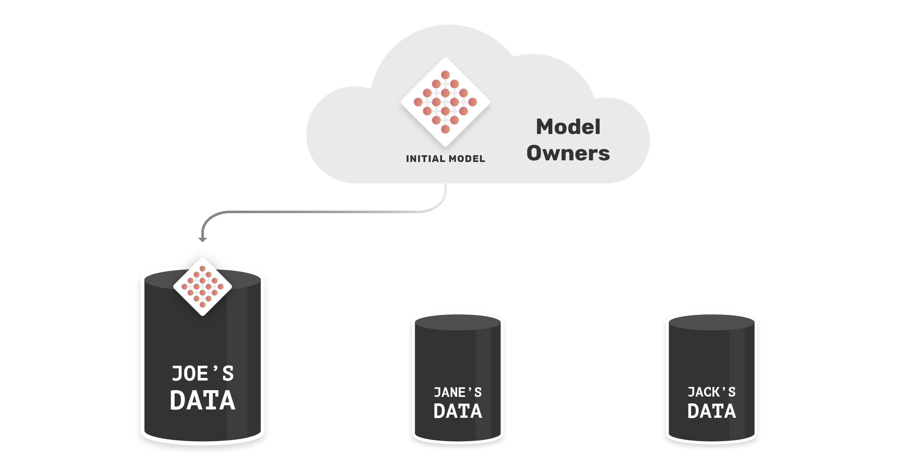

</figure>

Now, Joe can update this model by training it on his dataset. After training, the updated model will return to the AI company.

<figure class="">

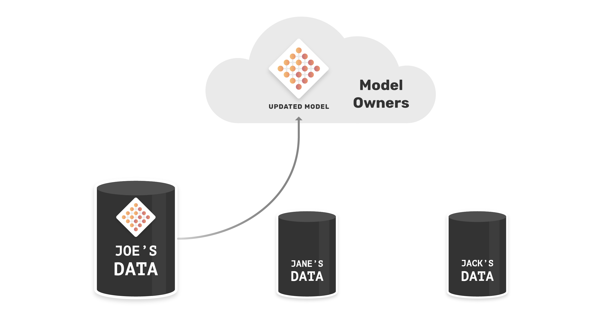

</figure>

Now, the AI Incorporated sends the updated AI model to another device, in this case Jane’s device.

Jane’s will update this model by training it on her dataset. After the model trains on Jane’s data, Jane sends the updated weights back to the data scientist.

<figure class="">

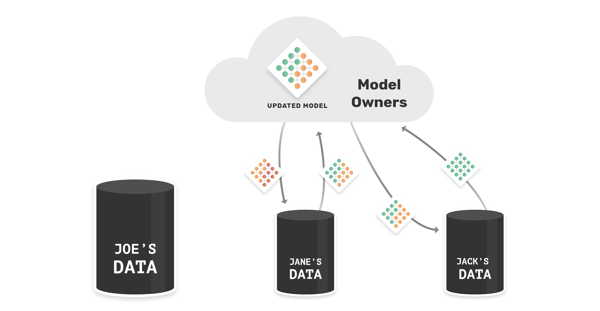

</figure>

Now the model has learned from both Joe and Jane’s data. **We can repeat this process over many nodes, and we can even train models simultaneously on multiple nodes and average them, allowing for faster improvements to the model.**

**The main benefits of federated learning are:**

-   The training data stays on user’s devices (or, for example, the hospital servers)
-   This increases privacy of sensitive data
-   Reduces legal liability for model owners (data scientists, companies)
-   Reduces network bandwidth involved in uploading huge datasets

It’s easy to think of potential use cases of this technology. For example,

-   [A scientist training on data from multiple hospitals](https://blog.openmined.org/federated-learning-differential-privacy-and-encrypted-computation-for-medical-imaging/)
-   [A smartphone app training on data from multiple phones](https://blog.openmined.org/apheris-openmined-pytorch-announcement/)
-   [A company leaning to predict data when it’s machines need maintenance by training models across data from many sensors](https://blog.openmined.org/predictive-maintenance-of-turbofan-engines-using-federated-learning/)

## Secure Multi-party Computation

Secure Multi-party Computation (SMPC) is a different way to encrypt data, sharing it to different devices. The main advantage is, unlike traditional cryptography, SMPC allows us to perform logic and arithmetic operations using encrypted data.

How can you perform math with multi-party computation? Here’s a (very) simplified example of how this works:

<figure class="">

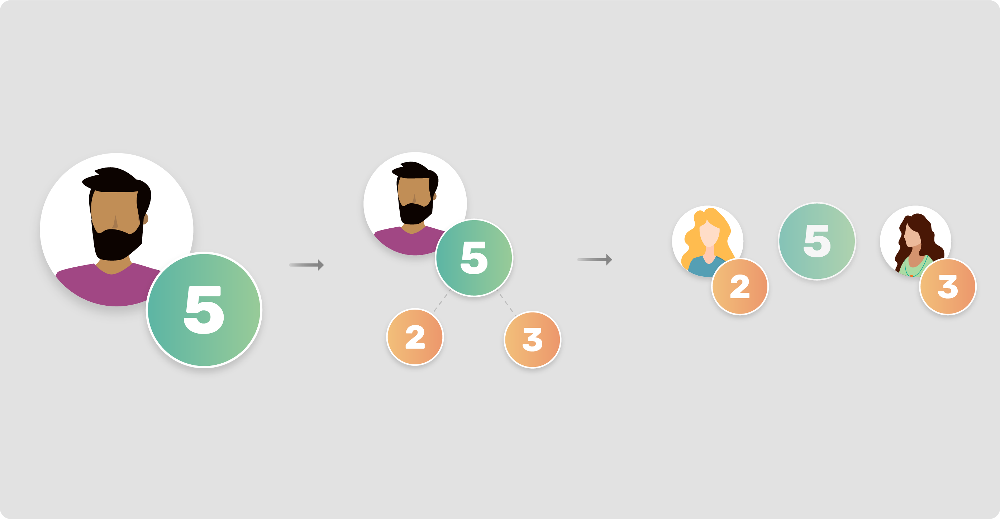

</figure>

In this example, we have Andrew holding his number, in this case he is the owner of the number 5, his personal data. Andrew can anonymize his data decomposing his number into 2 (or more) different numbers. In this case, he decomposes the number 5 into 2 and 3. That way, he can share his anonymized data with his friends Marianne and Bob.

Here, none of them really know the real value of Andrew’s data. They’re holding only a part of it. Any of them can perform any kind of operation without the agreement of all of them. But, while these numbers are encrypted between them, we’ll still be able to perform computations. **That way, we can use encrypted values to compute user’s data without showing any kind of sensitive information.**

<figure class="">

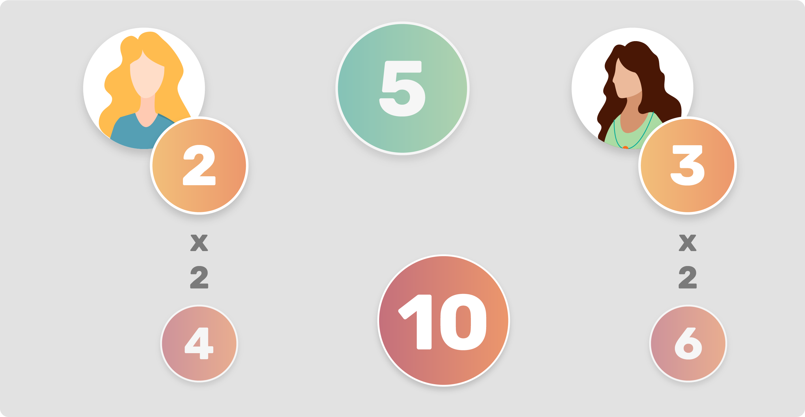

</figure>

With these concepts understood, we can now explain PySyft and PyGrid.

---

## The PySyft Library

<figure class="">

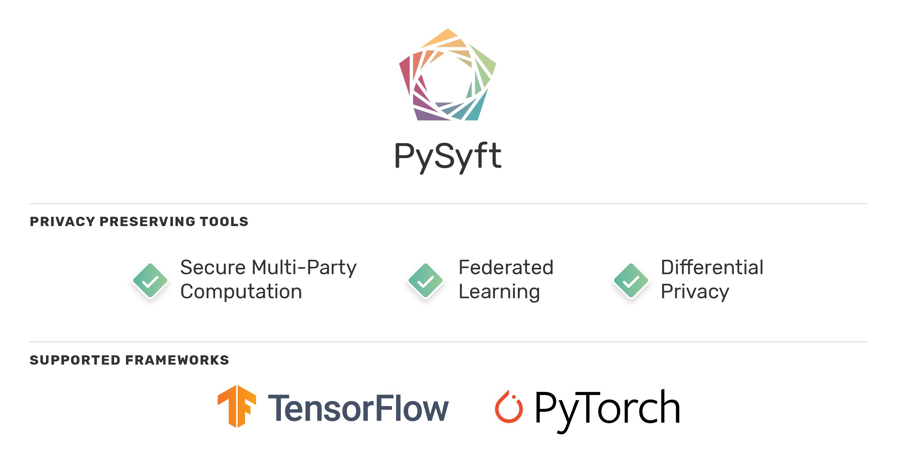

</figure>

PySyft is a Python library for secure and private Deep Learning. PySyft aims to provide privacy preserving tools within the main Deep Learning frameworks like PyTorch and TensorFlow. That way, the data scientists can use these frameworks to manage any kind of sensitive data applying privacy preserving concepts, without having to be privacy experts and themselves.

## The PyGrid Platform

<figure class="">

</figure>

PyGrid aims to be a peer-to-peer platform that uses the PySyft framework for Federated Learning and data science.

The architecture is composed of two components: Gateways and Nodes. The Gateway component works like a DNS, routing the nodes that provide the desired datasets.

**The nodes are provided by the data owners: they are private data clusters which will be managed and monitored by their data owners.** **The data does not leave the data owner’s server.**

**The data scientists can then use PyGrid to perform private statistical analysis on that dataset, or even perform federated learning across multiple institution’s datasets.**

Below, we explain how each of those use cases can be done.

---

## **Use Case 1: Private Statistical Analysis**

Let’s explore two work flows:

1.  **The data owner** that wants to publish his sensitive data on his node. (In this case, a hospital pediatric ward).
2.  **The data scientist** that wants to find a specific dataset over the grid network to compute some statistical analysis.

## The Data Owner

### Step 1: Import PySyft and dependencies

The first step as a data owner is importing our dependencies.

In this case we’ll import syft and replace standard torch modules using syft hook.

<figure class="">

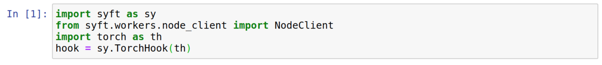

</figure>

### Step 2: Connect your node

The next step is to connect with your own node. It’s important to note that the node app was deployed in some environment and you need to know its address previously. In this case we’ll connect with the hospital node.

<figure class="">

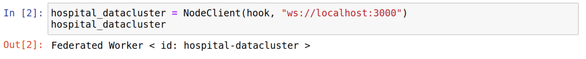

</figure>

### Step 3: Prepare data as tensors and add brief description

Now, we need to prepare our dataset to be published on the hospital node. To provide a clear understanding about the data that we want to publish we should add a brief description explaining the data meaning and the data structure. In this use case, we want to publish the hospital’s monthly birth records.

<figure class="">

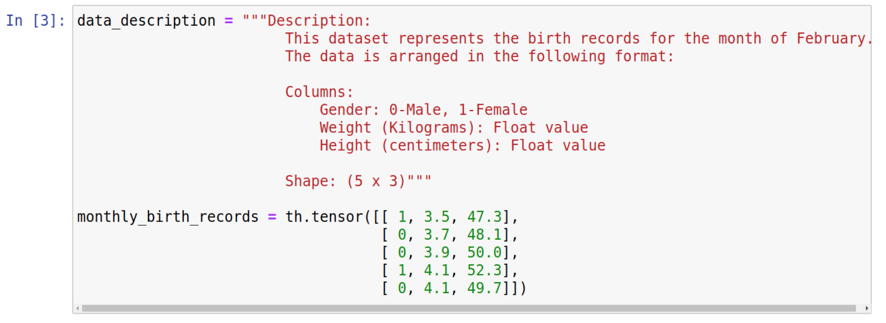

</figure>

### Step 4: Define access rules and permissions

After that, we need to define rules to control the data access. In this case, we’re allowing some users (Bob, Ana and Alice) to get total access to the real values of this data.

<figure class="">

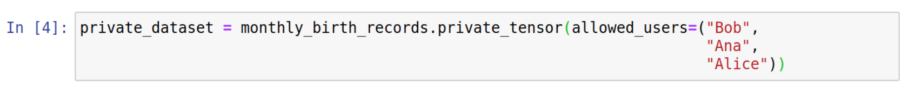

</figure>

### Step 5: Add tags and labels to help data scientists find your dataset

To make our data accessible from queries, we also need to add tags to identify and label them.

In this example, we’re adding two tags: #February to identify the month and #birth-records to identify the data meaning.

<figure class="">

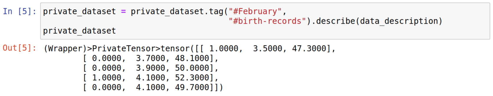

</figure>

### Step 6: Publish! You’re done.

Now, the data is ready to be published. It’s important to note that you need to be allowed to publish private datasets on this node. In this example we’re using Bob’s credential to publish this data on the node.

<figure class="">

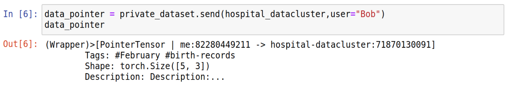

</figure>

As the data owner, that’s all that we need to do!

## The Data Scientist

### Step 1: Import PySyft and dependencies

As a data scientist, We also need to import syft library and replace torch modules using syft hook.

<figure class="">

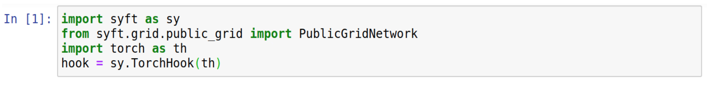

</figure>

### Step 2: Connect to Grid Platform

Unlike the data owners, we don’t know where the nodes and the datasets are, so we first need to connect with the GridNetwork. The address of the grid network will be the gateway component address.

<figure class="">

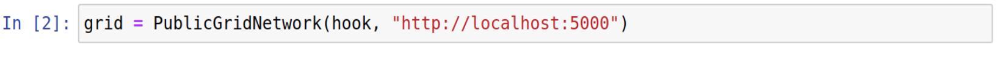

</figure>

### Step 3: What data are you looking for? Search the network.

After connecting with the grid network, we can search for the desired dataset tags. Perhaps you’re looking for x-rays of pneumonia, or hospital birth records. In this example, we’re using the same tags that we’ve published before. The grid network will return a dictionary containing the node’s ids as keys and data pointers as values.

<figure class="">

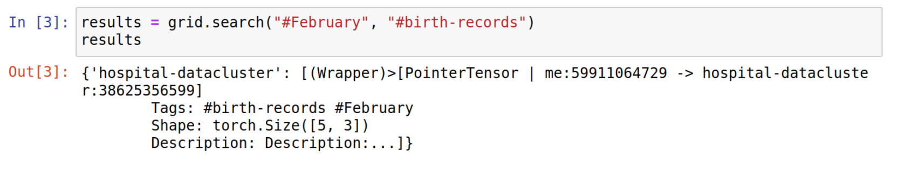

</figure>

### Step 4: Create a reference to that data pointer

Next, we define a direct reference to the hospital’s data pointer.

<figure class="">

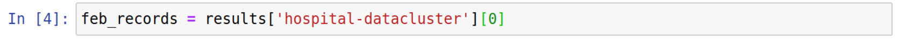

</figure>

### Step 4: Understand and explore the data

Understanding the data you’re working with is crucial for any data scientist. Next, we can explore the data pointers to understand their meaning and how they’re organized.

<figure class="">

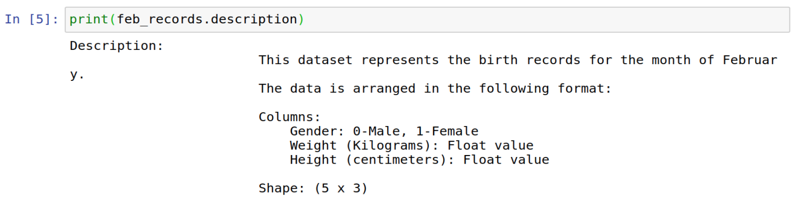

</figure>

### Wait – what if I try to copy that data?

**If we try to retrieve the real values of the data pointer without being allowed, an exception will be raised. This is how PyGrid can keep the data on the owner’s hands and empower them with the control to allow or deny access to the data samples.**

<figure class="">

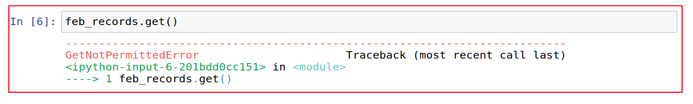

</figure>

### Step 5: Perform your computations

Even without copying the data, we are still able to perform remote computations on this data. In this example, we want to compute the average of the babies weight and height. To do this, we need to sum the column values remotely.

<figure class="">

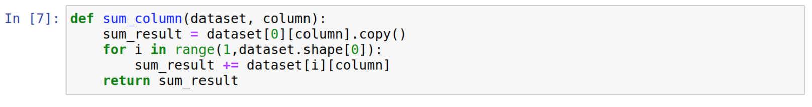

</figure>

Now, we can compute the weight sum remotely. It will generate other remote tensor.

<figure class="">

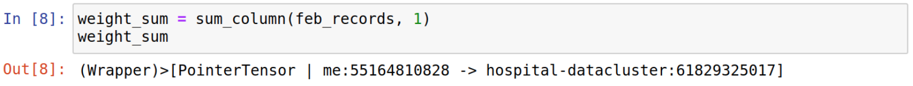

</figure>

We can do the same thing with the height column.

<figure class="">

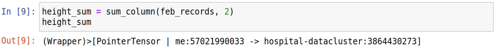

</figure>

Now, we just need to retrieve the aggregated value using our credentials and divide the value by 5  which is the dataset size.

<figure class="">

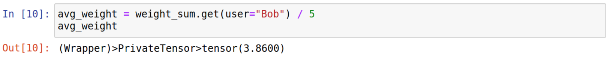

</figure>

We can do the same thing to get the height average. That way, we are able to compute the average weight and height  of the babies that was born on this month without get access to any sensitive data.

<figure class="">

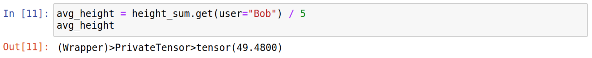

</figure>

**Done! We know the average height and weight of the babies born in February without ever moving the dataset to our own server, and we never needed to receive any private information about the individual babies.**

---

## How can we manage data access?

In the near future, we will provide an easy interface to authenticate and manage tensors’ rules. As a an admin of your own grid node, you’ll be able to manage node’s accounts. As the data owner, you can identify and control who can access your node.

<figure class="">

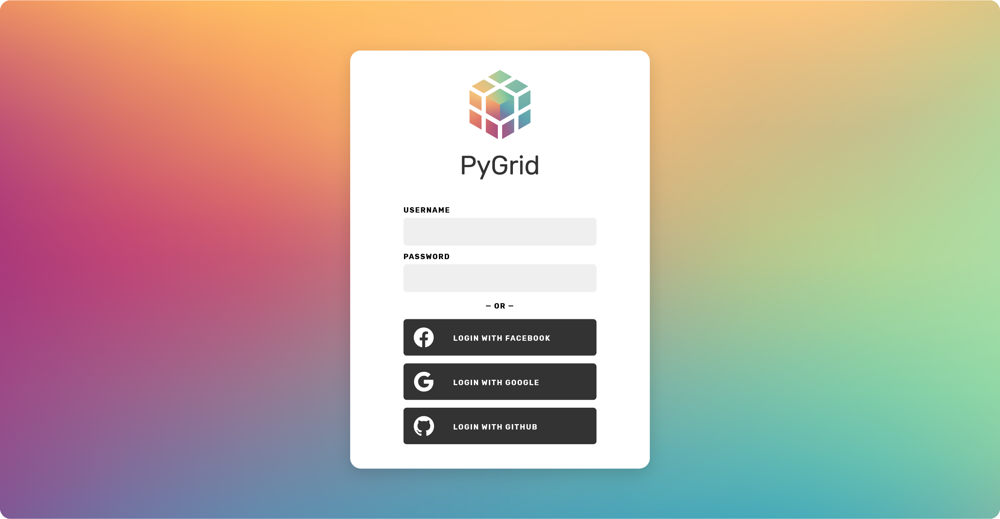

</figure>

The grid admin will be empowered to allow or deny access by evaluating requests using different techniques.

<figure class="">

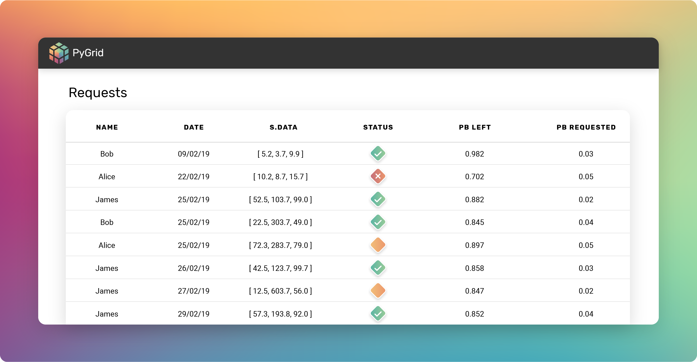

</figure>

---

## Use Case 2: Cross-Silo Federated Learning

How we can use PyGrid architecture to perform federated learning across institutions or devices? In this use case, we’ll train a MNIST model using federated learning approach. The process for the data owner to populate the nodes with dataset samples is the same as Use Case 1, so we will skip straight to the data scientist’s workflow.

Federated Learning – As the Data Scientist

### Step 1: Import PySyft and dependencies

<figure class="">

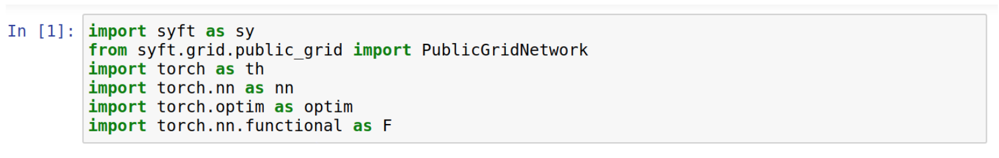

</figure>

### Step 2: Define our model architecture

Now, we need to define our model architecture and all the stuffs needed to perform a ML process on Neural Networks.

<figure class="">

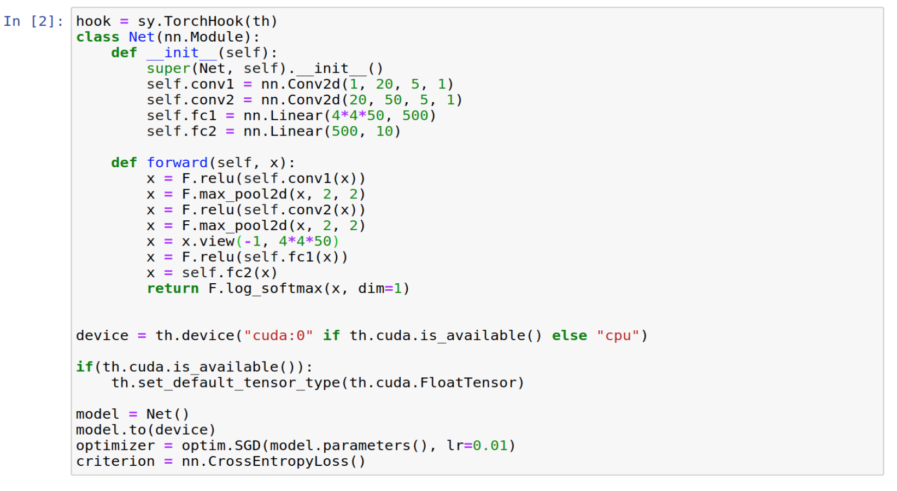

</figure>

### Step 3: Connect to the Grid Platform

As we did before, we need to connect with the grid network to perform queries over the nodes.

<figure class="">

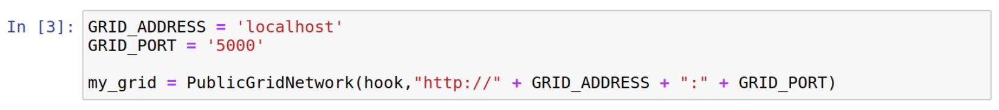

</figure>

### Step 4: Search for your desired dataset

In this example, we’re searching for MNIST datasets and their labels.

<figure class="">

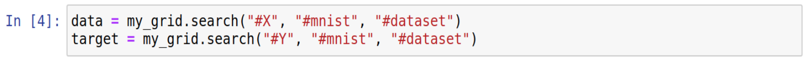

</figure>

As we can see here, our grid network have some nodes that are hosting MNIST datasets.

<figure class="">

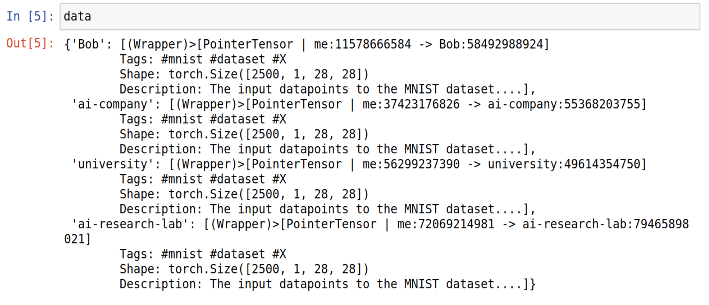

</figure>

<figure class="">

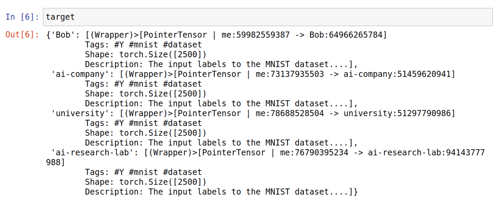

</figure>

### Step 5: Create a reference to that data pointer

Now, we just need to get a direct reference to handle these pointers.

<figure class="">

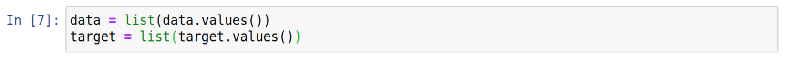

</figure>

This function will help us to figure out how our Federated Learning algorithm is working.

<figure class="">

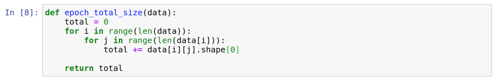

</figure>

### Step 6: Train your model!

In this training function we’re iterating over the data pointers to find the respective worker and training the models remotely. Here we have a couple of instructions:

-   The first one is model.send(worker) : This function will send a copy of our global model to the current worker to be trained using the worker’s data.
-   The second one is model.get() : After training with the local data, we need to retrieve the local model to update our global model.

That way, the federated learning process will go through all the nodes that hosts the MNIST dataset.

<figure class="">

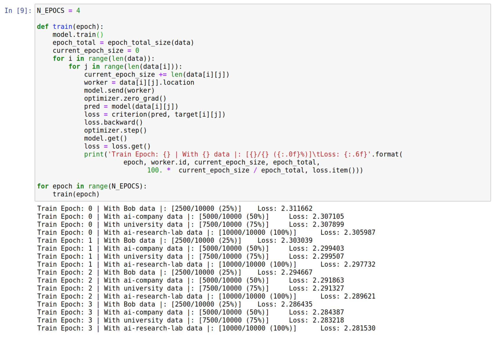

</figure>

## Use Case 3: Encrypted MLaaS

How we can host models and perform inferences in a secure and private way?

The PyGrid solution for this problem is use a data structure named **plan** and **Multi-Party Computation (MPC) protocols**. A plan is a data structure to define and serialize a set of instructions that will be  executed remotely. Using plans, we can define a model structure that will execute in a remote device. That way, a plan that uses remote MPC pointers distributed on different machines can perform model inferences in a secure way.

### Step 1: Import PySyft and dependencies

As previously, the first step is import our dependencies. It’s important to note that we need to setup the hook.local\_worker.is\_client\_worker to False. This will allow the syft library  to store plan’s metadata on its structure.

<figure class="">

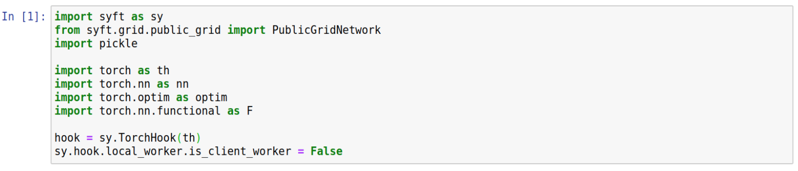

</figure>

### Step 2: Connect to the Grid Platform

Now, as seen previously we need to connect to the grid platform.

<figure class="">

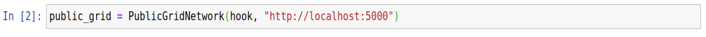

</figure>

### Step 3: Define model

Here we are defining our model. It’s important to note the need to extend Plans on Model’s definition. For this explanation, we’ll use a linear model with only one layer that have the weights and bias values set in advance. That way, we can predict and understand the results.

<figure class="">

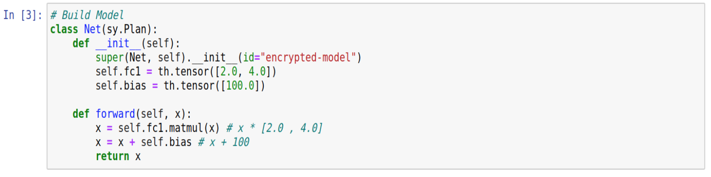

</figure>

### Step 4: Define input data

Our  input data will be this 1 dimension tensor. Thus, we are already able to visualize the final result.

<figure class="">

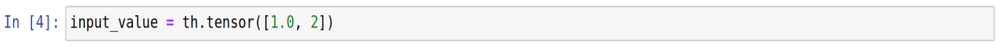

</figure>

### Step 5: Initialize model

Now, we need to initialize the model. For comparison, we’ll init a decrypted model as well.

<figure class="">

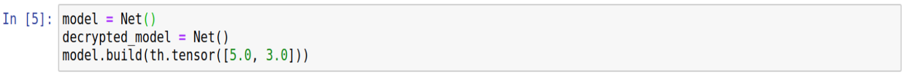

</figure>

### Step 6: Serve model onto the grid network

Finally, we can serve this model on the grid network. It’s important to note the MPC flag. This flag will allow the syft library to split the plan parameters into different devices over the network using MPC protocols.

<figure class="">

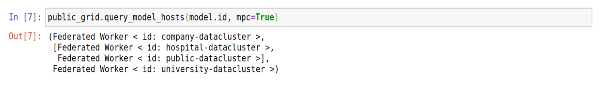

</figure>

Here, we can see where’s our plan and its parameter slices. The company-datacluster is hosting our plan structure, the hospital-datacluster and public-datacluster are hosting the MPC parameter values. And finally, the university-datacluster is our crypto provider which allow us to perform MPC multiplications.

### Step 7: Return results

<figure class="">

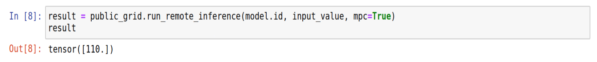

</figure>

Here we have a lot of stuff happening at the same time. So let’s dig deep:

1 – This function will download plan structure from company’s data-cluster and retrieve its remote pointers.

2 – The second step is split the input\_values into MPC values and share it with the same devices that hosts the plan’s MPC pointers.

3 – As all the MPC pointers are distributed over the devices, we can execute the plan.

4 – Finally, we can aggregate the MPC results which will return the real result.

### Comparison with the decrypted model

For comparison, if we execute the decrypted model, we’ll get the same result.

<figure class="">

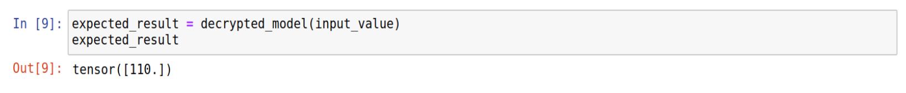

</figure>

---

## OpenMined’s PyGrid Roadmap for 2020

In 2020, the PyGrid team has 4 main goals:

### Heterogeneous Network (syft.js, swift.js, mobile workers)

First, is create a standard way to send and receive messages from different platforms an apps. Today, the PyGrid platform is a server based platform, which means you need to setup and  provide an infrastructure to  the nodes. We intend to extend PyGrid features to mobile devices.

### Privacy Budget

Develop the Privacy budget to evaluate and control the data anonymization level.

### Automatic Differential Privacy Tracking

This allows for the automatic tracking of a privacy budget for entities in a dataset over time.

That way we can make formal guarantees around the amount of information leaked whenever a private asset is published (such as an AI model).

It is preferred for this infrastructure to be as automated as possible, but applications (UIs) which allow for the vetting of digital assets for private information by humans are also allowed (and are likely essential for earlier adopters).

### Data Request Queue

We will create the data request queue, which allows the data owners to evaluate data requests controlling  the data access.

---

## Contributors

<figure class="">

</figure>

Finally, we would like to thank all of the contributors who worked on this project.

The main contributors include: [Andrew Trask](https://github.com/iamtrask), [Ionésio Junior](https://github.com/IonesioJunior), [Marianne Linhares](https://github.com/mari-linhares), [Robert Wagner](https://github.com/robert-wagner), [Théo Ryffel](https://github.com/LaRiffle), [Patrick Cason](https://github.com/cereallarceny), [Héricles Emanuel](https://github.com/hericlesme), [Tallal Javed](https://github.com/tallalj), [Karl Higley](https://github.com/karlhigley), [Matthias Lau](https://github.com/matthiaslau), [Vova Manannikov](https://github.com/vvmnnnkv), [João Lucas](https://github.com/joaolcaas)

---

## Interested?

If you’re interested in this post, you can contribute to OpenMined in a number of ways:

### Do you have a use case for PyGrid?

If you, your institution, or your company have a use case for PyGrid and would like to learn more, contact the partnerships team: partnerships@openmined.org

### Apply to join the PyGrid Team

Would you like to contribute? [**Fill in this form**](https://docs.google.com/forms/d/e/1FAIpQLSfPWP4Kgo4704yJdSbqX_ajX16bHrKVcOhIZASapyK3FC2Mdw/viewform)**!**

### Star PySyft & PyGrid on GitHub

The easiest way to help our community is just by starring the repositories! This helps raise awareness of the cool tools we’re building.

-   [Star PySyft](https://github.com/OpenMined/PySyft)
-   [Star PyGrid](https://github.com/OpenMined/PyGrid)

### Try our tutorials on GitHub!

We made really nice tutorials to get a better understanding of Privacy-Preserving Machine Learning and the building blocks we have created to make it easy to do!

-   [Checkout the PySyft tutorials](https://github.com/OpenMined/PySyft/tree/master/examples/tutorials)

### Join our Slack!

The best way to keep up to date on the latest advancements is to join our community!

-   [Join slack.openmined.org](http://slack.openmined.org/)

### Join a Code Project!

The best way to contribute to our community is to become a code contributor! If you want to start “one off” mini-projects, you can go to PySyft GitHub Issues page and search for issues marked `Good First Issue`.

-   [PySyft Good First Issue Tickets](https://github.com/OpenMined/PySyft/issues?q=is%3Aopen+is%3Aissue+label%3A%22good+first+issue%22)
-   [PyGrid Good First Issue Tickets](https://github.com/OpenMined/PyGrid/labels/good%20first%20issue)

### Donate

If you don’t have time to contribute to our codebase, but would still like to lend support, you can also become a Backer on our Open Collective. All donations go toward our web hosting and other community expenses such as hackathons and meetups!

-   [Donate through OpenMined’s Open Collective Page](https://opencollective.com/openmined)
