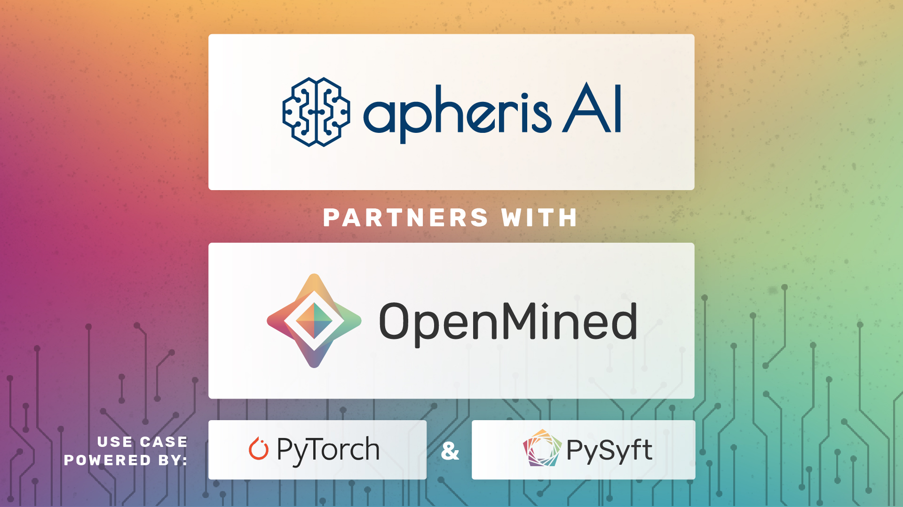
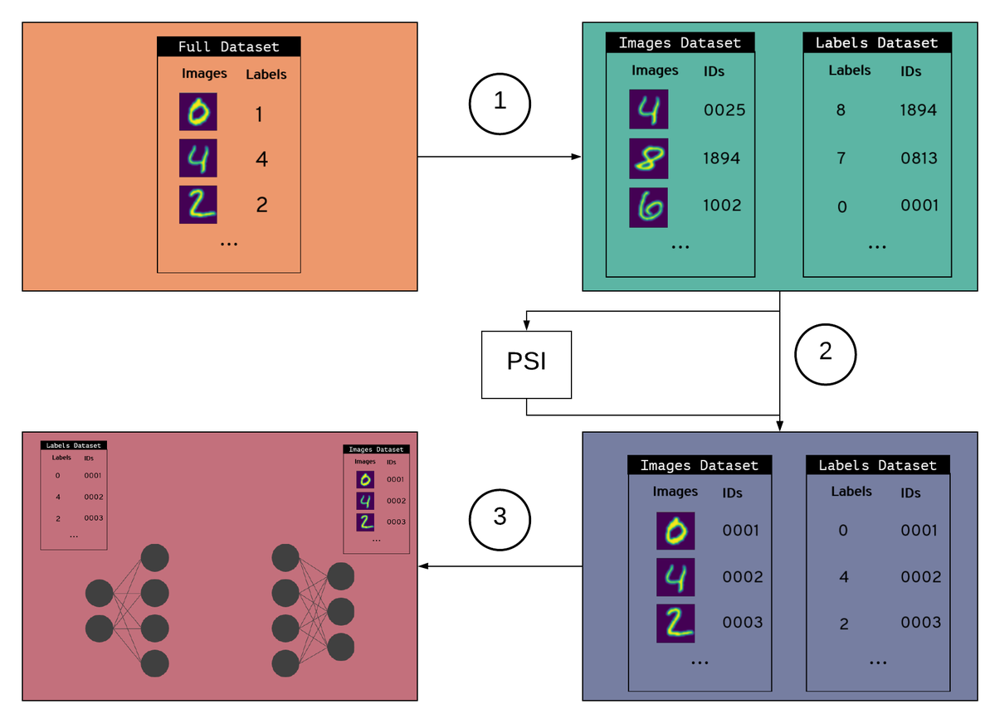
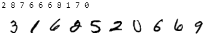
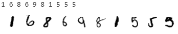
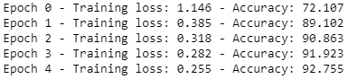
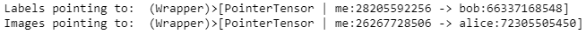

<!-- TODO(a11y): 6 localized body image(s) have empty alt text -->


<!-- TODO(content): shortcode(s) present (verify) -->

**_This post is part of our_ [_Privacy-Preserving Data Science, Explained_](https://blog.openmined.org/private-machine-learning-explained/) _series._**

<figure class="">



</figure>

In this post, we cover:

-   A brief outline of basic concepts: an explanation of Private Set Intersection, Split Neural Networks and vertically partitioned data
-   The technical details: how PyVertical is implemented in a test environment and how it can be extended to be used in the real world

## Basic Concepts

Let’s firstly briefly explain the three basic concepts regarding [PyVertical](https://github.com/OpenMined/PyVertical).

## Private Set Intersection

Private set intersection (PSI) is a powerful cryptographic technique which enables two parties, which both have a set of data points, to find the intersection of both sets without exposing their raw data to the other party, thus protecting the data privacy of each party. Each party does not learn anything from the other party’s data set except for the intersection. In other words, PSI allows us to test in a privacy preserving way whether the parties share common data points (such as a location, ID, etc.) – the result is a third data set with only those elements, which both parties have in common.

For more information and a code demonstration, see [**What is Private Set Intersection?**](https://blog.openmined.org/private-set-intersection/)

## Split Neural Networks

The training of a Neural Network (NN) is ‘split’ across two or more hosts. Each host possesses a subset of the original model layers that act as a self-contained NN. Each host trains their part of the model, i.e. the specific layers they trained, and sends the trained model to the next host [\[1\]](https://arxiv.org/abs/1810.06060).

This allows for improved efficiency of Split Neural Networks (SplitNNs) in terms of computational power during the training process, while achieving higher accuracy over a large number of hosts [\[2\]](https://arxiv.org/abs/1812.00564). SplitNNs often compared with Federated Learning, which is more efficient in situations where the number of the participating entities and/or the size of the model is small [\[3\]](https://arxiv.org/abs/1909.09145).

For more information, see **[Split Neural Networks on PySyft](https://blog.openmined.org/split-neural-networks-on-pysyft/)**.

## Vertically partitioned data

Data is vertically partitioned if the fields relating to a single record are distributed across multiple datasets. For example, multiple hospitals may have different admissions data on the same individual. Hence, vertically partitioned data is also a common phenomenon in the administration of records in the public sector. Vertically partitioned data could be applied to solve essential problems, but data holders cannot combine their datasets without breaching the users’ privacy.

Now that we have a grasp of the basic concepts, let’s have a look at how they are leveraged in combination in PyVertical to enable privacy preserving data analysis!

## PyVertical

[PyVertical](https://github.com/OpenMined/PyVertical) uses [PSI](https://www.github.com/OpenMined/PSI) to link datasets in a privacy-preserving way. We train SplitNNs on the vertically partitioned data to ensure the data remains separated throughout the entire process.

For the Proof-of-Concept, we are going to demonstrate PyVertical’s training process on the MNIST dataset that consists of images of hand-written digits and their labels \[[3](https://en.wikipedia.org/wiki/MNIST_database)\].

All following code examples are taken from the [PyVertical GitHub repo](https://github.com/OpenMined/PyVertical).

## The training process

1.  **Create vertically partitioned dataset**

-   Create a vertically partitioned dataset by splitting MNIST into a dataset of images and a dataset of labels
-   Give each data point (image + label) a unique ID
-   Randomly shuffle each dataset
-   Randomly remove some elements from each dataset

**2\. Link datasets using PSI**

-   Use **PSI** to link indices in each dataset using unique IDs
-   Filter each data set for the IDs that are element of the intersection as obtained via PSI
-   Reorder the samples in the datasets using linked indices

**3\. Train a Split Neural Network**

-   Hold both datasets in a data loader
-   Send images to the first part of the split network
-   Send labels to the second part of the split network
-   Train the network

<figure class="">



</figure>

## Implementing PyVertical

Next, we will go into a code example where we implement a Simple Vertically Partitioned Split Neural Network on the MNIST dataset as described above.

**Basic Concept:**

**Alice**

-   Has model segment 1
-   Has the handwritten Images

**Bob**

-   Has model segment 2
-   Has the image Labels

Firstly, we define our SplitNN class. This class takes a set of models and their linked optimizers as its input.

```python
    class SplitNN:
        def __init__(self, models, optimizers):
            self.models = models
            self.optimizers = optimizers

            self.data = []
            self.remote_tensors = []

        def forward(self, x):
            data = []
            remote_tensors = []

            data.append(self.models[0](x))

            if data[-1].location == self.models[1].location:
                remote_tensors.append(data[-1].detach().requires_grad_())
            else:
                remote_tensors.append(
                    data[-1].detach().move(self.models[1].location).requires_grad_()
                )

            i = 1
            while i < (len(models) - 1):
                data.append(self.models[i](remote_tensors[-1]))

                if data[-1].location == self.models[i + 1].location:
                    remote_tensors.append(data[-1].detach().requires_grad_())
                else:
                    remote_tensors.append(
                        data[-1].detach().move(self.models[i + 1].location).requires_grad_()
                    )

                i += 1

            data.append(self.models[i](remote_tensors[-1]))

            self.data = data
            self.remote_tensors = remote_tensors

            return data[-1]

        def backward(self):
            for i in range(len(models) - 2, -1, -1):
                if self.remote_tensors[i].location == self.data[i].location:
                    grads = self.remote_tensors[i].grad.copy()
                else:
                    grads = self.remote_tensors[i].grad.copy().move(self.data[i].location)

                self.data[i].backward(grads)

        def zero_grads(self):
            for opt in self.optimizers:
                opt.zero_grad()

        def step(self):
            for opt in self.optimizers:
                opt.step()
```

Then, we import all the regular imports for training with PySyft, all the imports for splitting the dataset vertically and re-linking it using PSI, set up a torch hook and pull in the MNIST data. We need to use PySyft’s torch hook (overriding PyTorch’s defaults) to be able to use tensors controlled by a “remote” worker (for more information, see [this](https://pysyft.readthedocs.io/en/stable/api/syft/frameworks/torch/hook/hook/index.html)).

```python
sys.path.append('../')

import torch
from torchvision import datasets, transforms
from torch import nn, optim
from torchvision.datasets import MNIST
from torchvision.transforms import ToTensor

import syft as sy

from src.dataloader import VerticalDataLoader
from src.psi.util import compute_psi
from src.utils import add_ids

hook = sy.TorchHook(torch)
```

Now it’s time to split the dataset vertically (images + labels) and batch data into our data loader.

```python
# Create dataset
data = add_ids(MNIST)(".", download=True, transform=ToTensor())  # add_ids adds unique IDs to data points

# Batch data
dataloader = VerticalDataLoader(data, batch_size=128) # partition_dataset uses by default "remove_data=True, keep_order=False"
```

Let’s first check if the data is unordered by plotting the labels with their corresponding images.

```python
# We need matplotlib library to plot the dataset
import matplotlib.pyplot as plt

# Plot the first 10 entries of the labels and the dataset
figure = plt.figure()
num_of_entries = 10
for index in range(1, num_of_entries + 1):
plt.subplot(6, 10, index)
plt.axis('off')
plt.imshow(dataloader.dataloader1.dataset.data[index].numpy().squeeze(), cmap='gray_r')
print(dataloader.dataloader2.dataset[index][0], end=" ")
```

The output of the above code snippet produces the first ten labels followed by the first ten plotted images, similar to:

<figure class="">



</figure>

**Correct!** The two datasets are unordered.

So, let’s implement PSI to link the datasets accordingly.

```python
# Compute private set intersection
client_items = dataloader.dataloader1.dataset.get_ids()
server_items = dataloader.dataloader2.dataset.get_ids()

client = Client(client_items)
server = Server(server_items)

setup, response = server.process_request(client.request, len(client_items))
intersection = client.compute_intersection(setup, response)

# Order data
dataloader.drop_non_intersecting(intersection)
dataloader.sort_by_ids()
```

Check again if the datasets are ordered.

```python
# We need matplotlib library to plot the dataset
import matplotlib.pyplot as plt

# Plot the first 10 entries of the labels and the dataset
figure = plt.figure()
num_of_entries = 10
for index in range(1, num_of_entries + 1):
plt.subplot(6, 10, index)
plt.axis('off')
plt.imshow(dataloader.dataloader1.dataset.data[index].numpy().squeeze(), cmap='gray_r')
print(dataloader.dataloader2.dataset[index][0], end=" ")
```

The output of the above code snippet produces the first ten labels followed by the first ten plotted images, similar to:

<figure class="">



</figure>

**Perfect!** The datasets have been filtered and sorted successfully thanks to PSI, so the data is prepared for our next step.

We can continue with the SplitNN by defining the network which will be distributed. We are going for a simple, three-layer network using code similar to [OpenMined’s PySyft Folded SplitNN Tutorial 3](https://github.com/OpenMined/PySyft/blob/master/examples/tutorials/advanced/split_neural_network/Tutorial%203%20-%20Folded%20Split%20Neural%20Network.ipynb) presented in [Split Neural Networks on PySyft](https://medium.com/analytics-vidhya/split-neural-networks-on-pysyft-ed2abf6385c0). As in the original examples, we can do this for a network of any size or shape. Each segment is a self-contained network. What matters is the shape of the layer where one segment joins to the next. The sending layer must have an equal output shape to the receiving layers’ input shape. For more information on how the model parameters were chosen for this particular dataset, [read this tutorial.](https://towardsdatascience.com/handwritten-digit-mnist-pytorch-977b5338e627)

```python
torch.manual_seed(0)

# Define our model segments

input_size = 784
hidden_sizes = [128, 640]
output_size = 10

models = [
nn.Sequential(
nn.Linear(input_size, hidden_sizes[0]),
nn.ReLU(),
nn.Linear(hidden_sizes[0], hidden_sizes[1]),
nn.ReLU(),
),
nn.Sequential(nn.Linear(hidden_sizes[1], output_size), nn.LogSoftmax(dim=1)),
]

# Create optimizers for each segment and link to them
optimizers = [
optim.SGD(model.parameters(), lr=0.03,)
for model in models
]
```

Next, we define some workers to host our models and send the models to their locations.

```python
# create some workers
alice = sy.VirtualWorker(hook, id="alice")
bob = sy.VirtualWorker(hook, id="bob")

# Send Model Segments to model locations
model_locations = [alice, bob]
for model, location in zip(models, model_locations):
model.send(location)
```

We then build the SplitNN. All that is required for this to work is for the model segments to be in their starting locations and paired to their respective optimizers.

```python
#Instantiate a SpliNN class with our distributed segments and their respective optimizers
splitNN = SplitNN(models, optimizers)
```

Furthermore, we define our training function. The usage of SplitNN is similar to a conventional model. All that is required is a second backpropagation phase to push gradients back over the segments.

```python
def train(x, target, splitNN):

#1) Zero our grads
splitNN.zero_grads()

#2) Make a prediction
pred = splitNN.forward(x)

#3) Figure out how much we missed by
criterion = nn.NLLLoss()
loss = criterion(pred, target)

#4) Backprop the loss on the end layer
loss.backward()

#5) Feed Gradients backward through the nework
splitNN.backward()

#6) Change the weights
splitNN.step()

return loss, pred
```

Finally, we train our model by sending data to starting locations as we go, and printing the output loss alongside with the accuracy of our model.

```python
for i in range(epochs):
running_loss = 0
correct_preds = 0
total_preds = 0

for (data, ids1), (labels, ids2) in dataloader:
# Train a model
data = data.send(models[0].location)
data = data.view(data.shape[0], -1)
labels = labels.send(models[-1].location)

# Call model
loss, preds = train(data, labels, splitNN)

# Collect statistics
running_loss += loss.get()
correct_preds += preds.max(1)[1].eq(labels).sum().get().item()
total_preds += preds.get().size(0)

print(f"Epoch {i} - Training loss: {running_loss/len(dataloader):.3f} - Accuracy: {100*correct_preds/total_preds:.3f}")
```

The output of the above code snippet is similar to:

<figure class="">



</figure>

We trained our SplitNN successfully, but is data still vertically-partitioned?

```python
print("Labels pointing to: ", labels)
print("Images pointing to: ", data)
```

The output of the above code snippet is similar to:

<figure class="">



</figure>

We can now verify that it is! [The full example is available on the PyVertical Github repository.](https://github.com/OpenMined/PyVertical/blob/master/examples/PyVertical%20Example.ipynb)

## Why is it important?

As explained at the start of the article, vertically partitioned datasets are common in the real-world. For example, imagine a scenario where some data about an individual such as _“Name, Telephone, Address, Marital Status, Dependents, …”_ may be available to department X, while some other data about _the same person_ such as _“Name, Telephone, Address, Bank Debt, Mortgage Installment, …”_ are available to department Y. These two departments have **partial information** about the same person, but they cannot combine their data, since this would breach the person’s privacy. This scenario is common in many places, including Electronic Health Records (EHR) management.

## Conclusion & Future Steps

The simple PyVertical MNIST example we presented above is probably the first open-source Split Neural Network implementation on vertically partitioned data. The future steps of the project include the generalization of the algorithm into more complex datasets as the presented, instead of simple split images and their labels. For more information about the future steps, you can see the current open issues on the [PyVertical Github repository.](https://github.com/OpenMined/PyVertical)

Get involved, test, experiment using our Jupyter Notebooks examples and open new issues about bugs and any new features that you’d like to see! If you would like to contribute, we follow OpenMined’s [contributing guidelines](https://github.com/OpenMined/.github/blob/master/CONTRIBUTING.md) and [style guide](https://github.com/OpenMined/.github/blob/master/STYLEGUIDE.md) for more information.

You made it to the end, that’s cool and we hope you enjoyed it! We are happy to get Feedback, thoughts and ideas at [info@apheris.com](mailto:info@apheris.com). Reach out to us for any privacy-preserving technology question or other inquiry.

<3 apheris AI and OpenMined

**This post was written by:**

1.  **[Pavlos Papadopoulos](https://blog.openmined.org/author/pavlos/)**  
    Researcher at apheris AI / Security & Identity team member at OpenMined / PhD student at Edinburgh Napier University
2.  **[Tom Titcombe](https://blog.openmined.org/author/tom-titcombe/)**  
    OpenMined Research Engineer. Security & Identity team member. Data Scientist by trade.
3.  [**Robin Roehm**](https://blog.openmined.org/author/robin/)  
    CEO & Co-Founder of apheris AI
4.  [**Michael Hoeh**](https://blog.openmined.org/author/michael/)  
    CTO & Co-Founder of apheris AI
