<!-- TODO(a11y): 20 localized body image(s) have empty alt text -->

### _Do you want to help unlock advances in every scientific field by increasing humanity’s access to data by 1000x in a safe and secure way?_

## ? We’re currently taking [Padawan Applications](https://docs.google.com/forms/d/e/1FAIpQLSdBgcz4Sj9ow0vhWsfKP2WMlLAynHB8caPr3eTBp9m6JeeLSA/viewform) for our next round ??

OpenMined works on encrypted computation in the context of deep learning to provide FREE user-friendly Privacy Enhancing Technology (PETs) tools to the world. We have a unique remote first Open Source culture and want to grow our team organically from the community that has helped us over the past 6 years.

[

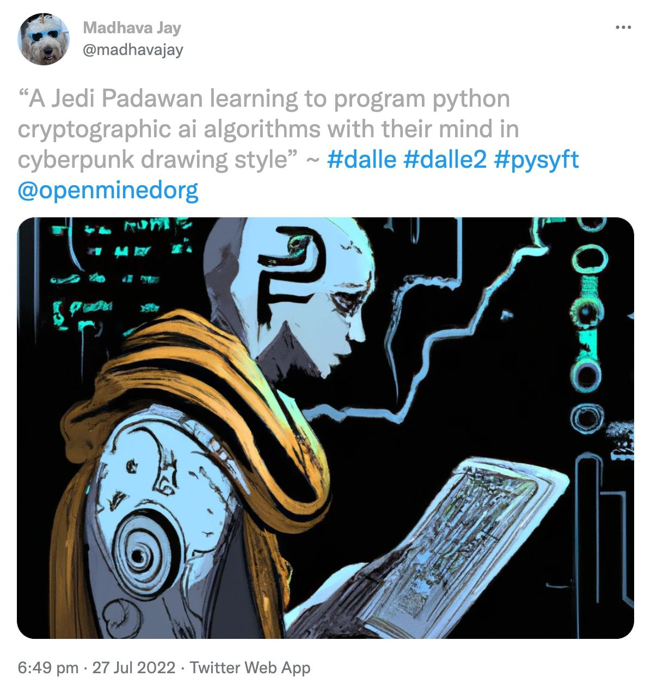

](https://twitter.com/madhavajay/status/1552214636706942976)

You may have recently seen OpenAI’s DALL-E 2. Now, imagine if the impressive abilities of models like GPT-3 or DALL-E 2 were focussed on tasks like preventing climate change or curing cancer?

OpenMined is at the forefront of Privacy Enhancing Technology which will enable breakthroughs in all scientific fields, in particular those with a positive impact on humanity.

To achieve this goal we need more value aligned individuals who are interested in working on both the research and implementation of cutting edge technology in the field of PETs.

## OpenMined’s Recent Achievements

Here are just some of the cutting edge things we have been working on lately which you would get to work on by joining our team:

-   **? Research:** An Adversarial Accountant using _Renyi Differential Privacy_ for tracking privacy across data subjects
-   **? ML Engineering:** Integrating _SMPC Crypten_ into PySyft, adding _Deep Learning_ support with _JAX_ and building a working end to end system applying _SMPC_ for input privacy and _DP_ for output privacy
-   **? Project Manager:** Working with the _UN_ and their _PET Lab_ to do a pilot of _SMPC + DP_ operations between private datasets in different countries
-   ******?**** ****Program Manager:****** Co-launch the United Nations Privacy Enhancing Technology Lab, featured in [The Economist](https://www.economist.com/science-and-technology/the-un-is-testing-technology-that-processes-data-confidentially/21807385), co-announced by _President Biden’s National Security Advisor_
-   **? Project Manager:** Working with the Twitter team to pioneer the use of PETs in social media transparency
-   **? DevOps:** Deploying our stack to _Docker_ and _Kubernetes_ with Continuous Integration and Deployment to _PyPI_ and _Docker Hub_
-   **? Data Science:** Assisting the _UN PetLab_ to use PySyft to study data across a federated data network, hosted by the United Nations
-   **? Writing:** Released our _[3rd Online Video Course](https://courses.openmined.org/)_ with over 9000 students
-   ******✒️**** ****Grant Writing:****** Wrote and secured a $650,000 grant from the _Alfred P. Sloan Foundation_
-   ******?**** ****Speaker / Community Manager:****** Hosted a [live conference](https://pricon.openmined.org/) attended by 2,000+ attendees
-   ******?**** ****UI Design:****** Ensuring that our interfaces look great and communicate complex cutting edge ideas with intuitive simplicity
-   **? UX Design:** Improving our APIs so that working with PySyft fills users with joy

## But don’t I need a fancy degree and extensive industry experience to contribute to the cutting edge and make a difference?  

Consider the following diagram comparing the traditional career and employment pathways for tech roles and the alternative pathway at OpenMined.

<figure class="">

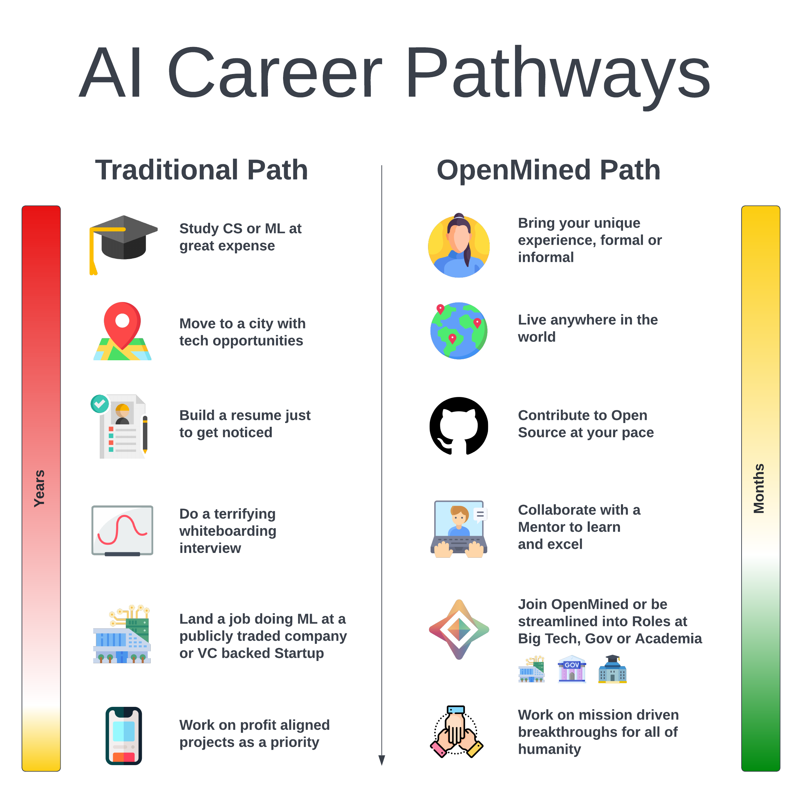

</figure>

## What’s the catch?

The reality is that companies and organizations on the _left hand_ side have well established business models which require specialized skill-sets and in turn pay high salaries which creates increased demand and competition. Unfortunately, even if you make it through the long path to a big tech or unicorn startup role, you may find yourself working on AI projects which ultimately must make a profit for shareholders and investors.

On the other side of the fence is a **different path**, a much more _Open_ path; one which we believe is the future of _mission driven, remote first work_. **OpenMined** is a Charity (much like Mozilla) aimed at delivering Open Source technology and AI advancements for the common good. Instead of terrifying PASS / FAIL whiteboard interviews we prefer to hire people who demonstrate the communication skills, empathy and motivation to learn; that match the core values of the OpenMined community.

## How OpenMined Members began their Journey

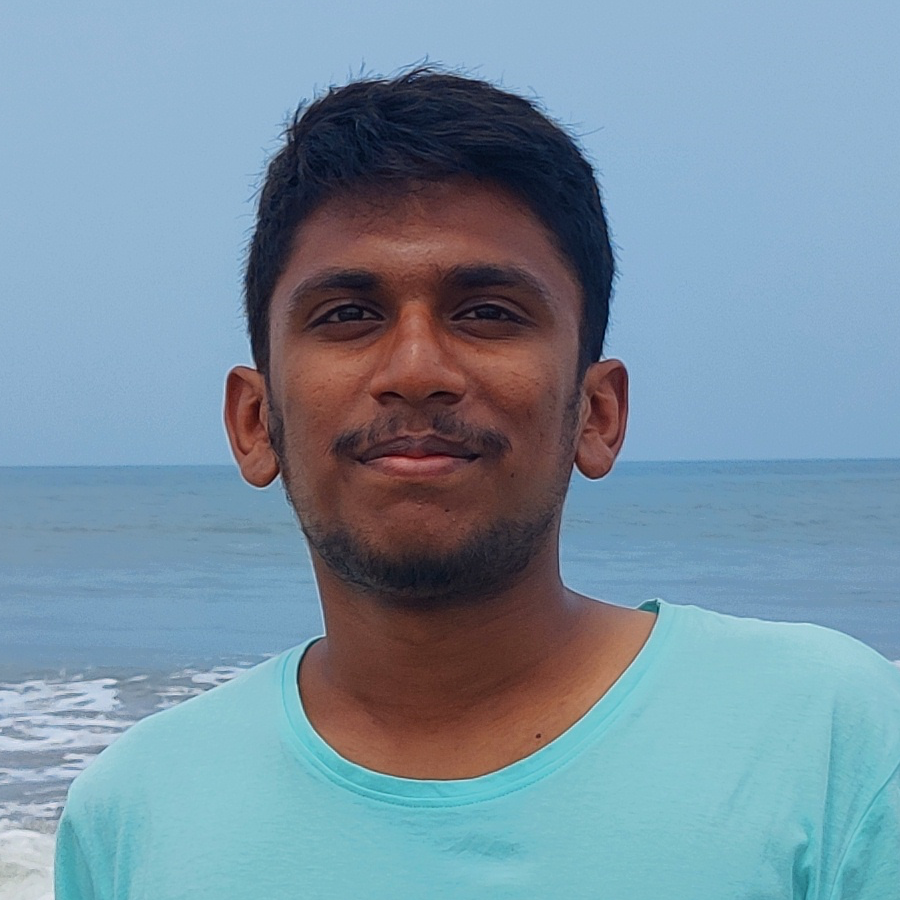

<h6 style="text-align:left; margin-top:0">Rasswanth ??</h6>
Rasswanth studied CS in Coimbatore, India and joined the Crypto Team as a GSOC candidate and was quickly hired due to his exceptional talents and dedication to learning PySyft and contributing high quality PRs.

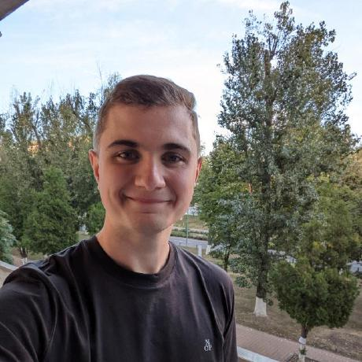

<h6 style="text-align:left; margin-top:0">Tudor ??</h6>
Tudor took the OpenMined privacy course &amp; started contributing to PySyft. His excellent engineering work at OpenMined helped him secure a Masters Scholarship to ENS de Lyon in France where he is studying cryptography while still contributing to PySyft.

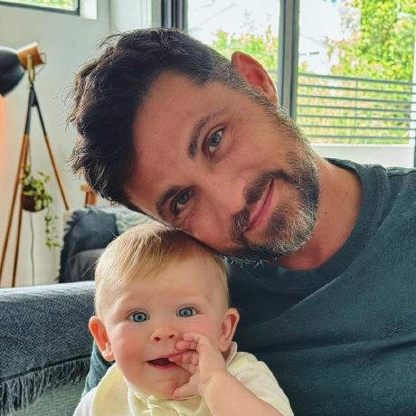

<h6 style="text-align:left; margin-top:0">Madhava ??</h6>
Madhava is a self taught Engineer who discovered OpenMined while looking for solutions to AI data privacy at a MedTech Startup. Originally joining the DP team writing Swift, he is now Core Team Lead.

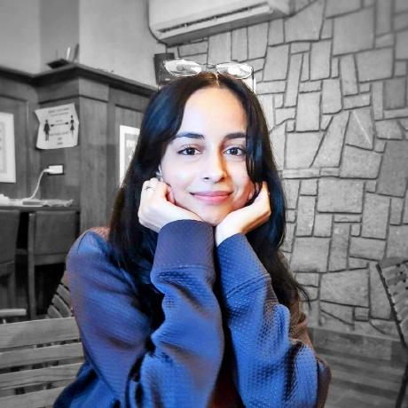

<h6 style="text-align:left; margin-top:0">Kritika ??</h6>
Kritika studied CS in Hyderabad, India and joined OpenMined in the DP Team. Her groundbreaking academic work led to a position as a Research Associate at Google. She still continues to contribute to PySyft’s DP system.

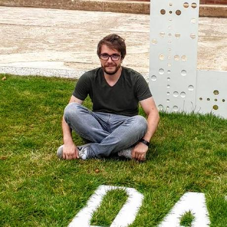

<h6 style="text-align:left; margin-top:0">George ??</h6>
George entered OpenMined on the Crypto Team, while studying his Masters in Bucharest. His applied research experience in SMPC at OpenMined, resulted in a full time role at Bloomberg, and then DeepMind in London, UK. He still contributes to PySyft’s SMPC.

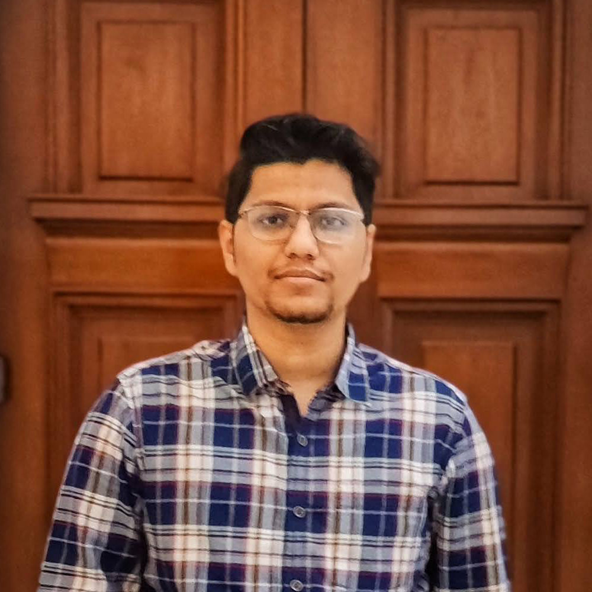

<h6 style="text-align:left; margin-top:0">Shubham ??</h6>
Before joining OpenMined, Shubham worked as a Data Scientist and Software Engineer with B2B and B2C tech companies. In his work as a Data Scientist Shubham discovered PETs. Now spends his time engineering the Data Science API of Syft.

Learn more from our recent [R2Q4 Graduate Padawans](https://blog.openmined.org/openmined-r2q4-padawan-graduates/) and [Padawan Program Alumni](https://blog.openmined.org/padawan-program-alumni/) and find out what they are up to now!

### What do all of the above community members have in common?

They all joined OpenMined out of an interest in PETs, either from their area of study or from AI industry needs and were willing to take a chance by contributing work and code to OpenMined’s open source repositories.

After proving themselves, their Mentor secured a _paid_ contributor grant to allow them to continue contributing based around their schedule. Some members contribute part time while they study or work other jobs; for others OpenMined is their full time gig.

All of our full time paid contributors began their journey on other paid contributor programs (such as **GSOC** or **UCSF Grants**) and it worked so well, we have decided to create our own.

Introducing…

### OpenMined’s PySyft Padawan Program – OP3 BETA

<figure class="">

</figure>

Some of us are Star Wars fans… forgive us. ?

Not only does OpenMined want to foster talent in the PET space, we also receive requests from our partners to nominate community members who understand the PySyft tech stack. They are looking to fill exciting Big Tech, Gov and Academic roles deploying and working on PySyft full time.

While most contributors join the [Slack community](https://slack.openmined.org/) and progress through the three phases of an OpenMined contributor, we have so much demand we want to introduce a new _fast lane_, called the **PySyft Padawan Program**.

<figure class="">

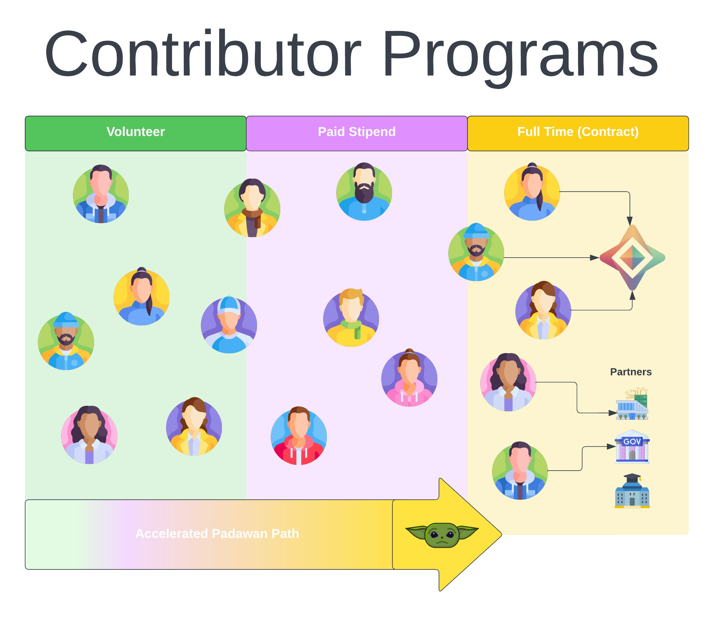

</figure>

## Beta Testers Required

We are looking for people who can start quickly in any of the roles listed above in our **“Recent Achievements”**. To accelerate your learning you will be shadowing a Mentor from the team, learning by watching what they do; and then taking on tasks as you feel comfortable.

**Skills and Experience:**

-   Anyone from early career to seasoned expert is welcome to apply
-   We believe the right candidates can excel regardless of their level of prior experience
-   The determination to learn challenging things fast and not give up

**Minimum Requirements:**

-   [Midi-chlorian](https://starwars.fandom.com/wiki/Midi-chlorian) count >= 5000 ? (? star wars joke alert)
-   Members of the First Order need not apply ? (? last one I promise)
-   10+ hours a week availability for learning the material
-   At least 2 hours overlap with your Mentor’s time zone

## What our Padawans get:

-   Mentorship from core members of the OpenMined Team working across our different skill sets and disciplines.
-   Learning tools to understand the PyGrid and PySyft code base inside and out to see how we code and solve problems on a day to day basis.
-   Depending on the mentor you may be working directly on Automatic Differential Privacy, Secure Multi-Party Compute, Distributed Computing, DevOps or any combination of these
-   For non coding roles, work with our team and closely with partners, like the UN, Twitter, Google, Meta (Facebook AI), top Universities, US Census Bureau and more
-   The opportunity to contribute to a major Open Source project in the PETs / AI space and learn the inner workings of a distributed ML stack while deploying Federated Learning into production environments
-   Priority offers for upcoming roles in OpenMined and the skills required to apply for Jobs posted in our #jobs channel by Companies and Organizations deploying PETs
-   The opportunity to contribute to the most exciting space in AI, while making a real positive difference to the world!

### Should I apply?

If you are excited about unlocking advances in every scientific field by increasing humanities access to data by 1000x, in a safe and secure way and; can learn fast, love what you do and are a reliable, good communicator then: **YES!**

-   You might have a job which allows you to do Open Source work on the side, or work at an organization who would benefit from a deeper understanding of PETs and is willing to volunteer a small amount of your time to learn the ropes and contribute to Open Source
-   You might be doing a degree or a masters on an AI / Privacy related topic and want to gain valuable experience for your project, or even be further in your academic career and want to leverage OpenMined’s PET technology for your own research
-   Or perhaps you are simply interested in becoming a remote first open source contributor

Whatever your background is, the most important thing is that you are a reliable good communicator who is keen to learn and can commit to **10+ hours a week** for at least 5 _weeks_.

## Padawan BETA

### Are you in a time zone with a Mentor?

While this role is remote, there is a heavy emphasis on real time collaboration to speed up the onboarding process and maximize the learning experience. For the second BETA we have a variety of Mentors in overlapping time zones. After onboarding, you are free to work from any time zone anywhere in the world!

<figure class="">

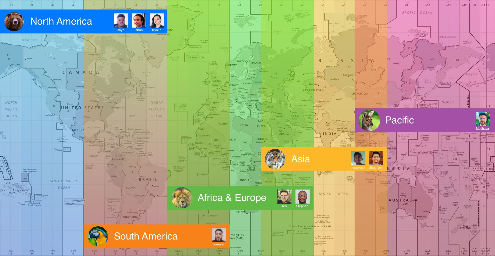

</figure>

We  suggest you choose your nearest Time Zone region based upon the assumptions that you would want to sync between 9am – 5pm local time and have at least 2 hours overlap with your Mentor on any given day. People who prefer to work different hours (for example night owls) that still sync are welcome to apply.

## Meet the Mentors

<h6 style="text-align:center; margin-top:0">Ishan ??</h6>
EST / Canada (-5)

Hi! I’m Ishan ? I lead the Differential Privacy team at OpenMined, as well as [lead our collaboration with Twitter working on algorithmic transparency and accountability](https://blog.twitter.com/engineering/en_us/topics/insights/2022/investing-in-privacy-enhancing-tech-to-advance-transparency-in-ML). I also monopolize our production of puns. ?

**Track: Engineering**  
Time Zones: UTC -9 ↔️ UTC -1

?? [Click here to Apply!](https://forms.gle/crRYFdorEA73L2zTA)

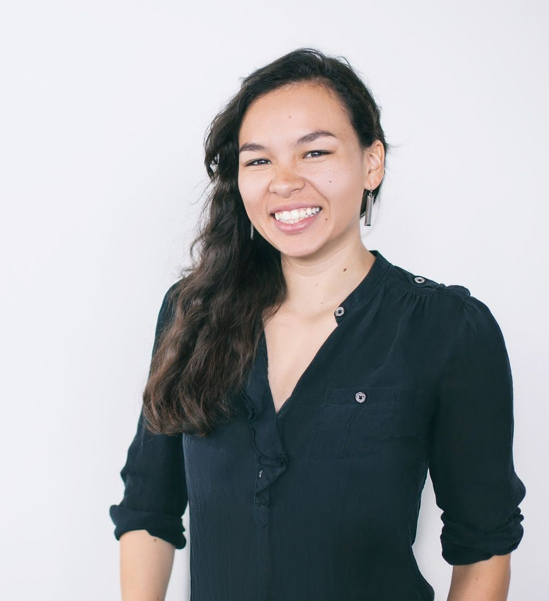

<h6 style="text-align:center; margin-top:0">Kyoko ??</h6>
CST, TN (-6)

Kyoko Eng is the design lead for OpenMined’s community and a product lead for OpenMined’s PyGrid platform. Before coming to OpenMined Kyoko worked with B2B tech companies to help them form their brand systems and evolve their applications and websites. On the day to day she coordinates with the core team to help align and prioritize product design decisions; conducts qualitative research to further product insights, and then translates the aforementioned into product plans and UI.

**Track: Product**  
Time Zones: UTC -3 ↔️ UTC +5

?? [Click here to Apply!](https://forms.gle/crRYFdorEA73L2zTA)

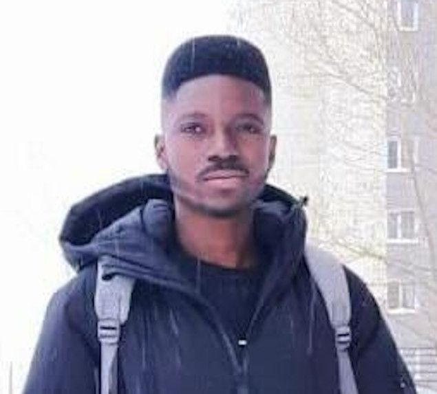

<h6 style="text-align:center; margin-top:0">Baye ??</h6>
EST, MA (-5)

Gaspard leads the efforts in securing OpenMined’s codebase. He provides security mechanisms for OpenMind’s API, VPN, PySyft, and PyGrid infrastructure. Gaspard also performs Application Security auditing and pentesting of these different infrastructures. He works closely with the Engineering team in fixing the various security bugs. He can guide anyone interested in making OpenSource safe again, starting with the OpenMined codebase.

**Track: Security**  
Time Zones: EST, MA(-5)

?? [Click here to Apply!](https://forms.gle/crRYFdorEA73L2zTA)

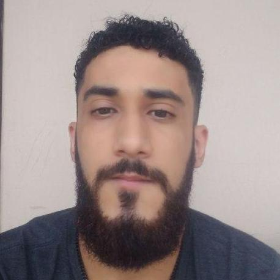

<h6 style="text-align:center; margin-top:0">Ionesio ??</h6>
BRT / Brazil (-3)

Ionesio is a Software Engineer with a background in Computer Science and some research experience in AI and cybersecurity. He has been working with the OpenMined community for 3 years, helping the organization to develop the decentralized platform called PyGrid.

**Track: Engineering**  
Time Zones: UTC -7 ↔️ UTC +1

?? [Click here to Apply!](https://forms.gle/crRYFdorEA73L2zTA)

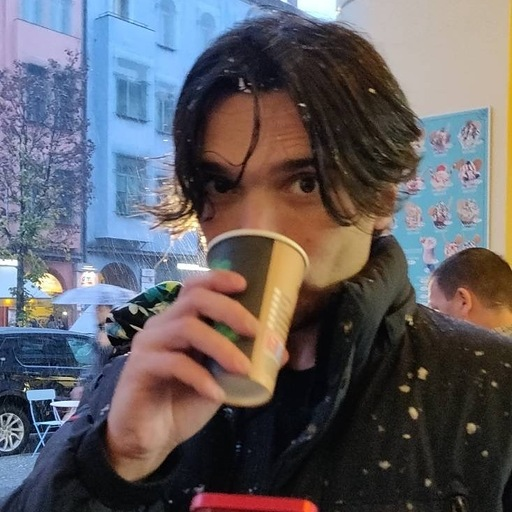

<h6 style="text-align:center; margin-top:0">Thiago ??</h6>
WET / Portugal (+0)

Thiago leads the Web and Mobile team where he works on PyGrid UI. Currently in sunny Portugal, Thiago hails from Belo Horizonte in Brazil and studied his masters in Computer Science at Uppsala University in Sweden.

**Track: Frontend Engineering**  
Time Zones: UTC -4 ↔️ UTC +4

?? [Click here to Apply!](https://forms.gle/crRYFdorEA73L2zTA)

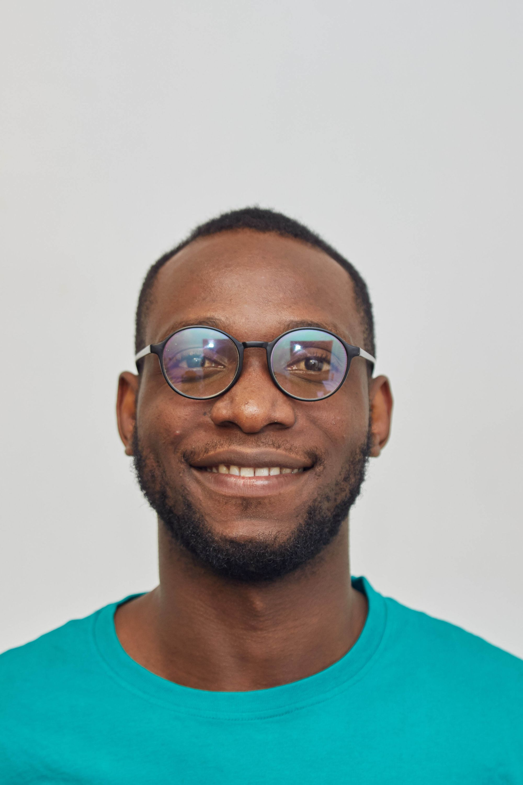

<h6 style="text-align:center; margin-top:0">Stephen ??</h6>
WAT / Nigeria (+1)

Stephen is based out of beautiful and vibrant city of Abuja, Nigeria where he works as a software engineer at OpenMined, with special interest in Platform / Infrastructure Engineering (_Yunno, the DevOpsie thingie_).

**Track: Engineering**  
Time Zones: UTC -3 ↔️ UTC +5

?? [Click here to Apply!](https://forms.gle/crRYFdorEA73L2zTA)

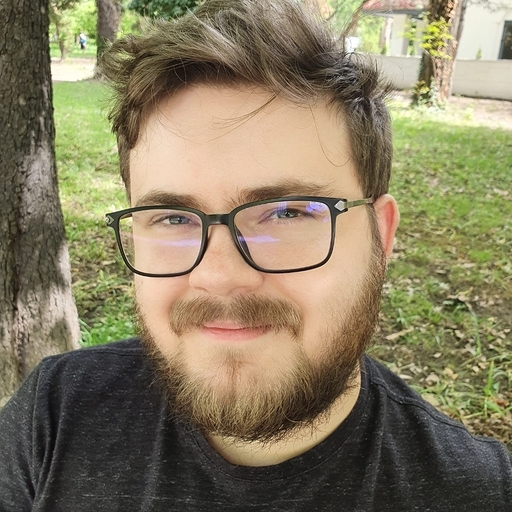

<h6 style="text-align:center; margin-top:0">Teo ??</h6>
EET / Romania (+3)

Teo works on integrating Deep Learning libraries inside Syft while also contributing on the Core team to improve tracing and benchmarking. You can’t improve anything if you don’t know how well it runs!

**Track: Engineering**  
Time Zones: UTC -1 ↔️ UTC +7

?? [Click here to Apply!](https://forms.gle/crRYFdorEA73L2zTA)

<h6 style="text-align:center; margin-top:0">Shubham ??</h6>
IST / Lucknow (+5.5)

Based out of Lucknow, India, Shubham works as a Software Engineer with the Core Engineering Team and also serves as a Product Manager for improving the UX of the PySyft APIs. On day to day basis, you can find him venturing from implementing / refactoring features to designing Mock APIs for the syft library.

**Track: Engineering**  
Time Zones: UTC +3.5 ↔️ UTC +11.5

?? [Click here to Apply!](https://forms.gle/crRYFdorEA73L2zTA)

<h6 style="text-align:center; margin-top:0">Rasswanth ??</h6>
IST / Tamil Nadu (+5.5)

Rasswanth works on the SMPC and Core teams to implement input privacy techniques and algorithms for both PySyft and PyGrid.

**Track: Engineering**  
Time Zones: UTC +3.5 ↔️ UTC +11.5

?? [Click here to Apply!](https://forms.gle/crRYFdorEA73L2zTA)

<h6 style="text-align:center; margin-top:0">Madhava ??</h6>
AEST / Brisbane (+10)

Madhava leads the Core team, and does a variety of things from code reviews, release management, evolving the Syft and Grid architecture, writing infrastructure as code and hearding CI. He has been working on Syft and Grid for two years and can guide you through the darkest corners of the code base.

**Track: Engineering**  
Time Zones: UTC +4 ↔️ UTC -8

?? [Click here to Apply!](https://forms.gle/crRYFdorEA73L2zTA)

## No Mentors Available for Your Preference?

If your area of interest has no available mentor or you are outside their time zone, and still want to join OpenMined, we would love to hear from you:

?? Please consider filling out [this form](https://docs.google.com/forms/d/e/1FAIpQLSeHsAItqkc8FV9M2_BlllNMYs-3bxQj_Pg-vgq77e5Ioi4NlA/viewform)

**Ideal Candidates for Engineering Roles have experience with one or more of the following:**

-   Writing Python
-   Using Jupyter Notebooks
-   Creating PRs on GitHub
-   Using the CLI

**Bonus experience:**

-   Running Docker Containers
-   DevOps and CI/CD
-   Writing Infrastructure as Code
-   Systems / Network Engineering
-   Significant Open Source or Industry Experience

**Availability:**

-   Minimum 10 hours a week
-   2+ hours overlap with your Mentor

## Checkout our GitHub

<a class="link-card link-card--dim" href="https://github.com/OpenMined/pysyft" target="_blank" rel="noopener noreferrer">
<strong class="link-card__title">GitHub – OpenMined/PySyft: A library for answering questions using data you cannot see</strong>
A library for answering questions using data you cannot see – GitHub – OpenMined/PySyft: A library for answering questions using data you cannot see

<svg class="link-card__arrow" width="24" height="24" viewBox="0 0 24 24" fill="none" aria-hidden="true"><path d="M5 12h14M13 6l6 6-6 6" stroke="currentColor" stroke-width="2" stroke-linecap="round" stroke-linejoin="round"></path></svg></a>

## Join our Slack Community

If you aren’t already in our slack make sure to join for more updates.

?? [Join Slack Now!](https://slack.openmined.org/)

?? [Apply to the Padawan Program here!](https://docs.google.com/forms/d/e/1FAIpQLSdBgcz4Sj9ow0vhWsfKP2WMlLAynHB8caPr3eTBp9m6JeeLSA/viewform?usp=sf_link)
