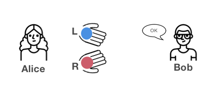

<!-- TODO(a11y): 1 localized body image(s) have empty alt text -->

__**This post is part of our [Privacy-Preserving Data Science, Explained](https://blog.openmined.org/private-machine-learning-explained/) series.**__

With the advancements in the field of Artificial Intelligence, our economy has become increasingly data-driven. Organisations harvest our data en mass in order to tap into information held between the data points.  For this reason, there’s an ever growing economic incentive for organisations to store your digital footprint as you participate in their technological ecosystem. Surveillance capitalists may use this data to learn what makes us tick, generating revenue through targeted online advertising. While this is relatively innocuous, this technology has since been adapted into far more insidious sectors than retail. The previous 10 years has seen use of these scalable tools of mass persuasion in order to [undermine democracy](https://www.theguardian.com/news/series/cambridge-analytica-files/all) and even as an [incitement to violence](https://www.bbc.co.uk/news/world-asia-46105934).

With these tools surveillance in ever increasing use, consumers of technology find themselves in a catch-22. Consumers can continue to engage in extremely useful online services, relinquish control of their data, and in many cases have their agency manipulated. On the other hand, they can choose not to participate in the digital economy and be cut off from a host of high utility services like social media, map software and search engines.

With this in mind, there is a growing appetite for tools to help manage the the trade-off between privacy and participation. One tool archetype in this intended transformation is **Zero Knowledge Proofs (ZKPs).**

### What are Zero Knowledge Proofs ?

The concept of zero-knowledge proofs was first conceived in 1989 by [Shafi Goldwasser](https://en.wikipedia.org/wiki/Shafi_Goldwasser), [Silvio Micali](https://en.wikipedia.org/wiki/Silvio_Micali) and [Charles Rackoff](https://en.wikipedia.org/wiki/Charles_Rackoff) in their paper “The Knowledge Complexity of Interactive Proof-Systems”. This paper introduced the concept of interactive proof systems which deals with Knowledge complexity, a measurement of amount of knowledge about the proof transferred from the prover to the verifier.

In simple terms, ZKP can be described as a mathematical method to prove to a party that you possess some knowledge without actually revealing the underlying information.

For example, let’s say you go to a bar. The bartender asks for your drivers licence so they can verify your age. You want the bartender to know you’re over 18 so they can sell you a drink. However, you don’t really want the bartender to know where you live or even how old you actually are. However, you need to present all of that information to the bartender because it’s all contained in your drivers licence. Under a ZKP method like [CL Signatures](https://misterwip.uk/cl-signatures), you could prove the value of your age is over a given threshold value without revealing the _actual_ value of your age.

### Properties of Zero Knowledge Proofs:

ZKPs as a type represent a smorgasbord methods which all must possess the following three properties;

1) **Completeness:** If a statement is true, and the protocol followed by the prover and verifier is true, then the verifier will accept the proof.  
2) **Soundness:** If the statement is false, even-though the verifier follows the protocol, the verifier will not be convinced by the proof  
3) **Zero-Knowledge:** If the prover follows the protocol, and the statement is true. then the verifier will be convinced that the provers’ proof is right, without learning any information from their interaction

Consider the following, very basic, ZKP protocol.

Imagine, your friend Alice is colour blind. Your friend Bob has two identical balls, however, one is red and another is blue. Alice has no way of perceiving this difference in colour and will not refuses to trust Bobs assertions that they are different. Alice has _zero-knowledge_ of the ball colour, Bob must _prove_ that the two balls are different colours to Alice. The following ZKP method solves this particular problem;

1) Alice takes the balls and and passes them between her hands behind her back.  
2) Alice then presents both balls to Bob and challenges him to identify the ‘blue’ one.  
3) As Bob can see the colour of the blue ball, they correctly identify it.  
4) These steps are repeated over a number of times. Eventually the probability of Bob predicting the correct ball each time will be so low that it is beyond all reasonable doubt that Bob is telling the truth.

<figure class="">

<figcaption>Source: https://blog.goodaudience.com/understanding-zero-knowledge-proofs-through-simple-examples-df673f796d99</figcaption></figure>

Probability of choosing from 1st time swap = 50%  
Probability of choosing from 2nd time swap = 25%  
Probability of choosing from 3rd time swap = 12.5%

On repeating this experiment several times, the probability gets reduced by 50% every time. When the probability of choices reduces to zero, Alice will be able to tell if the balls are of different colors.

Relating this experiment to the properties that was mentioned before, we find that

**Property 1 (Completeness):** Your friend must be convinced that the balls are different  
**Property 2 (Soundness):** The probability of all switches/non-switches approaches zero, which convinces that the balls are different coloured  
**Property 3 (Zero-Knowledge):** Your friend has no knowledge about the colour of the balls  
There are many such abstract examples and implementations of ZKPs, they can be viewed in the below mentioned links.

### Application of Zero Knowledge Proofs:

1) Used in cryptographic protocols for maintaining privacy. With the properties of ZKP, we ensure that the privacy of the user is not compromised  
2) Used in Blockchain like Bitcoin or Ethereum transactions, which keeps the transactions transparent while abstracting the sender/recipient details  
3) In 2016, the Princeton Plasma laboratory demonstrated a technique for nuclear disagreement talks, without revealing information about its working.  
4) Used in Authentication systems where one party wants to proves its identity to other party without revealing the secret like password.

**Further reading/implementation on ZKP:**

1.  PyZKP – python wrapper for open-source ZKP libraries by OpenMined [https://github.com/OpenMined/PyZPK](https://github.com/OpenMined/PyZPK)
2.  Podcasts on ZKP – [https://www.zeroknowledge.fm](https://www.zeroknowledge.fm)
3.  Awesome ZKP – [https://github.com/matter-labs/awesome-zero-knowledge-proofs](https://github.com/matter-labs/awesome-zero-knowledge-proofs)

**References:**

1.  [https://www.wired.com/story/zero-knowledge-proofs/](https://www.wired.com/story/zero-knowledge-proofs/)
2.  [https://en.wikipedia.org/wiki/Zero-knowledge\_proof](https://en.wikipedia.org/wiki/Zero-knowledge_proof)
3.  [http://publications.officialstatistics.org/handbooks/privacy-preserving-techniques-handbook/UN Handbook for Privacy-Preserving Techniques.pdf](http://publications.officialstatistics.org/handbooks/privacy-preserving-techniques-handbook/UN%20Handbook%20for%20Privacy-Preserving%20Techniques.pdf)
4.  [https://towardsdatascience.com/what-are-zero-knowledge-proofs-7ef6aab955fc](https://towardsdatascience.com/what-are-zero-knowledge-proofs-7ef6aab955fc)
