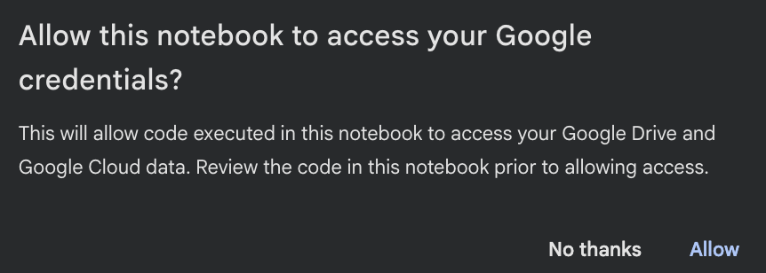
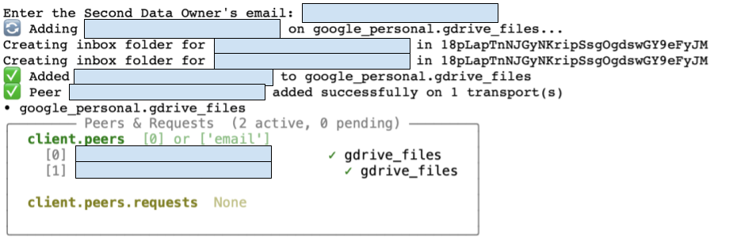
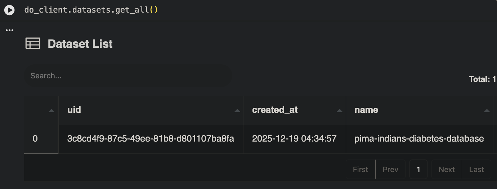
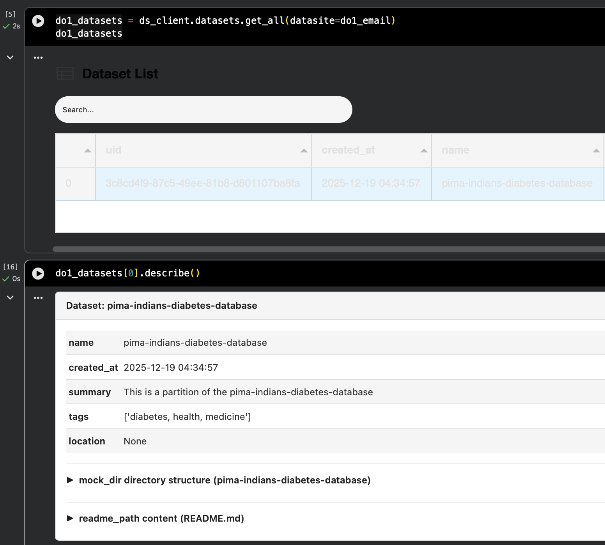
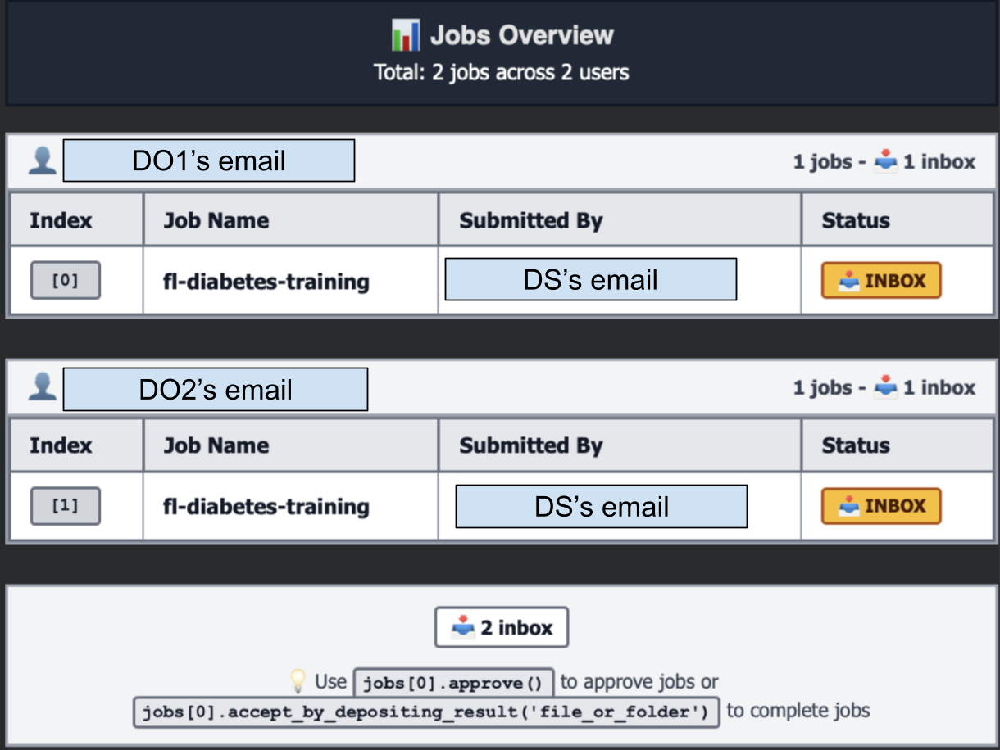
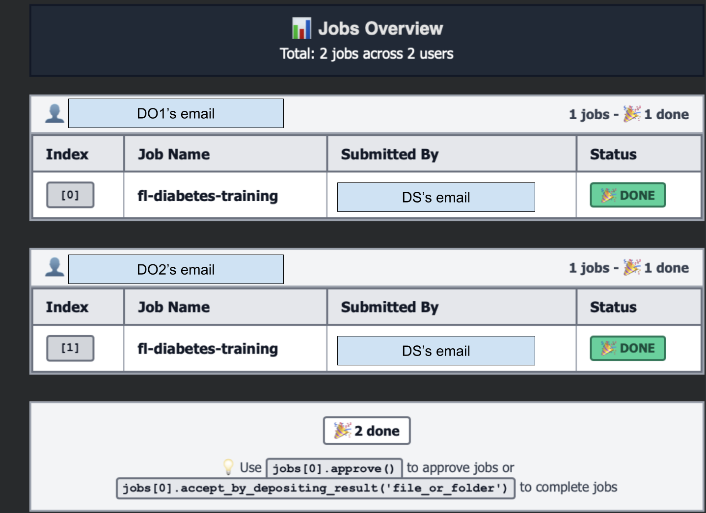

<!-- TODO(a11y): 6 localized body image(s) have empty alt text -->


<!-- TODO(content): content_width_px=730 (custom content-column width — needs handling); toc_offset_top_px=315 (TOC start offset — maps to TocAnchor) -->

Have you ever wanted to train a machine learning model on distributed private data without anyone sharing their raw data? In this tutorial, you’ll learn how to run a complete federated learning workflow directly from Google Colab—no local setup required.

We’ll use the [PIMA Indians Diabetes dataset](https://www.kaggle.com/datasets/uciml/pima-indians-diabetes-database) split across two data owners to train a diabetes prediction model collaboratively, all while keeping each party’s data private and secure.

 <a class="btn" href="https://github.com/OpenMined/syft-flwr/tree/main/notebooks/fl-diabetes-prediction/distributed-gdrive" target="_blank" rel="noopener">Get the notebooks ↗︎</a> 

## Quick Demo

<figure class="wp-block-embed is-type-video is-provider-youtube wp-block-embed-youtube wp-embed-aspect-16-9 wp-has-aspect-ratio"><div class="wp-block-embed__wrapper"><iframe title="Federated Learning in Google Colab — No Setup Required" width="500" height="281" src="https://www.youtube.com/embed/iWlQJhBMs1E?feature=oembed" frameborder="0" allow="accelerometer; autoplay; clipboard-write; encrypted-media; gyroscope; picture-in-picture; web-share" referrerpolicy="strict-origin-when-cross-origin" allowfullscreen=""></iframe></div></figure>

<p class="has-text-align-center prose-divider">⬩⬩⬩</p>

## Overview: The Parties

In this federated learning flow, there are three key parties:

1.  **Data Owners (DO1 & DO2)**: Organizations that hold private data. Each runs their own Colab notebook to manage their data and approve training jobs.
2.  **Data Scientist (DS)**: The coordinator who proposes the ML project, submits jobs to data owners, and aggregates the results.

Each party runs in a separate Google Colab notebook. You can use three different Google accounts (emails)—or call two friends to join you for a real collaborative experience!

The magic? Raw data never leaves the data owner’s environment—only model updates are shared, no local setup is required!

<p class="has-text-align-center prose-divider">⬩⬩⬩</p>

## Prerequisites

Before starting, you’ll need:

-   Three Google accounts (one for each party), or two friends willing to join
-   Each party downloads the notebook from the link provided, uploads and opens their respective notebook in Google Colab

That’s it! No local Python installation, no complex setup.

<p class="has-text-align-center prose-divider">⬩⬩⬩</p>

## Step 1: Set Up the Data Owners and the Data Scientist

Each data owner runs their own notebook. Let’s start with **DO1**.

### DO1 Notebook

1.  Open a new Colab notebook
2.  Install the `syft-flwr` package:

```python
!uv pip install -q "git+https://github.com/OpenMined/syft-flwr.git@main"
```

3.  Login as a Data Owner:

```python
import syft_client as sc
import syft_flwr

print(f"{sc.__version__ = }")
print(f"{syft_flwr.__version__ = }")

do_email = input("Enter the Data Owner's email: ")
do_client = sc.login_do(email=do_email)
```

Here, Google will ask for your permission to allow the notebook to access your Google credentials.

<figure class="wp-block-image size-full is-resized">



</figure>

Please click “Allow” and follow a few other pop-up windows to complete the process.

Switch to **DO2 notebook** and **DS notebook** to login similarly with respective emails, e.g.

```python
ds_email = input("Enter the Data Scientist's email: ")
ds_client = sc.login_ds(email=ds_email)
```

<p class="has-text-align-center prose-divider">⬩⬩⬩</p>

## Step 2: Data Scientist Adds Data Owner as Peers

Add both data owners as peers:

```python
do1_email = input("Enter the First Data Owner's email: ")
ds_client.add_peer(do1_email)

do2_email = input("Enter the Second Data Owner's email: ")
ds_client.add_peer(do2_email)

# check that the 2 DOs are added as peers
ds_client.peers
```

<figure class="wp-block-image size-full is-resized has-custom-border">



</figure>

<p class="has-text-align-center prose-divider">⬩⬩⬩</p>

## Step 3: Each Data Owner Creates A Diabetes Dataset

First, the DO downloads the [PIMA Indians Diabetes dataset](https://www.kaggle.com/datasets/uciml/pima-indians-diabetes-database) that’s already split into partitions from `Hugging Face`

```python
from pathlib import Path
from huggingface_hub import snapshot_download

DATASET_DIR = Path("./dataset/").expanduser().absolute()

if not DATASET_DIR.exists():    
    snapshot_download(
        repo_id="khoaguin/pima-indians-diabetes-database-partitions",
        repo_type="dataset",      
        local_dir=DATASET_DIR,
    )
```

Next, DO creates a Syft dataset from a partition of the downloaded dataset (with mock and private path)

```python
partition_number = 0

DATASET_PATH = DATASET_DIR / f"pima-indians-diabetes-database-{partition_number}"

do_client.create_dataset(
    name="pima-indians-diabetes-database",
    mock_path=DATASET_PATH / "mock",
    private_path=DATASET_PATH / "private",
    summary="This is a partition of the pima-indians-diabetes-database",
    readme_path=DATASET_PATH / "README.md",
    sync=True,
)
```

DO verifies that the dataset has been created

```python
do_client.datasets.get_all()
```

<figure class="wp-block-image size-large is-resized">



</figure>

**Key concept**: The `mock_path` contains synthetic/sample data that data scientists can explore and write code upon. The `private_path` contains the real data that never leaves this environment.

### DO2 Notebook

Repeat the same steps in the DO2’s notebook, but change the partition number:

```python
partition_number = 1  # DO2 uses partition 1 (or any other partition)
```

Everything else stays the same. Now you have two data owners, each holding a different slice of the diabetes dataset.

<p class="has-text-align-center prose-divider">⬩⬩⬩</p>

## Step 4: Data Scientist Explores the Data Owner’s Datasets

```python
# Check DO1's datasets

do1_datasets = ds_client.datasets.get_all(datasite=do1_email)  

do1_datasets[0].describe()

# Check DO2's datasets

do2_datasets = ds_client.datasets.get_all(datasite=do2_email)

do2_datasets[0].describe()
```

The DS will see something like below

<figure class="wp-block-image size-large is-resized">



</figure>

<p class="has-text-align-center prose-divider">⬩⬩⬩</p>

## Step 5: Data Scientist Proposes and Submits the FL Project

### Clone the FL Project

The FL project is built using [Flower](https://flower.ai/), a popular open-source federated learning framework. It defines the model architecture, training logic, and client/server communication—all following Flower’s standard patterns. The `syft-flwr` integration handles the secure job submission, data governance and communication layer on top. We have already prepared the FL project [here](https://github.com/khoaguin/fl-diabetes-prediction/) and you only need to clone it like below (in the DS’s notebook)

```python
from pathlib import Path

!mkdir -p /content/fl-diabetes-prediction

!curl -sL https://github.com/khoaguin/fl-diabetes-prediction/archive/refs/heads/main.tar.gz | tar -xz --strip-components=1 -C /content/fl-diabetes-prediction

SYFT_FLWR_PROJECT_PATH = Path("/content/fl-diabetes-prediction")

print(f"syft-flwr project at: {SYFT_FLWR_PROJECT_PATH}")
```

### Bootstrap the Project

This configures the project with the aggregator (DS) and participating datasites (DOs), and generates the `main.py` entry point:

```python
import syft_flwr

try:
    !rm -rf {SYFT_FLWR_PROJECT_PATH / "main.py"}
    print(f"syft_flwr version = {syft_flwr.__version__}")
    do_emails = [peer.email for peer in ds_client.peers]
    syft_flwr.bootstrap(
        SYFT_FLWR_PROJECT_PATH, aggregator=ds_email, datasites=do_emails
    )
    print("Bootstrapped project successfully ✅")
except Exception as e:
    print(e)
```

### Submit Jobs to Data Owners

Now send the FL project to each data owner for review. The job contains the training code—data owners can inspect it before approving execution on their private data.

```python
!rm -rf {SYFT_FLWR_PROJECT_PATH / "fl_diabetes_prediction" / "__pycache__"}

job_name = "fl-diabetes-training"

# Submit to DO1
ds_client.submit_python_job(
    user=do1_email,
    code_path=str(SYFT_FLWR_PROJECT_PATH),
    job_name=job_name,
)

# Submit to DO2
ds_client.submit_python_job(
    user=do2_email,
    code_path=str(SYFT_FLWR_PROJECT_PATH),
    job_name=job_name,
)
```

DS can check for submitted jobs with `ds_client.jobs`

<figure class="wp-block-image size-large is-resized">



</figure>

<p class="has-text-align-center prose-divider">⬩⬩⬩</p>

## Step 6: Data Owners Approve and Run Jobs

Back in each Data Owner’s notebook, check for incoming jobs:

```python
do_client.jobs
do_client.jobs[0]
```

Review and approve the job:

```python
do_client.jobs[0].approve()
do_client.jobs
```

Process the approved jobs (this runs the actual client-side training on private data for each DO):

```python
do_client.process_approved_jobs()
```

After this, you will see that the DOs start to install the packages and run the client-side of the FL workflow.

**Repeat this for both the DO1 and DO2 notebooks.**

<p class="has-text-align-center prose-divider">⬩⬩⬩</p>

## Step 7: Data Scientist Runs the Federated Learning Aggregator

Back in the Data Scientist notebook, the DS installs the required packages and runs the aggregator-side logic of the federated training:

```python
!uv pip install \
    "flwr-datasets>=0.5.0" \
    "imblearn>=0.0" \
    "loguru>=0.7.3" \
    "pandas>=2.3.0" \
    "ipywidgets>=8.1.7" \
    "scikit-learn==1.7.1" \
    "torch>=2.8.0" \
    "ray==2.31.0"
```

Start the aggregation server:

```python
ds_email = ds_client.email

syftbox_folder = f"/content/SyftBox_{ds_email}"

!SYFTBOX_EMAIL="{ds_email}" SYFTBOX_FOLDER="{syftbox_folder}" uv run {str(SYFT_FLWR_PROJECT_PATH / "main.py")}
```

You can start observing and monitoring the FL training log. After the FL flow is done, you can check the final job status:

```python
ds_client.jobs
```

> <figure class="wp-block-image size-large is-resized">



</figure>
> 
> **Fun Challenge**: From the FL training logs and the jobs’ details, can you find where the aggregated models are saved?

<p class="has-text-align-center prose-divider">⬩⬩⬩</p>

## Step 8: Clean Up

When you’re done, clean up the SyftBox resources in each notebook:

```python
# In DS notebook
ds_client.delete_syftbox()

# In DO1 and DO2 notebooks
do_client.delete_syftbox()
```

<p class="has-text-align-center prose-divider">⬩⬩⬩</p>

## What Just Happened?

Congratulations! You successfully trained a diabetes prediction model using federated learning:

1.  **Two data owners** each held a private partition of the PIMA Indians Diabetes dataset
2.  **A data scientist** coordinated the training without ever seeing the raw data
3.  **Model updates** were aggregated using the Flower framework
4.  **Privacy was preserved**—raw data never left the data owner’s Colab environment

This is the core promise of federated learning: collaborative machine learning without sharing sensitive data.

**Enjoying this project?** Help us grow the community by starring our repos on GitHub:

-   ⭐ [syft-flwr](https://github.com/OpenMined/syft-flwr)
-   ⭐ [syft-client](https://github.com/OpenMined/syft-client)
-   ⭐ [syftbox](https://github.com/OpenMined/syft-client)

Stars help others discover these tools and keep our contributors motivated!

<p class="has-text-align-center prose-divider">⬩⬩⬩</p>

## Next Steps

**Ready to build production federated learning solutions?**

We invite data scientists, researchers, and engineers working on production federated learning use cases to apply to our [Federated Learning Co-Design Program](https://openmined.org/federated-learning/co-design/). You’ll get direct support from the OpenMined team.

[Apply to the Co-Design Program Now](https://openmined.org/federated-learning/co-design/)

**Have questions, found some bugs, or want to contribute?**

Join the conversation in our [Slack Community](https://slack.openmined.org). Already in the OpenMined workspace? Join the **#community-federated-learning** channel.

<p class="has-text-align-center prose-divider">⬩⬩⬩</p>

## Resources

-   [syft-flwr GitHub Repository](https://github.com/OpenMined/syft-flwr)
-   [Flower Framework Documentation](https://flower.ai/docs/)
-   [OpenMined Community](https://openmined.org/get-involved/)
